# NODE FUNDAMENTALS
Node es una entorno de ejecucion (runtime eviroment) que permite crear servicios utilizando el lenguaje de JavaScript.
Este ultimo esta construido sobre el motor v8 de google chrome.

## Introducing Node
El motor v8 utilza un modelo de __manejador de eventos (event driven)__ que permite manejar eficientemente conexiones y respuestas. Y este es el primero y mas importate concepto que se tiene que entender.

Node es solo una interfaz para V8 cuando se ejecuta codigo JavaScript. Node es definido como un entorno de ejecucion que envuelve a V8 y provee modulo que permiten a los desarrolladores construir software con JS. Por lo tanto Node adopta el modelo que V8 tiene.

La mayoria de modulos de node estan controlados por eventos y se puedn utilizat de forma asincrona sin bloquear el hilo d ejecucion.

En node tienen un solo hilo principal para tu codigo y todas las operaciones lentas son ejecutadas fuera del hilo principal asincronicamente.

Cualquier codigo que deba ejecutarse depues de una operacion lenta puede gestionarse con eventos y menejadores de eventos. un evento significa que algo sucedio y que debe realizarse una accion especifica. La accion puede definirse en una funcion de menejador de eventos que se asocia al evento. Cada vez que se señaliza el evento se ejecuta su funcion de manejador. Esto es lo que significa "manejador por eventos".

## Using Build - In Modules
Puedes crear un servidor wen usando `buil` del modulo `node:http`

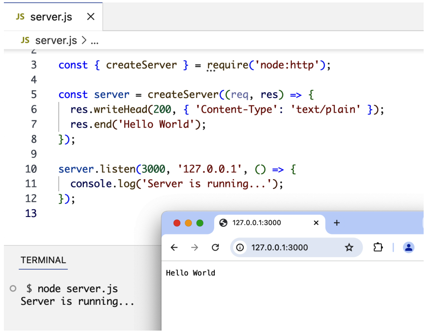

La funcion `require` es parte del metodo de gestion de dependencias original de Node y permite usar caracteristicas de otros modulos. Al requerir el modulo `node:http`, modulo `serve.js` ahora depende de el. No puede ejecutarse sin el.

Nosotros invocamos `createServe` para crear un objeto de servidor, esta recibe como argumento una funcion conocida como `RequestListener`.

Una funcion _listener_ en Node es asociada con cierto evento que se ejecuta cuando este evento ocurre. Node ejecuta `RequestListener` cada vez que hay una conexion de solicitud entrante al servidor web.

La funcion __listener__ recibe dos argumentos:

- _El `resquest` Object_: Puedes usar este objeto para leer informacion acerca de solicitudes que entran.
- _El `response` Object_: Puedes usar este objeto para escribir cosas al solicitante.

La funcion `creteServer` solo crear un objeto de servidor. Esto no lo activa. Para activar el servidor web, necesitas llamar al metodo `listen` en `createServer`.

El metodo `listen` acepta varios arguementos, como puerto del OS y el host que usa para el servidor. El ultimo argumento es una funcion que se ejecutara si el servidor esta ejecutandose correctemente el el puerto especificado.

Los metodos `createServer` y `listen` son ejemplos de funciones manejadoras de eventos, que estan asociadas con enventos relacionado a una operacion asincrona.
## Using Packages
El administrador de paquetes en Node es `npm`. Este es un simple `CLI`que te permite administrar e intalar paquete externos en proyecto Node. Una paquete `npm` puede ser un solo modulo o una coleccion de modulos agrupados y expuestos expuestos con una API.

En este ejemplo vamos a descargar el paquete `lodash` para esto podemos utilizar el comando `npm install lodash`.

Este comando descarga el paquete `lodash` del resgistro de `npm` y lo ubica en la carpeta de `node_modules` (la cual se creara si todavia no ha sido creada).
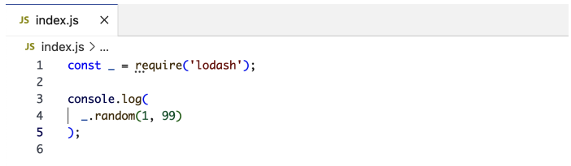
Dado que llamamos al metodo `require` con un modulo no incorporado (osea `lodash` en vez de esto `node:lodash`), Node lo buscara en la carpeta `node_modules` y gracias a `npm` lo encontrara ahi.

Cuando instalas un modulo, el comando`npm` lo listara en _package.json_ bajo la seccion __dependencies__

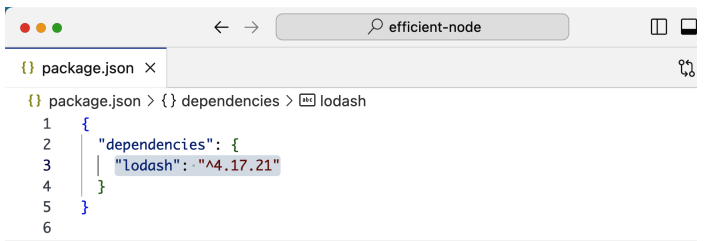

El  _package.json_ tambien contiene iformacion sobre el proyecto como, el nombre, version , descripcion y mas.
Puedes crear un archivo _package.json_ usando el comando `npm init`

Cuando otros desarroladores jalan (pull) tu codigo, ellos pueden correr el comando `npm install` sin ningun argumento, y npm leera todas las dependencias del _package.json_ y las instala en la carpeta _node_modules_.

Algunos paquetes solo son necesarios en un entorno de desarrollo, no en una de produccion. Puede indicar al comando `npm install` que incluya un paquete como despendencia exclusiva de desarrollo añadiendo el argumento `--save-dev` o `-D` para abreviar. `npm installa -D eslint`

Este se instalara en la carpeta _node_modules_ y se listara en el _package.json_ bajo la seccion __devDependencies__.
Por cada dependencia que instalas, estas indirectamente dependiendo de otras dependencias y estas a su vez, de sub dependencias. Se conciente de que estas formando un gran arbol de dependencias.

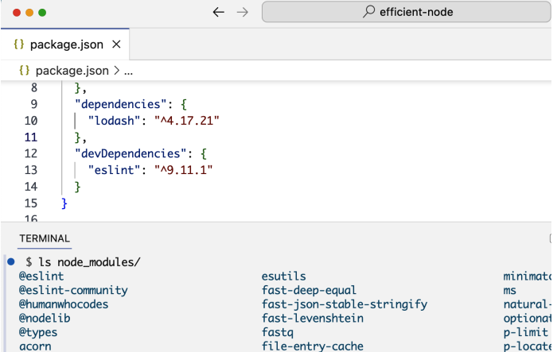

## ES Modules
Node tiene por defecto dos caragadores de modulos, el primero por defecto es el cargador `CommonJS`. El otro es el cargador nativo de JavaScript.

Una importante diferencia entre los dos sistemas de modulos esque CommonJS carga dinamicamente en tipo de ejecucion, mientras que ES caraga en tiempo de compilacion. El primero es sincrono y el segungo asincrono.
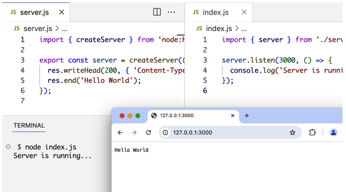
Tenga en cuenta el uso de las sentencias `import` y `export`. Esta en la sintaxis de modulos ES. Se utiliza _import_ para declara una dependencia de modulo y _export_ para definir que pueden usar otros modulos, cuando dependan del suyo.

Sin el `./` Node asume que el modulo que estas intentando importar es un modulo integrado o un modulo que existe en la carpeta _node_modules_.

La sintaxis  `export object` es concida como _exportaciones con nombres_, es ideal cuando necesitas exportar multiples elementos en un modulo. Se puede utilizar la palabra clave `export` como prefijo de cualquier objeto, incluyendo funciones clases y varibles destructuras.

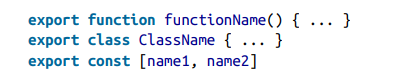

Pueden tambien utilizar `export` al final del modulo para exportar todos los nombre de objetos juntos.

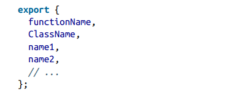

Puedes importar individualemte, o usar `*` para importar todo.
 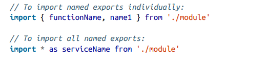

Adicionalmente los `modulos ES` tambien tiene una sitaxis de exportacion por defecto.

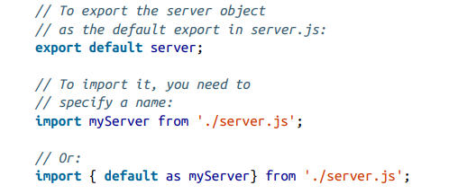

Tenga encuenta que para importar una _exportacion por defecto_ debe asignarle un nombre. Mientras que con las exportaciones con nombre no es necesario, estas son mas consistentes, faciles de descubir y mantener. Mi recomendacion es evitar las exportaciones predeterminadas, simpre usa exportaciones nombradas.

## The Non-Bloquing Model
Una promesa `Promise Object` es un objeto que representa un valor que debe estar disponible en el futuro. Esto nos permite envolver de forma nativa una operacion asincrona como una Promesa a la que se puede adjuntar funciones de controlador y ejecutar mas tarde una vez que se resuelven los valores de la Promesa.

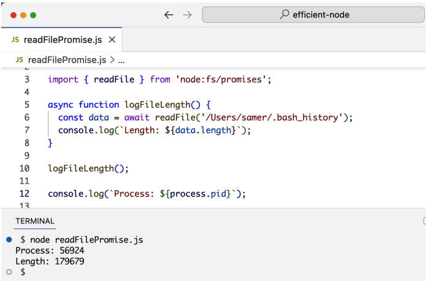

## Node Build-In Modules
Existen algunos modules claves de Node. Es bueno familiarizarse con esta lista y probar lo que puedes hacer con Node.

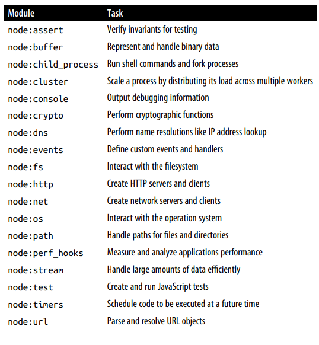

## Node Packages

npm y Node.js forman un ecosistema poderoso para JavaScript. Antes de Node, no existía un gestor de paquetes en el mundo JS, lo que hizo de npm algo revolucionario al cambiar completamente la forma de trabajar.
El registro de npm cuenta con más de un millón de paquetes instalables para servidores Node, con una CLI sencilla que permite instalar, mantener y compartir código. También es posible instalar paquetes desde otros registros, incluso directamente desde GitHub.
Lo más destacable es su versatilidad: npm y el sistema de módulos de Node no se limitan a servidores o navegadores. Pueden usarse para empaquetar, organizar y gestionar dependencias en cualquier entorno JavaScript, incluso en dispositivos embebidos. Los paquetes disponibles van desde utilidades pequeñas y específicas hasta herramientas completas para el ciclo de vida de aplicaciones grandes y complejas.

Aquí un resumen de las cuatro herramientas principales disponibles en npm:
- `ESLint` analiza el código JavaScript en busca de problemas, errores potenciales en tiempo de ejecución e inconsistencias de estilo. En algunos casos puede corregirlos automáticamente. Es una herramienta solo para desarrollo, no se incluye en producción.
- `Prettier` se encarga del formato del código de manera automática: indentación, longitud de líneas, uso de comillas, punto y coma, etc. Elimina la necesidad de tomar decisiones manuales de estilo, garantizando consistencia sin esfuerzo.
- `Webpack` permite empaquetar aplicaciones frontend de múltiples archivos en un solo archivo optimizado para producción. También compila extensiones de JavaScript como JSX para React. Puede usarse de forma independiente, sin necesidad de un servidor Node.
- `TypeScript` añade tipado estático y otras características al lenguaje. Ayuda a detectar errores antes de ejecutar el código, mejora el autocompletado en los editores y facilita el mantenimiento de proyectos grandes.
  
En conjunto, estas herramientas enriquecen el desarrollo JavaScript tanto en frontend como en backend. Es importante destacar que Node no tiene que ser el servidor de tu aplicación para aprovechar estas utilidades: puedes usarlo únicamente como capa de herramientas, combinándolo con otros frameworks como Ruby on Rails.

## Arguments Aginst Node

- Curva de aprendizaje — El modelo asíncrono y sin bloqueos es conceptualmente distinto a lo que la mayoría de desarrolladores conoce, y requiere tiempo para interiorizarse.
- Sistema de módulos confuso — Node soporta tanto CommonJS como ES Modules, pero mezclarlos genera inconsistencias y problemas de compatibilidad, especialmente para principiantes.
- Gestión de dependencias pesada — Los proyectos pueden acumular cientos de paquetes en node_modules. Mantenerlos actualizados, resolver conflictos de versiones y reemplazar paquetes abandonados es una tarea continua y exigente.
- Seguridad — Por defecto, un script de Node tiene acceso ilimitado al sistema de archivos, la red y otros recursos del sistema, lo que representa un riesgo al usar código de terceros. Aunque se está introduciendo un modelo de permisos, no viene activado por defecto.
- Falta de herramientas integradas — Node no incluye validación de tipos, linting ni formateo de forma nativa, obligando a depender de paquetes externos y configuraciones adicionales antes de poder empezar a desarrollar.
- No apto para tareas intensivas de CPU — Al ser monohilo, Node solo usa un núcleo a la vez. Tareas como procesamiento de imágenes o vídeo generan cuellos de botella, y JavaScript es menos eficiente que lenguajes como C++ o Rust para este tipo de cómputo.
- Tipado dinámico — La ausencia de tipos estrictos en JavaScript facilita errores difíciles de detectar en proyectos grandes, complicando el mantenimiento y la comprensión del código.

## Summary
Node es un potente marco para crear servicios de backend. Envuelve el motor V8 JavaScript para permitir a los desarrolladores ejecutar código JavaScript de forma sencilla, y se basa en un modelo sencillo, impulsado por eventos y sin bloqueos que facilita a los desarrolladores la creación de aplicaciones eficientes y escalables. En Node, las operaciones asíncronas se gestionan con funciones de devolución de llamada u objetos Promise. Las devoluciones de llamada y las promesas son implementaciones sencillas de un evento único que se gestiona con una función. Las promesas son una alternativa mejor que las devoluciones de llamada, ya que ofrecen una sintaxis más legible y pueden estructurarse de manera que permitan un mayor control sobre el código. Los módulos integrados en Node proporcionan un marco de trabajo de bajo nivel en el que los desarrolladores pueden basar sus aplicaciones para no tener que empezar desde cero. El sistema de módulos de Node permite a los desarrolladores organizar su código en módulos reutilizables que pueden importarse y utilizarse en otras partes de la aplicación. Node cuenta con una comunidad amplia y activa que ha creado muchos paquetes populares que pueden integrarse fácilmente en proyectos Node. Estos paquetes se pueden encontrar y descargar desde el registro npm. En el siguiente capítulo, exploraremos la CLI y el modo REPL de Node y aprenderemos cómo Node carga y ejecuta módulos. 

