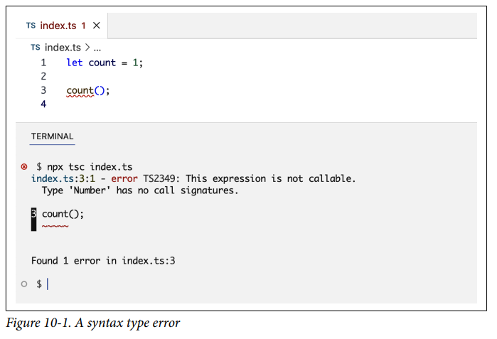
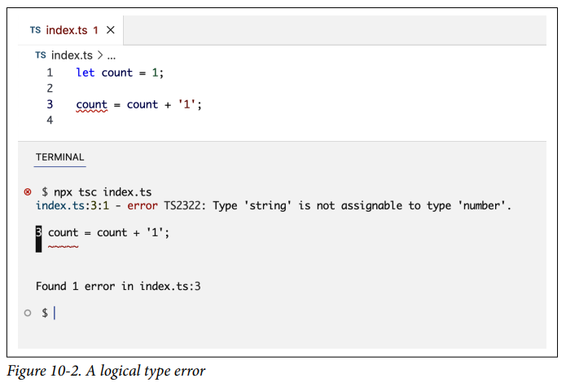
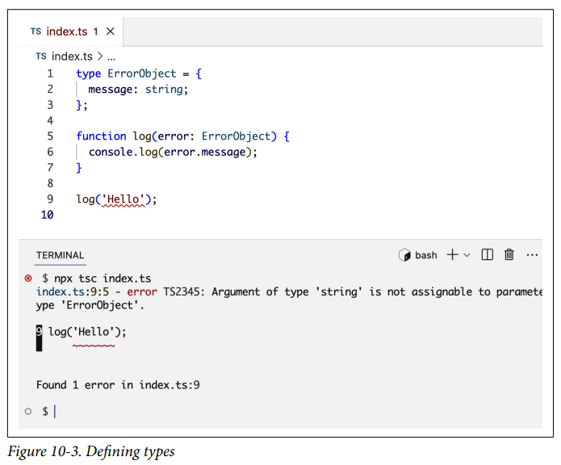
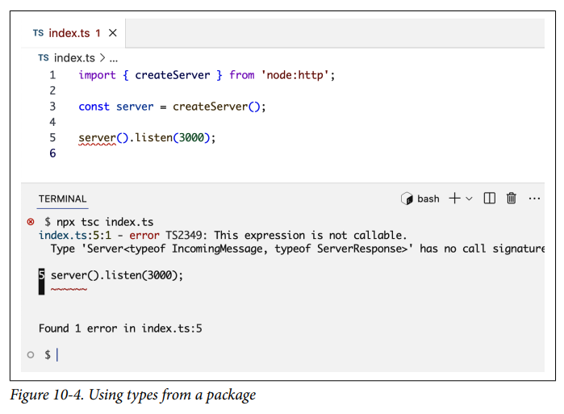

# Node Práctico

Si bien los módulos principales de Node están diseñados para ayudarnos a crear servicios backend, su flexibilidad, APIs asíncronas y fácil integración con entornos externos hacen de Node un gran entorno para ejecutar herramientas que ayudan con los flujos de trabajo de desarrollo tanto en el backend como en el frontend. En este capítulo, exploraremos algunas de estas herramientas y entenderemos sus roles en la construcción, prueba, despliegue y mantenimiento de proyectos Node.

Estas herramientas van desde pequeñas bibliotecas que se centran en unas pocas tareas hasta grandes frameworks que se pueden usar para el desarrollo full stack. Para cada tarea específica, hay muchas herramientas que puedes usar. En este capítulo, me centraré en las herramientas más populares y proporcionaré una visión general de su valor y los conceptos básicos de cómo usarlas.

Hablaremos sobre herramientas de calidad de código, empaquetadores de módulos, ejecutores de tareas, frameworks web y extensiones de JavaScript y transpiladores.

---

## Herramientas de Calidad de Código

En el Capítulo 1, revisamos algunas herramientas de Node que se pueden usar para ayudar en los ciclos de vida de una aplicación. Ampliemos dos de las más importantes en lo que respecta a la calidad del código: **Prettier** y **ESLint**.

Debido al gran valor que estas herramientas aportan a un proyecto, diría que ningún proyecto Node debería construirse sin ellas. Son simples y fáciles de integrar en un proyecto Node, y con ellas progresas más rápido y escribes código más limpio con estándares consistentes. ¿Por qué alguien no usaría algo que lo hace más rápido y mejor?

**Prettier** se usa para automatizar el formateo del código. No importa lo bueno que seas formateando código manualmente, sin Prettier, el formateo será inconsistente. Más importante aún, ¿por qué perder tiempo formateando código manualmente de todos modos? ¿Y por qué perder tiempo debatiendo cómo debería ser el formateo en las revisiones de código?

Prettier puede formatear código en muchos lenguajes, no solo JavaScript. Para proyectos frontend, también puedes usarlo para formatear CSS, HTML, JSON, GraphQL e incluso Markdown.

**ESLint** se puede usar para hacer cumplir reglas de calidad de código y encontrar cualquier error potencial en tu código tan pronto como lo escribes. Es como un detective que siempre está contigo, mirando por encima de tu hombro y dándote un codazo cada vez que intentas hacer algo incorrecto.

ESLint es altamente configurable. Puedes hacerlo súper estricto o súper flexible. Puedes elegir tus propias reglas o usar las recomendadas. Puedes hacer que corrija automáticamente algunos problemas o simplemente que los reporte mientras escribes. Puedes decirle que ignore ciertas violaciones en general o por razones específicas.

Hay muchos conjuntos de reglas recomendadas organizadas por diferentes comunidades de desarrolladores. Me gusta usar las incorporadas. Puedes ver una lista de todas las reglas de ESLint y cuáles son recomendadas en el sitio web de ESLint.

!!! tip

    Puede que no entiendas algunas de estas reglas recomendadas. ¡Mira eso como una oportunidad para aprender algo nuevo! Estas reglas existen por buenas razones. Búscalas y aprende por qué existen.

La mejor manera de integrar Prettier y ESLint en tu flujo de trabajo es hacer que se ejecuten cada vez que guardas tu código. ¡Algunos incluso prefieren que se ejecuten mientras están escribiendo código! A algunos les gusta ejecutarlos antes de enviar cambios. Me gusta la primera opción. Muchos editores de código tienen plugins y configuraciones para hacer que estas herramientas se ejecuten al guardar o mientras escribes.

Tener Prettier y ESLint integrados en los editores de código es genial, pero el proyecto también debería hacer cumplir automáticamente el uso de sus herramientas. Tal vez un plugin del editor esté funcionando mal. Tal vez alguien en el equipo olvidó activarlo o accidentalmente guardó mientras el plugin estaba deshabilitado.

La aplicación puede ocurrir localmente con hooks antes de que el código se envíe al repositorio remoto, o puede ocurrir remotamente después de que el código se envía pero antes de que sea aceptado. Exploraremos algunas herramientas que se pueden usar para la aplicación más adelante en este capítulo.

El paquete npm `prettier` instala un CLI que se puede ejecutar para formatear el código y verificar si el código está formateado correctamente. Lo mismo es cierto para el paquete `eslint`.

Estos dos paquetes se superponen un poco en sus ofertas. Por ejemplo, puedes hacer cumplir el uso (o no uso) de puntos y comas en JavaScript usando ambos, pero estas superposiciones son solo una pequeña parte de sus características y no hay nada de qué preocuparse. ESLint y Prettier funcionan muy bien juntos tanto para código backend como frontend, y sus paquetes deberían estar entre los primeros que agregues en tu entorno de desarrollo.

!!! note

    Hay algunos argumentos en contra de usar Prettier y ESLint. Entiendo que a veces pueden ser molestos. No son perfectos todo el tiempo. Podrían obligarte a reescribir código que está bien como está. Básicamente, a veces te harán pasar más tiempo del necesario, pero en mi opinión, el valor que aportan la mayor parte del tiempo supera las pequeñas imperfecciones que a veces tienen. También están mejorando con el tiempo, y puedes personalizarlos para que sean más flexibles cuando sea necesario.

### Prettier

Para usar Prettier en un proyecto Node, puedes instalarlo con npm:

```bash linenums="1"
$ npm i -D -E prettier
```

Nota cómo es una dependencia de desarrollo. No juega ningún papel en la ejecución de la aplicación en producción.

Nota también la bandera `-E` para guardar esta dependencia como una versión exacta. Esto asegura que todos los que trabajan en el proyecto usen la misma versión de Prettier. Incluso los lanzamientos patch de Prettier pueden resultar en un formateo ligeramente diferente. La actualización de Prettier debe hacerse periódicamente en un cambio aislado específico para esa tarea.

Prettier tiene un conjunto de configuraciones predeterminadas y se puede usar directamente, pero si quieres personalizar la forma en que funciona, puedes configurarlo para un proyecto Node usando una de las siguientes maneras:

- Una clave `prettier` en `package.json`
- Un archivo de módulo JavaScript con el nombre `prettier.config.js`
- Un archivo de configuración JSON con el nombre `.prettierrc`

Hay más formas de configurar Prettier, pero estas son las más comunes.

Aquí hay un ejemplo de archivo de configuración JSON de Prettier:

```json linenums="1"
{
  "arrowParens": "always",
  "quoteProps": "consistent",
  "singleQuote": true,
  "trailingComma": "es5"
}
```

La opción `singleQuote`, por ejemplo, formatea el código para usar comillas simples en lugar de comillas dobles alrededor de los strings. El valor `always` para `arrowParens` formatea el código para usar siempre paréntesis en las funciones flecha incluso cuando no son necesarios. Puedes ver una lista completa de todas las opciones y lo que significan en la documentación de Prettier.

Para usar Prettier, ejecutas el comando `prettier` con una opción `--write` para reescribir los archivos con el nuevo formateo o una opción `--check` para verificar si todos los archivos están formateados correctamente. El último se puede usar para hacer cumplir continuamente el uso de Prettier en el proyecto.

El comando `prettier` se puede ejecutar en un archivo, una carpeta o todas las carpetas dentro del proyecto usando `.` como destino:

```bash linenums="1"
$ npx prettier -w .
```

### ESLint

Para usar ESLint en un proyecto Node, necesitas instalarlo y agregar un archivo de configuración. Puedes hacer ambos con este comando:

```bash linenums="1"
$ npm init @eslint/config@latest
```

Este comando hará algunas preguntas de forma interactiva y usará tus respuestas para crear un archivo `eslint.config.js`. Instalará ESLint (y otros paquetes relacionados) como dependencias de desarrollo en tu proyecto.

Puedes personalizar los globales, plugins y reglas de ESLint dentro de su archivo de configuración. Aquí hay un archivo de configuración que muestra ejemplos de cada uno:

```js linenums="1"
import globals from 'globals';
import pluginJs from '@eslint/js';

export default [
  {
    languageOptions: {
      globals: { ...globals.browser, ...globals.node },
    },
  },
  pluginJs.configs.recommended,
  {
    rules: {
      'curly': 'error',
      'no-else-return': 'error',
      'no-unneeded-ternary': 'error',
      'no-useless-return': 'error',
      'no-var': 'error',
      'prefer-const': 'error',
      'yoda': ['error', 'never', { exceptRange: true }],
    },
  },
];
```

Por defecto, ESLint se quejará si tu código está usando una variable que no está declarada. Esta configuración hace una excepción para las variables globales tanto para entornos Node como browser, por lo que usar objetos de ámbito global como `process`, `console` y `window` estará permitido.

Las reglas recomendadas se agregan usando el plugin `@eslint/js`, luego se agregan también un conjunto de reglas personalizadas (que no son parte de las recomendadas). También puedes usar una regla personalizada para anular una recomendada.

Para mencionar algunos ejemplos de reglas personalizadas de ESLint: La regla `curly` asegura que todas las declaraciones de bloque estén envueltas en llaves, incluso cuando no son sintácticamente necesarias. La regla `no-var` asegura que la palabra clave `var` no se use para declarar variables. La regla `yoda` bloquea cualquier uso de condiciones yoda en declaraciones `if`. Nota cómo esta regla tiene más configuración para hacer una excepción para condiciones de rango. Si alguna de estas reglas personalizadas despierta tu interés, puedes buscarlas en la referencia de reglas de ESLint.

Una vez que ESLint está instalado y configurado para un proyecto, si tu editor tiene soporte para ESLint, comenzará a mostrarte cualquier problema de ESLint. El paquete `eslint` también viene con un comando que puedes ejecutar localmente (o en un pipeline de integración continua) para reportar cualquier problema o asegurarte de que no haya ninguno:

```bash linenums="1"
$ npx eslint .
```

### Otras Herramientas

Prettier y ESLint son geniales, y mejorarán la calidad de tu código, pero hay muchas otras herramientas que puedes usar en proyectos Node para la calidad del código también:

**Frameworks de testing**
: Si bien Node tiene excelentes fundamentos incorporados para pruebas, hay muchas bibliotecas de testing para Node que ofrecen muchas más características y APIs más fáciles de usar. Mocha y Chai están entre las más populares, pero mi favorita es Jest. Jest es simple y completo. Es genial tanto para proyectos backend como frontend.

**Herramientas de tipado estático**
: Si bien los tipos dinámicos de JavaScript lo hacen sentir más flexible, en realidad la falta de tipos estáticos (que se puedan verificar en tiempo de compilación) abre muchos caminos a problemas ocultos en tu código. Muchas herramientas evolucionaron para agregar tipado estático a JavaScript. La más popular y completa es **TypeScript**.

**Editores y asistentes de IA**
: Un editor de código avanzado marca una gran diferencia en la calidad de tu código. Editores como WebStorm, Atom y Visual Studio Code (VS Code) ofrecen excelentes características de calidad de código como finalización inteligente de código y navegación, detección de errores, depuración integrada y control de fuentes, y muchas más. Los asistentes de código de IA como GitHub Copilot hacen que estas características sean aún más poderosas. Aprovechan el aprendizaje automático del código abierto para proporcionar sugerencias de código sensibles al contexto para mejores prácticas y estándares de codificación.

---

## Empaquetadores de Módulos (Module Bundlers)

Para un entorno frontend como un navegador web, solicitar un recurso (como un archivo JavaScript o CSS) desde un servidor es una tarea asíncrona realizada a través de la red. Cada solicitud de red afecta el rendimiento del navegador web y la calidad de la experiencia del usuario. Esto es especialmente cierto en dispositivos móviles y dispositivos con recursos y conectividad limitados en general.

!!! tip

    Al desarrollar aplicaciones frontend, deberías considerar probarlas con recursos y conectividad limitados. Navegadores como Chrome ofrecen un modo de throttling para restringir tanto la red como la CPU. Estas restricciones te hacen consciente de cómo se comportará tu aplicación con recursos y conectividad limitados. Esto te ayuda a tomar mejores decisiones y manejar casos de los que no estarías al tanto de otra manera.

Si bien puedes hacer que tus módulos estén disponibles individualmente y las cosas funcionarían bien en navegadores modernos (que soportan la importación de módulos), aún deberías intentar minimizar la cantidad (y el tamaño) de los recursos necesarios para ejecutar tu aplicación en dispositivos frontend.

Las siguientes son algunas de las prácticas comunes que pueden ayudar a minimizar la cantidad y el tamaño de los recursos de la aplicación:

- **Combinar** todos los recursos iniciales necesarios para ejecutar la primera vista de la aplicación y servirlos todos con una sola solicitud. Esto se conoce como **bundling**, y el archivo generado se conoce como **archivo bundle**.
- **Minificar** el código en el archivo bundle eliminando espacios en blanco y acortando nombres de variables para reducir su tamaño. Si bien tu código fuente debe ser lo más legible posible, el código que envías a los navegadores no necesita serlo.
- **Eliminar** cualquier código no utilizado. Esto podría ser parte de tu propio código, como una función que definiste pero nunca usaste, o una biblioteca que instalaste pero usaste solo algunas de sus características. Por ejemplo, podrías instalar lodash en una aplicación y usar solo un puñado de sus funciones. No necesitas el resto de sus funciones en el bundle. Todo el código que no se usa en tu aplicación se puede eliminar para reducir el tamaño del bundle. Este proceso se conoce como **tree shaking**.
- Después de la primera vista, otras tareas en tu aplicación pueden solicitar más bundles según lo que hagan. En lugar de enviar todo el código de tu aplicación en un solo bundle, puedes dividir tu código por funcionalidad en diferentes bundles y cargar estos bundles bajo demanda cuando sean necesarios. Esto se conoce como **code splitting**.

Hay múltiples herramientas Node (como **Webpack**, **Parcel** y **Rollup**) que pueden ayudar con todas estas prácticas (y más). Exploremos el uso básico de Webpack para el empaquetado de módulos.

Webpack está dividido en dos paquetes principales, uno para la biblioteca principal (`webpack`) y uno para el CLI (`webpack-cli`). Instala ambos como dependencias de desarrollo:

```bash linenums="1"
$ npm i -D webpack webpack-cli
```

Para ejecutar Webpack, necesitas darle un **punto de entrada (entry point)**. Este es el primer archivo con el que Webpack comenzará. Es el inicio de tu gráfico de dependencias.

!!! tip

    En realidad, puedes ejecutar el comando `webpack` sin ninguna configuración si el punto de entrada de tu aplicación es `src/index.js`.

Una aplicación también puede tener múltiples puntos de entrada, y Webpack puede generar múltiples bundles. Puedes usar Webpack con **loaders** para hacer que procese muchos tipos de archivos antes del empaquetado. Puede, por ejemplo, procesar archivos CSS (y extensiones de CSS). Puede procesar Babel y TypeScript. Incluso puede procesar cosas como SVG, JSX, GraphQL y muchos más.

Webpack está construido con una estructura amigable para plugins, y soporta el uso de plugins externos que pueden engancharse al ciclo de vida de Webpack para implementar una variedad de características como definir constantes globales, copiar archivos, ignorar módulos e incluso integrarse con herramientas como ESLint y Prettier.

Aquí hay un ejemplo simplificado de un archivo de configuración de Webpack para un proyecto que usa TypeScript y la extensión CSS Sass:

```js linenums="1"
const webpack = require('webpack');
const CopyPlugin = require('copy-webpack-plugin');
const MiniCssExtractPlugin = require('mini-css-extract-plugin');

module.exports = {
  entry: {
    app: './src/app.ts',
    search: './src/search.ts',
  },
  output: {
    filename: '[name].ts',
    path: __dirname + '/dist',
  },
  module: {
    rules: [
      {
        test: /\.ts$/,
        exclude: /node_modules/,
        use: { loader: 'ts-loader' },
      },
      {
        test: /\.scss$/,
        exclude: /node_modules/,
        use: [
          MiniCssExtractPlugin.loader,
          { loader: 'css-loader', options: { url: false } },
          'sass-loader',
        ],
      },
    ],
  },
  plugins: [
    new CopyPlugin({
      patterns: [{ from: 'src', to: 'dist' }],
    }),
    new webpack.DefinePlugin({
      'PRODUCTION': JSON.stringify(process.env.NODE_ENV === 'production'),
      'process.env.API_KEY': JSON.stringify(process.env.API_KEY),
    }),
  ],
};
```

Esta configuración instruye a Webpack para usar dos archivos de punto de entrada y producir dos archivos bundle que coinciden con sus nombres. Usa un loader de TypeScript para procesar todos los archivos que terminan en `.ts`, y un loader de Sass para procesar todos los archivos que terminan en `.scss`. También extrae archivos CSS en bundles separados usando un loader del paquete `mini-css-extract-plugin`. Finalmente, usa el paquete `copy-webpack-plugin` para copiar archivos estáticos de `src` a `dist`, usa el `DefinePlugin` incorporado para definir una bandera `PRODUCTION` y habilita el uso de la variable de entorno `process.env.API_KEY` en el bundle.

Como puedes ver, Webpack es muy flexible y tiene muchas opciones y características para personalizar cómo funciona. Otros empaquetadores de módulos ofrecen características similares (y más) y se diferencian en el rendimiento y el tamaño del bundle que generan también.

!!! note

    El protocolo HTTP/2, con su multiplexación, compresión y características de server push, reduce la necesidad de bundling hasta cierto punto, ya que los navegadores pueden manejar múltiples solicitudes simultáneas y almacenarlas en caché mejor individualmente. El bundling todavía tiene sus beneficios, pero a medida que los navegadores evolucionan, esto será un acto de equilibrio entre qué empaquetar y qué enviar individualmente.

---

## Ejecutores de Tareas (Task Runners)

Las herramientas ejecutoras de tareas como **gulp** y **Grunt** se usan para ejecutar (y automatizar) tareas repetitivas en diferentes entornos. Algunas tareas son necesarias en entornos de desarrollo, algunas son necesarias en producción y algunas se usan para desplegar cambios de código en diferentes entornos y servidores.

Aquí hay algunos ejemplos de tareas que deben hacerse regularmente:

- Formatear y verificar el código en busca de problemas
- Ejecutar pruebas y analizar la cobertura
- Minificar código y generar bundles
- Desplegar código a otros entornos
- Generar informes y enviar correos electrónicos

Hacer estas tareas manualmente consume mucho tiempo y se pueden cometer errores. Definir estas tareas y tener una forma estándar de ejecutarlas cada vez reduce la posibilidad de errores manuales y ahorra tiempo en el proceso. Los ejecutores de tareas también pueden mejorar el rendimiento de sus tareas definidas. Por ejemplo, gulp usa streams de Node internamente, lo que lo hace funcionar mejor, especialmente para tareas grandes y aquellas que necesitan trabajar con el sistema de archivos.

Una tarea definida con un ejecutor de tareas también tiene el beneficio de claridad cuando alguien necesita entender qué hace exactamente esa tarea, o para depurar un problema con esa tarea.

Los ejecutores de tareas como gulp y Grunt tienen plugins que se pueden usar para definir tareas comunes. Por ejemplo, supongamos que una aplicación usa la extensión CSS Sass y necesitas definir una tarea para transformar todos los archivos Sass en archivos CSS. Si bien puedes hacer eso con un empaquetador de módulos completo como Webpack, supongamos que quieres hacerlo de manera diferente para tu entorno de producción.

Puedes usar la siguiente tarea de gulp:

```js linenums="1"
const gulp = require('gulp');
const sass = require('gulp-sass')(require('sass'));

gulp.task('sass', () => {
  return gulp.src('src/*.scss')   // Archivos fuente
    .pipe(sass())                 // Compilar Sass a CSS
    .pipe(gulp.dest('dist'));     // Destino de salida
});
```

O puedes usar la siguiente tarea de Grunt:

```js linenums="1"
module.exports = function(grunt) {
  grunt.initConfig({
    sass: {
      dist: {
        files: {
          'dist/app.css': 'src/app.scss'
        }
      }
    }
  });
  grunt.loadNpmTasks('grunt-sass');
  grunt.registerTask('default', ['sass']);
};
```

Para tareas simples, puedes usar la sección de scripts npm en `package.json`:

```json linenums="1"
"scripts": {
  "sass": "sass src/app.scss dist/app.css"
}
```

También puedes definir y ejecutar tus tareas en la nube con servicios de integración continua y despliegue como **GitHub Actions**, **Travis CI**, **CircleCI** y servicios similares. Estos servicios ofrecen flujos de trabajo más completos e integrados que se pueden ejecutar concurrentemente y son altamente configurables.

Elegir un ejecutor de tareas local o un servicio en la nube es una cuestión de preferencia, pero independientemente de tu elección, lo importante es que las tareas de tu aplicación estén bien definidas, sean fáciles de ejecutar con comandos simples y estén automatizadas para la mayoría de los casos.

---

## Automatización en Node

Necesitas maximizar el valor que obtienes de todas las herramientas de calidad y eficiencia que usas para Node, y para eso, necesitas automatizar tus flujos de trabajo.

La automatización es tu garantía de que nada pasará desapercibido. No confíes en el cerebro humano para recordar. La automatización también es tu mayor ahorro de tiempo. No ejecutes comandos de herramientas manualmente; haz que se ejecuten automáticamente en ciertos puntos de tus flujos de trabajo.

Integra las herramientas con tu editor para que funcionen mientras escribes o cuando guardas cambios. Usa el modo watch cuando trabajes con empaquetadores de módulos y frameworks de testing. Define pipelines remotos para integración continua y despliegue. No te excedas, sin embargo; la línea entre la productividad y la sobreingeniería es delgada. Más allá de las automatizaciones obvias para cosas que sabes con certeza que harás a menudo, espera hasta que notes que estás repitiendo una tarea una y otra vez, luego automatízala.

Hay algunas herramientas que puedes usar para mejorar y automatizar tus flujos de trabajo locales en Node. Aquí hay algunos ejemplos:

- **Scripts pre y post de npm** — Te permiten ejecutar un script antes o después de que otro script se ejecute. Por ejemplo, un script `pretest` se puede usar para ejecutar ESLint antes de ejecutar tus pruebas.
- **npm-run-all** — Te permite ejecutar múltiples scripts npm en paralelo o secuencialmente. Puedes usarlo, por ejemplo, para ejecutar Prettier y ESLint juntos.
- **Husky** — Te permite ejecutar comandos automáticamente en diferentes etapas del ciclo de vida de Git. Puedes usarlo, por ejemplo, para ejecutar una tarea de gulp cada vez que confirmas cambios en Git o cada vez que envías commits al repositorio remoto.
- **Live Server** — Monitorea los cambios en los archivos del proyecto de un servidor web y recarga el navegador automáticamente.

---

## Frameworks

Cuando se trata de desarrollo web, si bien Node proporciona un excelente soporte incorporado para HTTP a través de sus módulos `node:http` (y `http2`/`https`), la mayoría de los desarrolladores prefieren usar frameworks de más alto nivel para construir servidores web.

El soporte incorporado de Node proporciona solo los bloques de construcción fundamentales para construir y ejecutar servidores web. Usar el soporte incorporado por sí solo (aunque es posible) no es ideal. Necesitarás manejar muchas cosas manualmente, y esto podría resultar en código no estructurado y repetitivo que es difícil de entender y mantener.

Los frameworks web como **Express**, **Koa**, **hapi**, **AdonisJS** y muchos otros ofrecen APIs más fáciles de usar. Ofrecen mayores abstracciones de tareas comunes para permitirte concentrarte en tu propia lógica. Están bien estructurados, probados en batalla y son eficientes. Más importante aún, las personas que los usan siguen mejorándolos y agregando más plugins/extensiones para expandir y mejorar sus funcionalidades.

Una de las tareas comunes que necesitarás manejar en un servidor web es el **enrutamiento (routing)**, que es el proceso de definir cómo una aplicación responde a las solicitudes entrantes para URLs específicas (o rutas) y métodos HTTP. Sin un framework web, podemos verificar el valor de `req.url` y definir una declaración `switch` para cualquier ruta que necesitemos soportar:

```js linenums="1"
import { createServer } from 'node:http';

const server = createServer();

server.on('request', (req) => {
  switch (req.url) {
    case '/':
      // Lógica para la página principal
      break;
    case '/about':
      // Lógica para la página de acerca de
      break;
    // Más casos para todas las rutas de la app
    default:
      // Lógica para 404
  }
});

server.listen(3000, () => {
  console.log("Servidor corriendo en http://localhost:3000/");
});
```

Si bien esto puede estar bien para algunas páginas simples, y podemos mejorarlo para más, simplemente no es una buena forma de implementar el enrutamiento. Solo imagina a dónde te llevará esto cuando también necesites considerar los métodos HTTP:

```js linenums="1"
server.on('request', (req) => {
  switch (req.url) {
    // ...
    case '/user':
      switch (req.method) {
        case 'GET':
          // Lógica para leer usuario
          break;
        case 'POST':
          // Lógica para crear usuario
          break;
        case 'DELETE':
          // Lógica para eliminar usuario
          break;
      }
      break;
    // ...
  }
});
```

Necesitas una abstracción de más alto nivel para simplificar una tarea como esta. Esta es una rueda que fue inventada hace mucho tiempo por frameworks como Express y otros. Así es como se ve el enrutamiento en Express:

```js linenums="1"
import express from 'express';

const server = express();

server.get('/', (req, res) => {
  // Lógica para la página principal
  res.send('Página Principal');
});

server.get('/user', (req, res) => {
  // Lógica para leer recurso de usuario
  res.send('Página de Usuario');
});

server.post('/user', (req, res) => {
  // Lógica para crear recurso de usuario
  res.send({ status: 'ok' });
});

server.listen(3000, () => {
  console.log('Servidor corriendo en http://localhost:3000/');
});
```

Ejecuta este archivo después de instalar Express con npm y prueba las cosas. Nota algunas cosas sobre este código:

- La estructura principal del servidor web es similar a la estructura incorporada. Creamos un objeto servidor y lo ejecutamos usando el método `listen`. Esto se debe a que Express es un wrapper alrededor del módulo `node:http` de Node.
- En lugar de tener que lidiar con condicionales, tenemos una sintaxis más declarativa para definir diferentes manejadores para diferentes URLs y métodos HTTP.
- En lugar de usar métodos de bajo nivel como `write` y `end` (y otros) para preparar y enviar una respuesta con los encabezados correctos, tenemos un método `send` que se encarga de todo. Incluso puedes usarlo para enviar texto, HTML y objetos y arrays JSON. También funciona con buffers en Node.

Para enviar recursos estáticos como archivos o imágenes, las múltiples funciones de varias líneas que necesitas con el módulo `node:http` incorporado de Node se convierten en una sola línea con Express:

```js linenums="1"
// Sin Express
fs.readFile(imagePath, (err, data) => {
  if (err) {
    res.writeHead(500, { 'Content-Type': 'text/plain' });
    res.end('Error Interno del Servidor');
    return;
  }
  res.writeHead(200, { 'Content-Type': 'image/png' });
  res.end(data);
});

// Con Express
res.sendFile(imagePath);
```

Además de simplificar tareas comunes, frameworks como Express agregan muchas características mejoradas para hacer tu código más flexible y fácil de mantener. Por ejemplo, Express tiene una característica de **middleware** donde puedes enganchar cualquier lógica en todas las solicitudes y modificar todas las respuestas si es necesario. Las funciones middleware de Express son útiles para manejar tareas como logging, autenticación, parsing, manejo de errores y más.

Aquí hay un ejemplo de un servidor web usando middleware:

```js linenums="1"
import express from 'express';
import morgan from 'morgan';

const server = express();

// Middleware incorporado para parsear JSON
server.use(express.json());

// Middleware de terceros para logging
server.use(morgan('tiny'));

// Middleware a nivel de aplicación para autenticación
const authenticate = (req, res, next) => {
  const token = req.header('Authorization');
  if (token === process.env.SECRET_TOKEN) {
    next();
  } else {
    res.status(401).send('No autorizado');
  }
};

server.use(authenticate);

server.get('/', (req, res) => {
  // ...
});
```

Express tiene muchas otras grandes características y una infinidad de paquetes que pueden extender sus funcionalidades. Si estás usando Node para construir un servidor web, invertir tiempo en aprender un framework como Express o sus alternativas vale totalmente la pena.

Puedes llevar las cosas un paso más allá y usar un framework que sea incluso de más alto nivel que Express. Muchos frameworks web Node se integran en el lado frontend de las aplicaciones web. Por ejemplo, una aplicación web construida con React puede beneficiarse de tener un framework React Node como **Next.js**, que se puede usar para implementar características avanzadas como renderizado del lado del servidor, enrutamiento basado en archivos, división automática de código y más.

Muchos otros frameworks tienen casos de uso especializados, como los siguientes:

- **Apollo Server** — Especializado en construir servidores API basados en GraphQL
- **Socket.IO** — Especializado en aplicaciones en tiempo real
- **Strapi** — Especializado en sistemas de gestión de contenido
- **Mailchimp Open Commerce** (anteriormente Reaction Commerce) — Especializado en aplicaciones de comercio electrónico

**NestJS** es otro framework importante para Node que se centra en servicios backend en general. Tiene una gran arquitectura modular que hace que tu código sea más fácil de mantener y escalar. Utiliza características como inyección de dependencias y decoradores, y se integra muy bien con bases de datos como MongoDB y PostgreSQL. NestJS también funciona muy bien con microservicios y soporta muchas capas de transporte (por ejemplo, HTTP, WebSockets y gRPC).

---

## Transpiladores de JavaScript

El lenguaje JavaScript ha ido mejorando continuamente, especialmente desde el gran lanzamiento de la sexta versión de ECMAScript en 2015. Tanto Node como los entornos de navegadores han estado recibiendo actualizaciones continuas para soportar las últimas características del lenguaje.

Si bien tú, como desarrollador de una aplicación Node, puedes actualizar y usar fácilmente la última versión de Node y aprovechar las últimas características de JavaScript, cuando envías tus aplicaciones para que se ejecuten en navegadores, habrá usuarios que usen navegadores más antiguos que no soportan las características modernas.

Aquí es donde entran en juego los **transpiladores** de JavaScript como **Babel** y **TypeScript** para cerrar la brecha. Estos transpiladores toman el código JavaScript que está escrito con sintaxis moderna (o sintaxis extendida) y lo convierten en código que es más compatible con una gama más amplia de navegadores y sus versiones.

Puedes elegir qué tan compatible quieres que sea esta conversión. Por ejemplo, puedes configurarlos para soportar las tres versiones más recientes de Chrome y las cinco versiones más recientes de Microsoft Edge. Idealmente, tomarías esta decisión basándote en los patrones de uso que ves para tu aplicación.

Además de soportar navegadores más antiguos, también hay beneficios para la consistencia y el rendimiento. Tal vez la implementación de un navegador de cierta característica moderna sea lenta o incompleta. Transpilar el código asegura que se ejecute de manera consistente en todos los entornos de navegadores. Transpilar tu código también puede mejorar su rendimiento en algunos casos, ya que los transpiladores tienen muchas de las mejores prácticas incorporadas y a menudo escribirán versiones más eficientes de lo que tu código está tratando de hacer.

Babel se centra en transpilar la sintaxis moderna de JavaScript. También incluye **polyfills** que se pueden usar para agregar funcionalidades faltantes en entornos más antiguos. Los polyfills son geniales, ya que solo se usan cuando es necesario y los navegadores que no los necesitan ejecutarán el código tal como está.

El otro gran transpilador de JavaScript es **TypeScript**, pero TypeScript tiene un alcance mucho mayor que Babel. Además de transpilar la sintaxis moderna de JavaScript, TypeScript extiende el propio lenguaje JavaScript para agregar muchas características útiles como tipos estáticos, inferencia, interfaces, decoradores y muchos más.

---

## TypeScript

En mi opinión, la falta de tipado estático en JavaScript es uno de los argumentos válidos contra el lenguaje. En JavaScript, los tipos son dinámicos. Puedes definir una variable, inicializarla con un número y luego hacer que su valor sea un string más adelante. Si bien uno podría argumentar que esto hace que el lenguaje sea flexible, a menudo conduce a errores inesperados que solo aparecen cuando se ejecuta el código.

Tener tipos fijos para variables y funciones (argumentos y valores de retorno) mejora enormemente la calidad, legibilidad y confiabilidad de tu código. Hace que tanto la depuración como la refactorización sean más fáciles y rápidas, y da a los desarrolladores más confianza para hacer cambios. Más importante aún, los problemas de código se pueden detectar antes de que se ejecute el código. TypeScript simplemente te hace más eficiente.

Cuando alguien comienza con TypeScript, podría sentir que lo está ralentizando. En realidad, TypeScript te ahorrará mucho tiempo cuanto más lo uses y cuanto más grande sea tu aplicación. Creo que no usar TypeScript en un proyecto Node hoy en día es un error. Su valor es demasiado grande como para perdérselo.

!!! tip

    Si bien hay alternativas a TypeScript, nada se le acerca en términos de características, integraciones y desarrollo continuo.

Veamos algunos ejemplos de cómo TypeScript aporta un gran valor a tu código Node.

Primero, instálalo como una dependencia de desarrollo en tu proyecto:

```bash linenums="1"
$ npm i -D typescript @types/node
```

Esto te da el comando `tsc`. TypeScript también está integrado en muchos editores. Una vez instalado, un editor como VS Code comenzará a mostrarte cualquier problema reportado por TypeScript. También puedes ejecutar el comando `tsc` para ver si hay algún problema de TypeScript.

Nota que también instalamos `@types/node`, que es un paquete de definición de tipos para Node. Define tipos para los globales de Node y las APIs de sus módulos incorporados. Veremos un ejemplo de eso en breve.

A continuación, necesitarás un archivo de configuración `tsconfig.json` para personalizar cómo funciona TypeScript. Puedes usar `tsc --init` para crear ese archivo con la configuración recomendada (y configuraciones comentadas) con sus explicaciones:

```json linenums="1"
{
  "compilerOptions": {
    /* Visita https://aka.ms/tsconfig para leer más sobre este archivo */
    "target": "es2016",
    /* Establece la versión del lenguaje JavaScript para el JavaScript emitido
       e incluye declaraciones de biblioteca compatibles. */
    "module": "commonjs",
    /* Especifica qué código de módulo se genera. */
    "esModuleInterop": true,
    /* Emite JavaScript adicional para facilitar el soporte de importación
       de módulos CommonJS. Esto habilita 'allowSyntheticDefaultImports'
       para la compatibilidad de tipos. */
    "forceConsistentCasingInFileNames": true,
    /* Asegura que las mayúsculas/minúsculas sean correctas en las importaciones. */
    "strict": true,
    /* Habilita todas las opciones estrictas de verificación de tipos. */
    "skipLibCheck": true
    /* Omite la verificación de tipos de todos los archivos .d.ts. */
  }
}
```

Luego, en lugar de la extensión de archivo `.js`, usas una extensión de archivo `.ts`. Esto es configurable y hay muchas otras formas de usar TypeScript, pero el uso de una extensión `.ts` es la más simple.

Ahora, escribes tu código JavaScript en un archivo `.ts` y lo ejecutas con el comando `tsc` para transpilarlo a un archivo `.js`. Luego usas tu archivo `.js` para empaquetar y desplegar tu código. Puedes optimizar este flujo de trabajo con herramientas como Webpack.

Si TypeScript tiene problemas con tu código en el archivo `.ts`, se quejará y no generará un archivo `.js`.

Incluso sin agregar tipos estáticos, TypeScript puede inferir tipos de tu código y señalar cualquier violación. Echa un vistazo a la Figura 10-1 para ver un ejemplo.



El código declara una variable `count` y la inicializa a `1`. Luego, intenta invocar `count` como si fuera una función. TypeScript bloqueó esa operación. Sin TypeScript, dado que JavaScript es un lenguaje interpretado, problemas como estos podrían pasar desapercibidos, y el error solo aparecería cuando esa parte del código se ejecutara, en producción.

Este es un ejemplo de un **TypeError** real en JavaScript. Es un error de tiempo de ejecución que es fácil de detectar (con muchas otras herramientas). Los errores lógicos, por otro lado, son más desafiantes. Por ejemplo, echa un vistazo al código en la Figura 10-2.

Ese código intenta incrementar la variable `count`. ¡Excepto que, en JavaScript, `1 + "1"` es `"11"`!

TypeScript detectó este problema lógico sin la necesidad de ningún tipo definido. Esto se conoce en TypeScript como **inferencia de tipos**. Dado que `count` se inicializa con un número, TypeScript infirió ese tipo. También infirió que `count + "1"` es un string y concluyó que este código está intentando almacenar un valor de tipo string en una variable que tiene un tipo number. Ese es el problema reportado.



La inferencia es genial pero limitada, y no funciona en muchos casos. No deberías confiar en ella. Cuando TypeScript no puede inferir un tipo, usa el tipo `any` (lo que significa que se puede usar cualquier tipo). Debes evitar usar el tipo `any` por completo. Existe por algunas razones (por ejemplo, para usar una biblioteca de terceros que no tiene tipos), pero debes evitarlo completamente en tu propio código base.

!!! tip

    Puedes configurar TypeScript (con otras herramientas de calidad de código como ESLint) para asegurarte de que no se usen tipos `any` (tanto explícita como implícitamente).

Definir tipos explícitos en TypeScript es fácil; solo agregas `: TIPO` a una variable:

```ts linenums="1"
let isActive: boolean;
let hobbies: string[] = ['Reading', 'Hiking'];
let person: { name: string; age: number };

function add(x: number, y: number): number {
  return x + y;
}
```

Observa la sintaxis para definir tipos para arrays, objetos y funciones (argumentos + tipo de retorno). Los tipos pueden complicarse, pero tu inversión inicial en definirlos bien, desde el principio, dará sus frutos con el tiempo.

Hay algunas cosas que pueden facilitar el trabajo con tipos. Por ejemplo, los tipos se pueden definir una vez y usarse muchas veces después. Echa un vistazo al siguiente código y la Figura 10-3, por ejemplo:

```ts linenums="1"
type ErrorObject = {
  message: string;
};

function log(error: ErrorObject) {
  console.log(error.message);
}
```



Los tipos también se pueden exportar/importar y compartir con otros proyectos. Instalamos el paquete `@types/node`, que hace que los tipos de todos los módulos de Node estén disponibles en nuestro proyecto, como se muestra en la Figura 10-4.



Observa cómo TypeScript detectó el problema en `server()`. Sabe que `server` tiene un tipo `Server<typeof IncomingMessage, typeof ServerResponse>` que no es invocable. Esto es parte del paquete `@types/node`.

No tienes que preocuparte por definir tipos para ninguno de los objetos incorporados en Node. Una gran comunidad de desarrolladores ya lo ha hecho por Node y por muchas otras bibliotecas (y continúan actualizando estos tipos a medida que sus bibliotecas reciben actualizaciones). Por ejemplo, si necesitas usar el paquete `lodash` en tu proyecto TypeScript, instala `@types/lodash` para obtener las definiciones de tipos TypeScript para todos los métodos de lodash. Consulta el repositorio del proyecto **Definitely Typed** para ver qué bibliotecas tienen tipos predefinidos.

Algunos paquetes incluso proporcionan sus propias definiciones de tipos incorporadas. El paquete `graphql` es un ejemplo de eso: no necesitas `@types/graphql`; una vez que instalas `graphql`, también obtienes todos los tipos de sus objetos.

Con suerte, este es ahora el comienzo de tu viaje con TypeScript. Te recomiendo encarecidamente que expandas y aprendas más, y que uses TypeScript en todos los proyectos Node y en cualquier JavaScript que ejecutes en cualquier lugar.

## Resumen

Hay muchas herramientas que podemos usar para optimizar y mejorar los flujos de trabajo de desarrollo en Node. Estas herramientas hacen que los desarrolladores sean más eficientes y más productivos, y mejoran la calidad y confiabilidad del código.

Una herramienta simple como Prettier ahorra mucho tiempo y esfuerzo al formatear el código de manera consistente automáticamente. ESLint mejora la calidad del código y ayuda a detectar problemas en el código mientras escribes.

Los ejecutores de tareas como gulp y Grunt agilizan el proceso de ejecutar tareas repetitivas en diferentes entornos. Los empaquetadores de módulos y los transpiladores de JavaScript ayudan a empaquetar el código y optimizarlo para los navegadores.

Si bien los módulos incorporados de Node ofrecen excelentes características básicas para muchos servicios, muchos frameworks evolucionaron para envolver estas características, extenderlas y hacerlas utilizables de maneras más fáciles y eficientes.

TypeScript extiende el propio lenguaje JavaScript para ofrecer tipos estáticos que se pueden verificar en tiempo de compilación antes de que se ejecute el código. Esto ayuda a detectar errores temprano durante el desarrollo, bloqueando efectivamente a los desarrolladores de escribir código incorrecto y ayudándoles a producir código de mayor calidad y más confiable.
