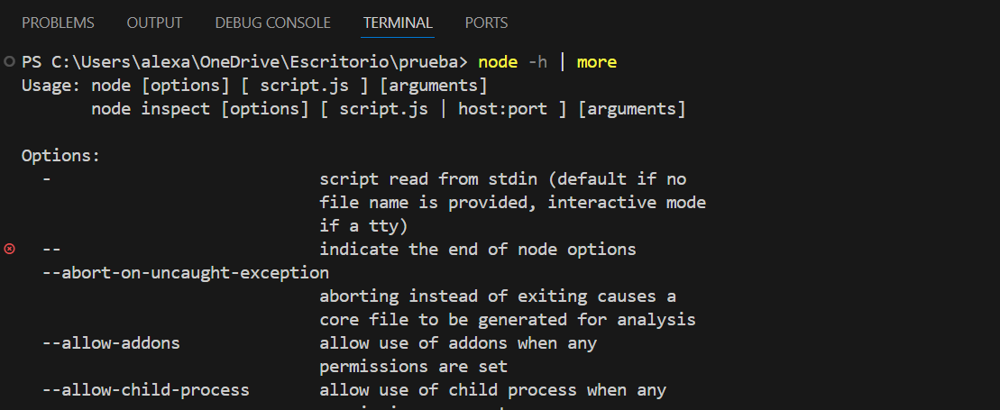
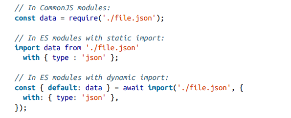
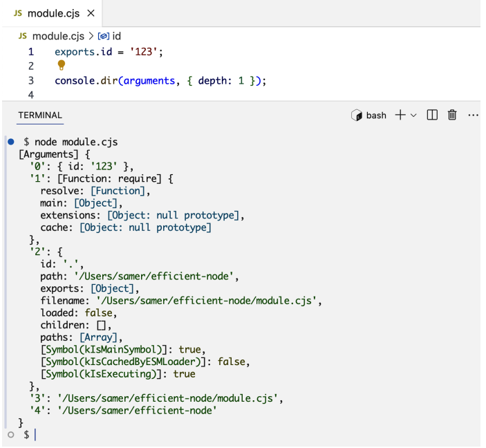
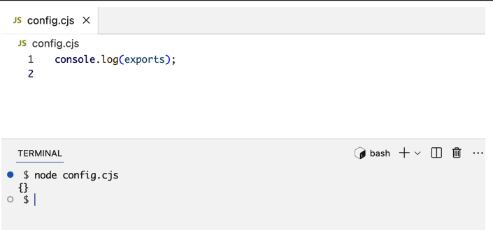
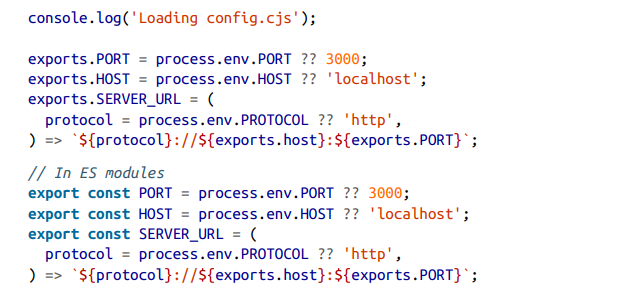
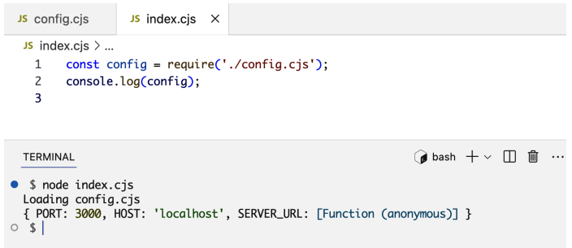
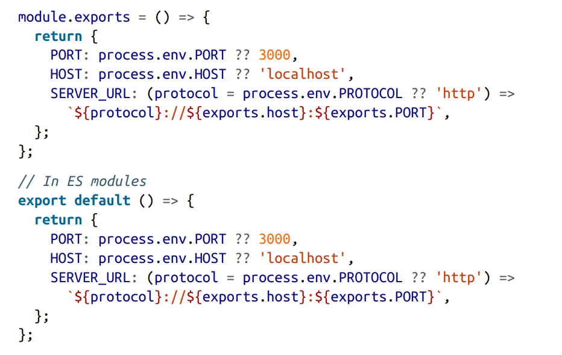
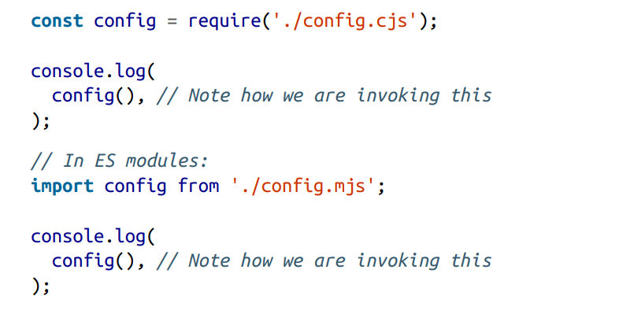
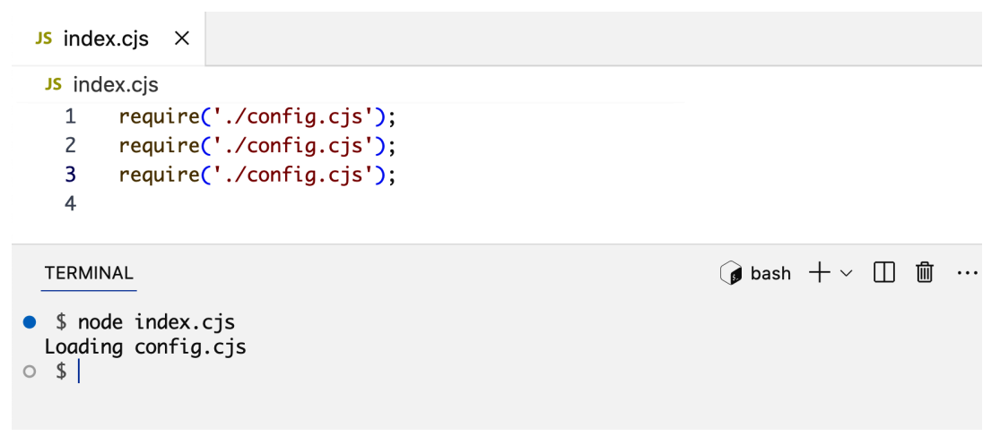

# Scripts and Modules
Es este capitulo aprenderemos como Node carga y ejecuta script y modulos, empezaremos explorando mas opciones, argumentos y entornos de variables que pueden ser usados con el comando `node` y aprenderemos mas acerca de que podemos hacer con una sesion `RELP`. Aprendemos los pasos a tomar para cargar y ejecutar un modulo

## Node CLI

El comando node tiene varios opciones para personalizar su comportamient. Tambien soporta argumentos y variables de entorno para mayor personalizacion y para transferir datos del entorno del Sistema Operativo al entorno de Node

Si escribirmo `node -h | more` Nos mostrara documentacion de ayuda para el comando.



Las dos primeras lineas especifican como usar el comando node. Todo lo que esta entre corchetes, es opcional lo que significa que, segun la primera linea, podemos usar el comando node por si solo, sin opciones ni argumento. Asi es como iniciamos una sesion RELP.

Un `REPL` es una consola interactiva donde escribes código y se ejecuta inmediatamente.
Significa: 

`R` → Read `E` → Eval `P` → Print `L` → Loop

En la pagina de ayuda justo despues de las lineas de uso, hay una lista de opciones que puedes usar con el comando. Dejame indicarte algunas opciones que deberias tener en cuenta.

## Options an Arguments
La opcion `--check` o `-c` revisa la __sintaxis__ del script de Node sin correr el script. Ejm. __node --check index.mjs__

La opcion `--eval` y `--print` o `-e` y `-p` ambas pueden ser usadas para excutar codigo directamente en la linea de comandos. Ejm. __node -p "Math.random()"__

la opcion `--watch` permite monitorizar un archivo (y sus dependencias) para detectar cambios. Es util en entornos de desarrollo. Ejm __node --watch index.mjs__ Esto iniciara el servidor en modo de monitorizacion. Realiza un cambio en el archivo y observa como el comando node se reinicio automaticamente.


## Enviroment Variables
`process` es un objeto global que representa el programa de Node que se está ejecutando en el sistema operativo. Es como el puente entre tu código JavaScript y el sistema operativo. A través de process puedes acceder a cosas como: variables de entorno, argumentos de la terminal, versión de Node, sistema operativo, eventos del proceso.

`process.env` es una propiedad del objeto process que contiene todas las variables de entorno del sistema. Simplemente contiene pares clave-valor que vienen del sistema operativo. Es básicamente un objeto así:
```js
{
  PORT: "3000",
  API_KEY: "abc123",
  API_KEY_1: "xyz789"
}
```
Node no interpreta el significado, solo guarda los valores. 
`process.env` realmente viene del sistema operativo (Linux, Windows, etc.), no de Node. Node simplemente lo expone a JavaScript.

Como crearlas, en la linea de comandos pon:
```sh
$env:PORT=4000
```
Las variables de entorno se usan para guardar configuración sensible o dependiente del entorno.
```sh
PORT
API_KEY
DATABASE_URL
JWT_SECRET
EMAIL_PASSWORD
```
### UN MEJOR CONTEXTO
Ok, vamos a ponerlo todo en perspectiva. Voy a explicarlo como un flujo natural, para que veas la relación entre __Node, process y el sistema operativo__ (SO) y por qué existe.

1️⃣ El SO y los procesos

Cada vez que ejecutas un programa, el sistema operativo crea un “proceso”.

- Un proceso es básicamente un contenedor donde se ejecuta tu programa: tiene memoria, acceso a archivos, variables de entorno, y puede comunicarse con hardware o red.
- El SO controla y regula esos procesos: quién puede leer qué, cuándo se detiene, qué recursos usa.

2️⃣ Node.js como intermediario

Node.js es un entorno de ejecución para JavaScript que corre fuera del navegador.

- Cuando haces node app.js, __Node arranca su propio proceso dentro del SO__.
- Node toma ese contenedor y le pone a tu disposición herramientas para interactuar con él.
- Una de esas herramientas es `process`.

💡 Piensa en Node como un traductor entre tu código JS y el sistema operativo.

3️⃣ Qué hace `process`

`process` es la interfaz de Node para tu proceso dentro del SO. Gracias a él puedes:

1 Leer variables de entorno:
- El SO las define, Node te permite verlas desde JS (process.env).
- Objetivo: que tu app pueda adaptarse al entorno sin tocar código.

2 Acceder a información del proceso:
- PID (process.pid), directorio actual (process.cwd()), plataforma (process.platform).
- Objetivo: hacer que tu app pueda comportarse diferente según dónde corre o ser monitorizada.

3 Controlar la ejecución:
- Salir del programa (process.exit()), escuchar eventos (process.on(...)).
- Objetivo: manejar errores, cierres ordenados, señales del SO.

4️⃣ Cómo puede process acceder al SO

- Node se comunica directamente con el núcleo del SO a través de su runtime escrito en C/C++ (el motor V8 y librerías internas).
- Cuando llamas a process.env.PORT, Node le pide al SO: “dame la variable de entorno PORT para este proceso”.
- Cuando llamas a process.exit(1), Node le dice al SO: “termina este proceso con código 1”.

Es decir, `process` es tu puerta de entrada programática al entorno del SO, pero siempre a través de Node, que actúa como traductor y garante de seguridad.

5️⃣ Para qué sirve esto

- Portabilidad: tu app puede correr en Windows, Linux o macOS sin cambios, porque Node traduce las diferencias del SO.
- Configuración flexible: variables de entorno, argumentos de línea de comandos, directorios, etc.
- Control y monitorización: puedes manejar errores, reinicios y señales externas de manera programática.
- Seguridad: no accedes al SO directamente, Node protege y regula el acceso.
### PREGUNTAS Y RESPUESTAS  
__¿Cuando declaro una variable en ``process.evn`` esta declaracion se hace a nivel de sistema operativo ?__

No exactamente, aunque es fácil confundirse porque process.env se siente como “el sistema operativo dentro de Node”. Te explico con claridad:

Cuando haces algo como:
``` JS
process.env.MI_VAR = "valor";
```

- __Esto no cambia el sistema operativo__ ni sus variables de entorno globales de manera permanente.
- __Lo que estás haciendo es modificar el objeto__ `env` __que Node.js creó al arrancar__. Ese objeto es una copia de las variables de entorno que el SO tenía en el momento de ejecutar Node.
- Cualquier cambio que hagas en` process.env` __solo vive dentro del proceso de Node__ y se pierde cuando el programa termina. Otros programas o terminales no verán ese valor.

__¿Puedo leer desde una aplicacion en Node.js una variable de entorno que pertenece a otra aplicación (como Netflix) instalada en mi mismo ordenador, asumiendo que ambas corren por separado y no comparten código ni configuración?__

Ah, aquí hay que ser muy preciso: ❌ No puedes simplemente “espiar” variables de otra aplicación que corre en tu SO si esa app no puso esa variable en el entorno de tu terminal o proceso de Node.

Lo que ocurre es esto:

- Cada aplicación corre en su propio proceso.
- Las variables de entorno son heredadas del SO al arrancar ese proceso.
- Node solo ve las variables de entorno del proceso que lo lanzó.

__¿Si Cada aplicación corre en su propio proceso, quiere decir que al principio no exisiten variables de entorno, si todavia no se ha definido niguna ?__

Exactamente, vas por buen camino. 🌱

Al arrancar un sistema operativo recién iniciado, no hay variables de entorno “mágicas” definidas aún. Lo que ocurre es:

- __El SO sí tiene un conjunto base de variables internas__, como `PATH`, `HOME` (Linux/macOS) o SystemRoot (Windows). Son definidas por el propio sistema y por los programas que se cargan al iniciar.
- Cada proceso que se ejecute hereda una copia de esas variables del entorno del proceso padre (por ejemplo, tu terminal o el gestor de inicio).
- Si no se define ninguna variable extra, `process.env` de Node verá solo esas básicas que el SO y tu terminal le pasaron.

En otras palabras: las variables de entorno “no existen” hasta que algún proceso las define o el SO las proporciona. Cada proceso tiene su propia copia y puede modificarlas solo dentro de sí mismo.

## Node Modules
La palabra modulo es una pieza reutilizable de codigo. Lo puedes incluir para un aplicacion la veces que necesites. Cuando especificas un modulo como dependencia Node realiza algunos pasos para completar el proceso de carga del modulo: contenido del modulo, aislamiento del ambito del modulo , ejecucion del contenido del modulo y almacenamiento en cache del modulo.

## Resolving Modules
Node usa el siguiente proceso para determinar como encontrar un modulo que se esta importado.

Si el nombre del modulo no empieza con `.`(que indica una ruta relativa) o una `/`(que indica una ruta absoluta), Node comprobara primero si se trata de un modulo integrado. Si lo es, lo cargar y ejecutara directamente.

Si el modulo no esta integrado, Node buscara en la carpeta _node_modules_, comenzado desde la ubicacion donde se encuentra el modulo que lo importa y ascendiendo en la jerarquia de carpetas sucesivamente hasta llegar a la raiz.

Si el modulo importado comienza con `./ o `/` Node lo buscara en la carpeta o archivo especificado por la ruta relativa oabsoluta.

Si necesitas solo resolver el modulo y no ejecutarlo, puedes usar la funcion `require.resolve()` par modulos de CommondJS o la funcion `import.meta.resolve()` para modulos ES. Estas funciones no cargan el modulo, solo verifican si existen, si no, lanzan un error.

## Loading Modules
Una vez la ruta del modulo se resuelve, Node determinara el cotenido y determinara su tipo.

Un modulo puede ser un modulo CommondJS on un modulo ES. Las extensiones de archivos permitidos son `.js` `.cjs` `.mjs`. Puede ser un unico archivo o un directorio con un archivo package.json que  especifique que archivos del directorio puede importar.

Un archivo JSON tambien puede ser un modulo. Cuando importas un archivo JSON obtienes un objeto JavaScrip que representa esos datos en el archivo JSON.



> La palabra clave __with__ se usa para especificar el  atributo de _importacion de tipo_ indica como se debe cargar un modulo en tiempo de ejecucion. Estandar para evitar que se ejecute codigo malicioso. tambien se puede utilizar con otro tipos de modulos. Por ejemplo un modulo "css" en un navegador.

## Scoping Modules
CommonJS es el sistema de módulos histórico utilizado por Node.js. En este modelo, cada archivo se trata como un módulo independiente que se ejecuta dentro de una función interna creada por el entorno. Esa función proporciona variables especiales como exports, require, module, __filename y __dirname, lo que permite que el código tenga un ámbito privado y que el desarrollador decida explícitamente qué parte del módulo quiere exponer. Los módulos se cargan dinámicamente durante la ejecución del programa, lo que significa que las dependencias se resuelven cuando el código llega al punto donde se solicita otro módulo.

__Node envuelve tu archivo dentro de una función__. Algo parecido a esto:
```js
(function(exports, require, module, __filename, __dirname) {

  // TU CÓDIGO AQUÍ

});
```
> Estos cinco argumentos implícitos son (en orden): __exports__, __require__, __module__, ____filename__ y ____dirname__. Cuando los usas dentro de un módulo CommonJS, no estás usando una variable global, sino un argumento de la función envolvente implícita. Node unicamente devuelve `modules.export` Todo lo demás queda privado dentro del scope del __wrapper__. Esto permite encapsulación, que es una idea central de la ingeniería de software.



ECMAScript Modules es el sistema de módulos moderno y estandarizado del lenguaje JavaScript. A diferencia de CommonJS, __no utiliza una función wrapper__ ni define variables como __exports o require__. En su lugar, ESM se basa en __importaciones y exportaciones declarativas.__
```js
// math.mjs
export function suma(a,b){
  return a+b
}
```
```js
import { suma } from "./math.mjs"
console.log(suma(2,3))
```
## Executing Modules
Este es el paso donde Node ejecutara el codigo en un modulo y finalizara sus dependencias y exportaciones. Una practica practica muy comun de codificar es colocar cualquier __variable configurable__ que se use para inicializar o ejecutar una aplicacion en sus propios modulos. Un ejemplo de tales variables configurable son el PUERTO y el HOST en el que se ejecutara el servidor web. Crearemos un archivo config.cjs para alojar estas dos variables configurables. Este modulo tendra cinco argumentos implicitos.

Como se puede ver el argumento __exports__ comenzará como un objeto vacío.



Para configurar la API del modulo  _config.cjs_ definimos las propiedades en el __objeto export__. la spropiedades pueden ser valores estaticos o cualquier objerto de JavaScript (como una funcion, clase, promesa):



Ahora usamos las variables __process.evn__ para personalizar la configuracion en diferentes entornos. Tambien se creo una funcion __SERVER_URL__  que recive como argumento un protocolo.

Cuando importamos el modulo _config.cjs_ la funcion __require()__ devuelve el objeto __exports__. Ahora podemos decir que _index.js_ depende de _config.cjs_. De ahí proviene el término «gestión de dependencias». En este caso, gestionamos las dependencias de un módulo y adaptamos la API de un módulo para utilizarla en otro.

> _API de módulo (programación): Es lo que un módulo o librería expone para que otro código lo use, normalmente funciones, objetos o métodos. Es comunicación dentro del mismo programa. Por ejemplo, en Node.js lo que se exporta con exports o module.exports es la API del módulo._

> _API de internet (Web API): Es un conjunto de endpoints accesibles por red (normalmente HTTP) que permite que diferentes aplicaciones se comuniquen entre sí. En lugar de funciones, se usan URLs y peticiones para enviar y recibir datos._

Diferencia clave:
`API de módulo` → comunicación entre partes de un mismo programa.
`API web` → comunicación entre programas a través de internet.



El argumento `exports` en los módulos CommonJS es, en realidad, un alias de `module.exports`. Este último es lo que se devuelve cuando invocamos la función `require`.

En algunos casos, es posible que necesites que el objeto de la API sea una función o una clase. En estos casos, tendrás que cambiar el valor de `module.exports` para definir tu API especial.

Por ejemplo, supongamos que queremos que todas las propiedades de configuración sean el resultado de la ejecución de una función. Esto podría resultar útil para las pruebas, ya que podemos simular la función de configuración de forma diferente para cada prueba. 



Por lo tanto, para utilizar el valor de configuración en index.cjs, tendremos que invocar lo que obtenemos de la función `require`:



Este método suele resultar útil cuando se necesita utilizar el patrón de diseño de _«inyección de dependencias»_, es decir, cuando se inyectan algunos módulos en otros para ganar flexibilidad y hacer que los módulos sean más reutilizables.

## Caching Modules
Para enteder otro concepto de como Node trabaja con los modulos vamos repetir __require__ varias veces en index.cjs

Cuando ejecutemos index.cjs ¿cuántas veces aparecerá la línea «Loading config.cjs» ? La respuesta no es tres veces. Solo aparecerá una vez.

Tanto los módulos CommonJS como los módulos ES en Node se almacenan en caché tras la primera llamada. Un módulo se ejecuta la primera vez que se importa; luego, cuando se vuelve a importar, Node lo carga desde la caché.


## Summary
La CLI de Node cuenta con numerosas opciones potentes que podemos controlar. Podemos pasarle argumentos y configurar variables de entorno antes de ejecutarla. Ambas opciones nos permiten pasar datos del entorno del sistema operativo a un proceso de Node en ejecución. El objeto `process` de Node actúa como puente.

El modo REPL de Node es una buena forma de probar expresiones sencillas, explorar todo lo que se puede utilizar en Node y echar un vistazo rápido a la API de cualquier elemento, incluidos los módulos básicos, los módulos instalados e incluso los objetos que se instancian.

Los módulos CommonJS en Node se envuelven implícitamente en una función y se les pasan cinco argumentos. Los módulos ES también tienen un ámbito privado.

Utilizamos el objeto `exports` en los módulos CommonJS o las sentencias `export` en los módulos ES para definir la API de un módulo. Los módulos que dependen de otros módulos utilizan la función `require` o las sentencias `import` para acceder a la API de una dependencia.

Node gestiona una caché para todos los módulos. Para localizar un módulo, Node sigue un conjunto de reglas predefinidas en función de la ruta del módulo. Una ruta puede ser relativa, absoluta o simplemente un nombre. En este último caso, Node busca el módulo en las carpetas node_modules.

En el próximo capítulo, analizaremos en profundidad cómo gestiona Node las operaciones asíncronas y aprenderemos sobre la naturaleza basada en eventos de los módulos de Node.

