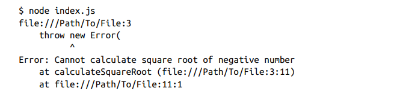

# Errors and Debugging
En Node los objetos error son importantes porque nos dan contexto y detalles de la existencia de problemas, buenos manejadores de errores hacen programas mas seguros.
Primero hablaremos del __lanzamientos(throwing)__ y __captura (catching)__  de errores y luego discutiremos los diferentes tipos de errores. Y cómo se ve el **manejo de errores en capas**. Entonces nosotros exploraremos **depurar código Node** y discutiremos algunas **medidas preventivas** que podemos usar para **reducir errores potenciales**.

## Throwing and Catching Errors
Un error es una instancia de un objeto de la clase `Error`. A veces necesitarás crear tus propios objetos de error, como este:
```js
const error = new Error("Error message")
```
Este es un objeto de error genérico, algo que nunca deberías usar. Hay una mejor opcion que lo discutiremos en breve. Node cuenta con integracion de errores que son basicamente objetos ya creados para ti. La siguiente seccion cubre eso.

**¿Qué exactamente haces con un objeto de error?** 

Bueno, **independientemente del tipo de error** y si **tú lo creaste** o es **integrado**, siempre que estés en un lugar del código donde **una condición no debería ocurrir**, necesitas **señalar los detalles de ese problema** a quien sea que esté usando tu código.

Por ejemplo, supongamos que queremos crear una función para calcular la **raíz cuadrada** de un número. Una restricción que debería tener dicha función es **bloquear cualquier operación** que intente usar la función con un **número negativo**, ya que **no existe raíz cuadrada para un número negativo**.

Ese caso es un **error de entrada del usuario** que **se espera**, y si ocurre, la función debería **proporcionar una señal** de que se está usando incorrectamente. 

Una forma simple de hacer esto es **lanzando un error** con `throw`:

```js linenums="1"
function calculateSquareRoot(number) {
    if (number < 0) 
        throw new Error('Cannot calculate square root of negative number');
    return Math.sqrt(number);
}
calculateSquareRoot(-1);
// Error: Cannot calculate square root of negative number
```
<<<<<<< HEAD

Si se produce un error, la operación actual se detendrá por completo. Al producirse cualquier error en Node, el proceso se bloqueará y finalizará. Esto es lo que sucede al ejecutar este código:



Esto puede parecer incorrecto. ¿Por qué bloquear una aplicación completa debido a un simple uso erróneo de una sola función?


Verificar la informacion que ingresa a la aplicacion por medio de lanzamiento de errores es vital  para la integridada de la aplicacion. Ignorar los errores pueden generar vulnerabilidades de seguridad y ser utilizados como puntos de ataques.

En tus módulos principales, siempre debes generar errores cuando te encuentres en una condición que indique un problema.
=======
**Lanzar un error** hará que la **operación actual se detenga completamente**. Cuando **lanzas errores en Node**, el **proceso se colapsará y saldrá**. 

Aquí está lo que sucede cuando **ejecutamos este código**:


Esto **puede sentirse mal**. ¿Por qué **colapsar toda una aplicación** por un **simple uso incorrecto de una sola función**?

>>>>>>> 5f0563c (update files)

La respuesta simple aquí es que es un **problema que no debería ser ignorado** y que **debe manejarse de alguna forma**.  **Ignorar errores** podría llevar a **consecuencias no deseadas** y compromete la **integridad de la aplicación**. Una función que se llama con la **entrada incorrecta** podría tener **datos incorrectos propagados** a través de toda la aplicación. **Eso realmente no es bueno**. En algunos casos, incluso podría causar una **vulnerabilidad de seguridad**. En este simple ejemplo, una **entrada no validada** podría ser el camino para un **ataque explotador** contra la aplicación.

Para **errores relacionados con el entorno de la aplicación**, no manejarlos podría llevar a **fugas** y **agotamiento potencial de recursos del sistema**. **Es demasiado riesgoso** ignorar cualquier error. En tus **módulos principales**, siempre debes **lanzar errores** cuando estés en una condición que signifique un problema. Es tu **señal** de que un problema debe ser **reconocido y manejado apropiadamente** o hacer que la **aplicación colapse**.

Ahora, los **módulos que usan tus módulos principales** podrían hacer una **excepción para ciertos errores**. Por ejemplo, un módulo que usa tu función `calculateSquareRoot` podría decidir **implementar una excepción** para cuando la función se llame con un **número negativo**. Eso se puede hacer **capturando el error**.

Siempre que escribas código que **use otro código** (como llamar a una función), debes **siempre recordar** que ese otro código **podría lanzar errores**. Como **usuario de ese código**, puedes decidir **qué hacer con esos errores**. Lo haces **capturando el error** y **manejándolo de alguna forma**.

Por ejemplo, supongamos que decidiste que cuando `calculateSquareRoot` se llame con un **número negativo**, solo debe **imprimir una advertencia**, no salir de toda la aplicación. **Así es como lo haces**:
```js linenums="1"
try {
 let result = calculateSquareRoot(-1);
} catch (error) {
 console.error(error.message);
}
```
Porque la llamada está envuelta en un **try...catch**, y el bloque **catch** solo **imprime el error en la consola**, usar este código y llamar a `calculateSquareRoot` con un **número negativo** **no rompera el proceso**. Este error ahora es una **excepción manejada**.

El problema es que la **excepción manejada** aquí no es solo el error por un **argumento de número negativo**. Es **cualquier error** dentro de la función `calculateSquareRoot`.  Si la función lanza **cualquier otro error**, todos serán **capturados por el try...catch** e **ignorados en este nivel** también. Deberíamos hacer excepciones **solo para los errores que conocemos**. **Cualquier error desconocido** debería aun ser **lanzado**.

??? note

    El texto original dice:

    > "Si la función lanza cualquier otro error, todos serán capturados por el try...catch e **ignorados** en este nivel también."

    La palabra "ignorados" aquí es confusa porque suena como si el error simplemente no se detectara. Pero en realidad sí se detecta — el `catch` lo atrapa. El problema es lo que pasa **después** de que lo atrapa.

    Como el `catch` no distingue entre errores, hace lo mismo con todos: El `catch` recibe cualquier error que ocurra dentro del `try`, pero solo sabe manejar el error que se tenía previsto — en este caso, "Número negativo". Si llega un error diferente, como un `TypeError` causado por un bug, el `catch` lo recibe sin saber qué hacer con él y ejecuta su código de todas formas, por lo tanto, el error queda ignorado — nunca se reporta, nunca se relanza, simplemente desaparece:

    ```javascript
    try {
    calculateSquareRoot(4);
    } catch (error) {
    return 0; // ← esto se ejecuta para CUALQUIER error
    }
    ```

    Ahora imagina que dentro de `calculateSquareRoot` hay un bug — por ejemplo, intentas llamar un método que no existe en un número:

    ```{ .javascript .annotate }
    function calculateSquareRoot(n) {
    if (n < 0) throw new Error("Número negativo"); //(1)!
    return n.toUpperCase(); // bug: los números no tienen toUpperCase 
    }
    ```

    1. Si el número es negativo, lanzamos un error manualmente.
   

    Eso lanza un `TypeError`. Un `TypeError` es el error que JavaScript lanza automáticamente cuando intentas hacer algo con un valor que no es compatible con esa operación — como llamar `.toUpperCase()` en un número, o acceder a una propiedad de `null`. No es un error que tú lanzaste con `throw`, sino uno que JavaScript mismo detectó porque algo en el código no tiene sentido.

    Entonces si llega ese `TypeError`, el `catch` lo recibe, ejecuta `return 0`, y el programa continúa. El `TypeError` nunca apareció en consola, nunca fue reportado, nunca fue relanzado. Simplemente entró al `catch` y desapareció. A eso se refiere con "ignorado" — no es que no se detectó, sino que **se detectó y se descartó sin hacer nada útil con él**.

    La solución es que dentro del `catch` preguntes si el error es el que tú conoces. Si no lo es, lo relanzas con `throw error`:

    ```javascript
    try {
    calculateSquareRoot(4);
    } catch (error) {
    if (error.message === "Número negativo") {
        return 0; // este lo conozco, lo manejo yo
    }
    throw error; // este no lo conozco, lo relanza
    }
    ```
    
    Cuando haces `throw error`, el error **sale del `catch` y sube un nivel** — es decir, va al `try...catch` que esté por encima de este en el código. Si no hay ninguno, el programa crashea y el error aparece en consola. Eso es exactamente lo que quieres, porque significa que hay un bug real que necesitas ver y arreglar. El error ya no queda "ignorado".

    ---

    Por eso una frase más clara que la del texto sería:

    > "Si la función lanza cualquier otro error — como un `TypeError` que JavaScript genera automáticamente cuando algo en el código no tiene sentido — todos serán capturados por el try...catch y **descartados silenciosamente, ocultando bugs reales. Por eso los errores desconocidos deben relanzarse con `throw error`, para que suban un nivel y no queden enterrados.**"


Para hacer eso, necesitamos una forma de **manejar el error condicionalmente**. Necesitamos **verificar el tipo de un error**. Hablemos de **los tipos de errores** a continuación.

## Types of Errors

Los distintos tipos de errores suelen tener diferentes estrategias de manejo. Conocer estos tipos y sus causas subyacentes ayuda a identificar qué ocurre cuando aparecen.
Los tipos de errores más importantes en Node son los __errores estándar(Standard Errors)__, __los errores del sistema(System Errors)__ y __los errores personalizados(Custom Errors)__. Analicemos algunos ejemplos.

### Standard Errors
Los errores estándar son errores integrados que proporciona JavaScript. El motor de JavaScript los genera cuando encuentra alguna condición inesperada que impide el funcionamiento normal del programa. Por ejemplo, cuando se utiliza una sintaxis incorrecta, se hace referencia a una variable antes de declararla o se utiliza una función de forma inválida.

Las principales clases de error estándar en JavaScript son:  __SyntaxError__, __ReferenceError__, __RangeError__, and __TypeError__ 

#### SyntaxError
Este es el tipo de error que se produce cuando intentamos ejecutar código que no es JavaScript válido. Lo obtenemos si usamos una palabra clave reservada, declaramos una variable con un nombre no válido, colocamos incorrectamente una coma, un corchete o un paréntesis, o hacemos cualquier otra cosa que no cumpla con las reglas sintácticas del lenguaje.

```bash
> console.log('Hello world';
console.log('Hello world';
 ^^^^^^^^^^^^^
// Uncaught SyntaxError: missing ) after argument list
>
```

#### ReferenceError
Este es el tipo de error que se lanza cuando intentas usar una **variable que no ha sido declarada** o **no está en el scope actual**:
```js
console.log(x);
// Uncaught ReferenceError: x is not defined
let x = 5;
```
#### RangeError
Este es el tipo de error que se lanza cuando intentas usar un **valor que no está dentro del rango permitido** impuesto por un **límite de implementación** o un **límite de memoria** —por ejemplo, si usas un método con un argumento que **no está dentro del rango aceptado**:

```js
(123.456).toFixed(101); // (1)!
 // Uncaught RangeError: toFixed() digits argument
 // must be between 0 and 100
```

1. `toFixed()` solo acepta argumentos entre 0 y 100. Si pasas 101, JavaScript lanza un `RangeError` automáticamente.
   
Llama a una funcion recurciva sin una condicion exit() podria generar un RangeError
```js
function f() {
 f();
}
f(); // Uncaught RangeError: Maximum call stack size exceeded
```
#### TypeError
Este es el tipo de error que se lanza cuando intentas usar un valor de un tipo inesperado en cualquier lugar donde se espera un tipo específico. Por ejemplo, el método `thing.toUpperCase()` espera que `thing` sea una cadena de texto, pero si intentas usar ese método con un número, obtendrás un error de tipo.
```js
let thing = 42;
console.log(thing.toUpperCase());
// Uncaught TypeError: thing.toUpperCase is not a function
```

Otros ejemplos de TypeError incluyen intentar modificar una variable constante, acceder a propiedades de objetos nulos e indefinidos y usar la palabra clave `new` con funciones que no son constructoras, entre otros casos.

!!! note

    Estos son los **errores estándar más comunes**. Hay algunos más como **URIError**, que está relacionado con el manejo de URIs, y **EvalError**, que existe **solo por compatibilidad** y ya **no se lanza** por JavaScript moderno.

### System Errors

Los errores del sistema (System Errors) en Node se lanza cuando ocurre algo inesperado a nivel del sistema. Estos son basicamente los problemas que surgen debido al entorno y al sistema operativo donde se ejecuta una aplicación Node; por ejemplo, si se intenta leer o escribir en un archivo que no existe, usar un puerto de red que ya está en uso, enviar datos a través de un socket cerrado, etc.

Estos errores tienen códigos específicos que puedes consultar para entender por qué ocurren. Aquí tienes algunos códigos de error comunes del sistema:

`ENOENT`

:    Se lanza cuando tratas de acceder a un archivo o directorio que no existe.

`EACCES`

:   Se lanza cuando una operación no tiene los permisos adecuados. Por ejemplo, si intentamos escribir en un archivo de solo lectura.

`EADDRINUSE`

:   Se lanza cuando un servidor HTTP (o TCP) no se inicia porque la dirección que intenta usar ya está en uso.

`ECONNREFUSED`

:   Se produce cuando se intenta establecer una conexión con un servidor que no está en corriendo.

Otros **errores de sistema comunes** incluyen **ETIMEDOUT** (operación expiró), **ECONNRESET** (conexión reiniciada por el peer), **ENOTFOUND** (entidad no encontrada), **EPERM** (operación no permitida), y muchos más. Si el **código de error** se ve como **ESOMETHING**, usualmente es un **código de error de sistema**. 
Puedes ver la **lista completa de errores de sistema** usando `os.constants.errno`, como se muestra en la **Figura 4-1**.


!!! tip

    Estos **códigos de error de sistema** son **códigos POSIX**. **POSIX** (**Portable Operating System Interface**) es un **conjunto de estándares** (basados en el SO **Unix**) que se usan para **mantener la compatibilidad** entre **diferentes sistemas operativos**.

### Custom Errors

Los custom error en Node son errores generados por ti, el desarrollador para manejar espcificas condiciones y escenarios de tu codigo. El error que lanzamos para la **raíz cuadrada de un número negativo** es un **error personalizado genérico**.

!!! tip
    Custom errors are also known as user-specified errors (user in this
    case refers to the developer, not the end user of the application).

Trabajarás **la mayor parte de tiempo con errores personalizados** que con otros tipos. Los creamos para **manejo de errores específico** y para **agregar contexto adicional** o propiedades relevantes a la lógica de nuestra aplicación. Por ejemplo, un **custom `UserNotFoundError`** podría usarse cuando algo intenta acceder al registro de un usuario que **no está en el sistema**, o un **`TransactionFailedError`** podría lanzarse cuando una transacción **falla al completarse exitosamente**. **No es raro** que una aplicación Node tenga **decenas, si no cientos**, de errores personalizados.

Aunque una **instancia genérica de la clase Error** es un **error personalizado**, deberías **dar a tus errores personalizados sus propias clasificaciones**.  Podemos hacer eso **extendiendo la clase Error**, y luego **instanciando objetos** de esa clase extendida:

```js linenums="1"
class ValidationError extends Error {
 constructor(message, fieldName) {
 super(message);
 this.name = 'ValidationError';
 this.fieldName = fieldName;
 }
}
// To use:
// throw new ValidationError('Some message', 'some_field');
```
Esta clase ValidationError personalizada se puede usar para lanzar un error específico cuando estes validando algo. Por ejemplo, si necesita asegurarse de que un objeto de usuario tenga un campo de nombre de usuario, puede generar este error si no lo tiene:

```js linenums="1"
function validateUser(user) {
 if (!user.username) {
 throw new ValidationError('Username is required', 'username');
 }
}
```
Nota cómo el error es **específico y útil**; cuando se lanza, **sabremos exactamente por qué ocurrió**, y podremos obtener los **detalles útiles** que están empaquetados en él.  Aquí hay **otro ejemplo**:

```js linenums="1"
try {
 validateUser({}); // An empty object is not a valid user object
} catch (error) {
 if (error instanceof ValidationError) { // (1)!
    console.error(`Error in field '${error.fieldName}': ${error.message}`)
 } else { // (2)!
    console.error(`Unexpected error: ${error.message}`);
    throw error;
 }
}
```

1.  ` error instanceof ValidationError` valida si el error fue creado con tu clase específica.
2.  Cualquier otro error en el runtime, __lo vuelve a lanzar para no ocultarlo silenciosamente__

!!! tip

    **Mantén la extensión de la clase Error a un solo nivel**, y **no crees un árbol de errores**. Si tu código está dividido en **diferentes estructuras** (dominio, api, app, etc.), puedes **categorizar tus errores** en **diferentes módulos** bajo estas estructuras. **No importa cómo organices tus errores personalizados**, ¡**sé lo más detallado posible al nombrarlos**! 

    ¿Hay una condición donde **no se puede establecer una conexión a la base de datos**? Lanza un **`DatabaseConnectionError`**. 

    ¿Hay una condición donde **no se pudo encontrar el registro de un usuario** usando un ID único? Lanza un **`CouldNotFindUserFromIdError`**. 

    Fijate cómo usé **nombres basados en sustantivos** y **basados en verbos** en estos dos ejemplos. **Elige el que prefieras**.

Observe cómo en este ejemplo, después de crear la excepción para el error conocido y esperado, se vuelven a lanzar todos los demás errores. Esto es muy importante, así que hablaremos de ello en la siguiente sección.

!!! info "Assertion Errors"

    Otra **categoría de errores** en Node son los **errores de afirmación** (**assertion errors**). Son **errores específicos** usados principalmente en **entornos de testing y desarrollo**.  Se usan normalmente cuando el código **espera que algo sea verdadero** pero lo encuentra **falso**. 

    Los **errores de afirmación** también se usan comúnmente para **escribir tests** y cuando **depurando y validando suposiciones** durante el desarrollo. Si una **afirmación falla** en cualquier lugar del código, significa que *probablemente hay un bug** o un **malentendido** que lleva hasta ese punto de falla, que necesita ser abordado **antes de lanzar cualquier cambio de código**.

    Los **errores de afirmación** en Node se lanzan usando el **módulo `assert`**, que proporciona un **conjunto simple de pruebas de afirmación** como las siguientes:

    - **`assert(value[, message])`**  
    ¿Es el valor verdadero?

    - **`assert.equal(actual, expected[, message])`**  
    ¿El valor actual es igual al valor esperado?

    - **`assert.doesNotMatch(string, regexp[, message])`**  
    ¿El valor string coincide con el patrón regexp?

    Cuando se llama a un **método de afirmación**, evalúa su **condición específica**. Si la **condición no se cumple**, el método de afirmación lanza un **`AssertionError`** que detalla la naturaleza del fallo. 

    Si la condición **se cumple**, el programa continúa la ejecución normalmente. 

    Hay **muchos otros métodos de afirmación** para varias condiciones. Consulta la **página de documentación de Node** para el módulo `assert`. 

    Veremos ejemplos de cómo usar este módulo en el **Capítulo 8**.

## Layered Error Management

Supongamos que tienes **módulos A, B y C**, donde el **módulo B usa el módulo A**, y el **módulo C usa el módulo B**. Cuando pensamos en **gestión de errores**, necesitas recordar este tipo de **estructura en capas**. 

Con el entendimiento de **tipos de errores** y cómo crear **objetos de error personalizados**, ahora podemos **lanzar errores distintos** para **distintas condiciones** y darle a las **capas superiores** que usan nuestros módulos principales la oportunidad de **hacer excepciones** para estos errores específicos. 

Sin embargo, **después de hacer estas excepciones**, un bloque `catch` **siempre debería terminar** con una llamada `throw error` para **relanzar cualquier error desconocido**:

```js linenums="1"
try {
 // Some code that might throw multiple types of errors
} catch (error) {
 if (error instanceof KnownErrorType) {
 // Handle specific known error
 } else if (error instanceof AnotherKnownErrorType) {
 // Handle another specific known error
 } else {
 // Log and rethrow unknown errors
 console.log('Encountered an unexpected error: ', error);
 throw error;
 }
}

```

Si no reenviamos el objeto de error (que se desconoce una vez que se han gestionado las excepciones conocidas), lo estaríamos ignorando sin más y haciendo que la aplicación se ejecutara en un estado inestable o incorrecto, sin indicar (a todas las capas superiores) que algo ha fallado en esta capa. Esto también complica mucho la depuración de problemas, ya que se perdería el contexto del error.

Al volver a lanzar el error, lo propagas a las capas superiores. No volver a lanzar el error equivale, básicamente, a ocultarlo a las capas superiores.

Existe otra forma de gestionar los errores. En lugar de lanzarlos, podemos pasarlos a otras partes de la aplicación que utilizan nuestros módulos principales y dejar que cualquiera de estas partes los gestionen o los reenvíen de nuevo

El método de reenvío de errores es comunmente utilizado en la programación asíncrona y basada en eventos, donde un error que se produce en una función no se gestiona inmediatamente dentro de esa función, sino que se envía junto con cualquier dato a la siguiente función de la secuencia.

`El estilo de callback «error-first»` que se discutido en el capítulo 3 es, básicamente, una forma de realizar el reenvío de errores. Cuando se produce un error dentro de una función, este se empaqueta y se pasa como primer argumento al siguiente callback. Esto permite que la siguiente función de la secuencia
compruebe si hay algún error y decida cómo gestionarlo:

```js linenums="1"
function fetchData(callback) {
    getSomeDataFromAnAPI((err, data) => {
    if (err) {
        callback(err); // Forwarding the error to the callback
        return;
    }
    callback(null, data); // No error occurred, continue as normal
  });
}
fetchData((err, data) => {
    if (err) {
    console.log('Error fetching data: ', err);
    return;
 }
 console.log('Data received: ', data);
});

```
`Las funciones basadas en promesas` son otra forma de reenviar errores. Un error dentro de la implementación de la promesa se reenvía mediante el método `reject`:

``` js linenums="1"
function fetchData() {
  return new Promise((resolve, reject) => { // (1)!
     getSomeDataFromAnAPI((err, data) => {
     if (err) {
        reject(err); // Forwarding the error through rejection
     } else {
        resolve(data); // Resolving the promise if no error
     }
    });
 });
}
fetchData().then((data) => {
  console.log('Data received: ', data);
 })
 .catch((err) => {
 console.log('Error fetching data: ', err);
 });
```

1. En `promise` se usa el `then()` obtener al promesa resuelta y el `catch()` para capturar los errores. 

Sin embargo, **no necesitamos promesas ni callbacks** para implementar el reenvío de errores. Podemos hacerlo simplemente haciendo que las **funciones devuelvan** ya sea **datos (éxito)** o **error (fracaso)**, o incluso **ambos** (éxito parcial). Esto se puede hacer **unificando el retorno en un objeto** con una **propiedad de error** y **datos**, o usando un **enfoque más simple** de devolver ya sea un **objeto de datos** o un **objeto de error**. Esto último es un poco complicado, ya que cada función tendría que devolver dos tipos diferentes. Recomendaría este último enfoque solo si el proyecto Node utiliza TypeScript, que añade tipado estático a JavaScript. En el capítulo 10 veremos los conceptos básicos de TypeScript para Node.

Aquí tienes un **ejemplo de una función** que unifica el retorno en un objeto:

```js linenums="1"
function fetchData() {
 try {
    let data = getSomeData();
    return { error: null, data: data };
 } catch (error) {
    return { error: error, data: null };
 }
}

const result = fetchData();
if (result.error) {
    console.log('Error fetching data:', result.error);
} else {
    console.log(result.data);
}
```
El **reenvío de errores** puede usarse para mantener un **flujo limpio y predecible** tanto de **datos y errores** a través de las operaciones de la aplicación. 

Sin embargo, **todas las partes de la aplicación** necesitan **manejar los errores o reenviarlos**, del mismo modo, sin reenvío de errores, cada parte de la aplicacion necesita **manejarlos o lanzarlos**. La **gestión de errores** debe ser un **estilo que se aplique en toda la aplicación**.

## Debugging in Node