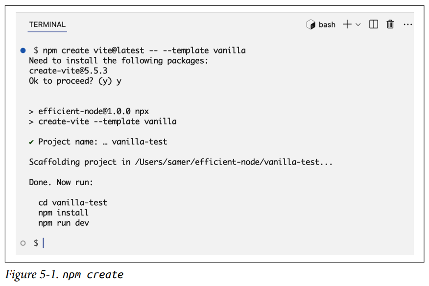
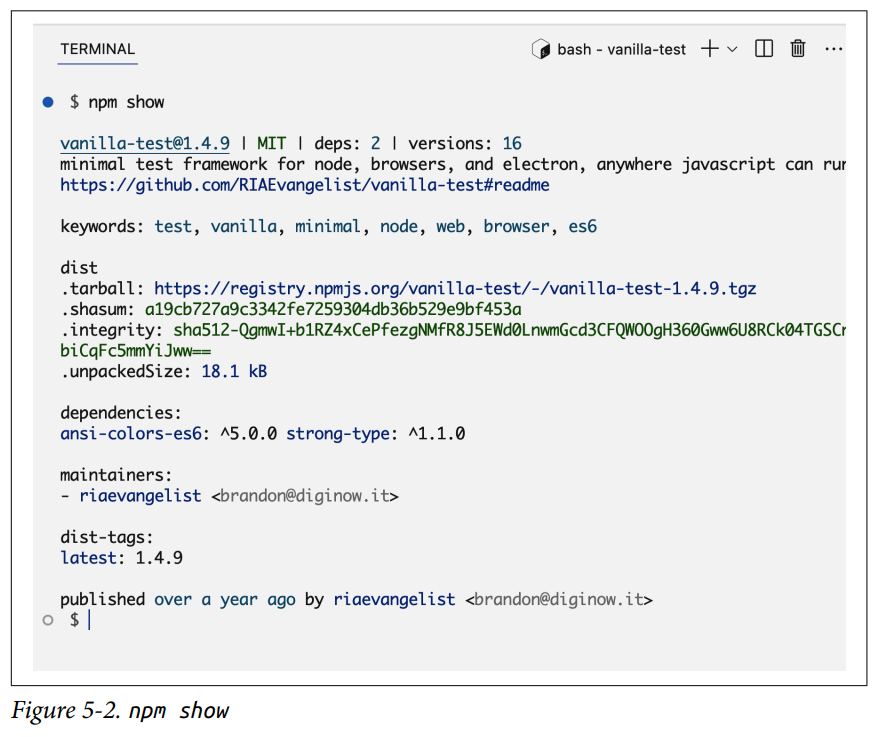
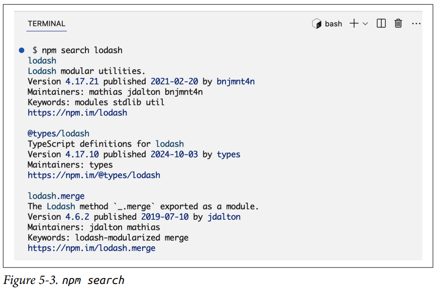
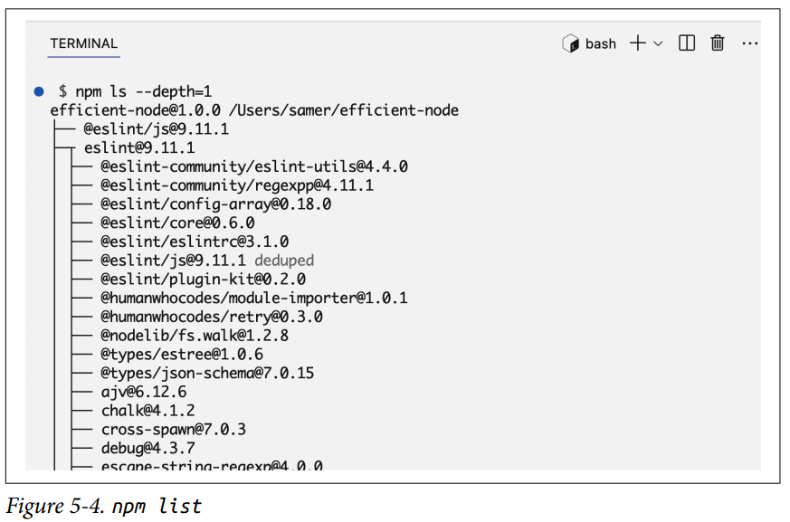
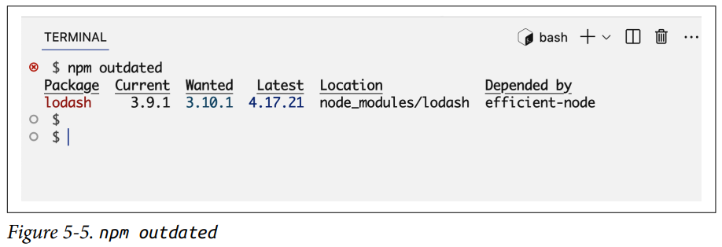
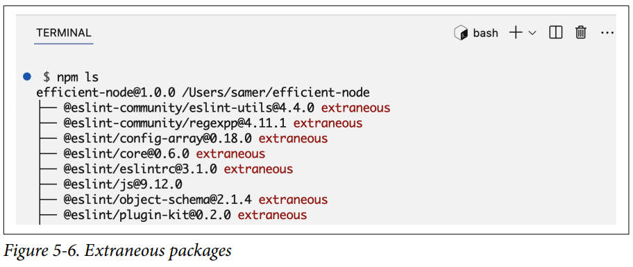
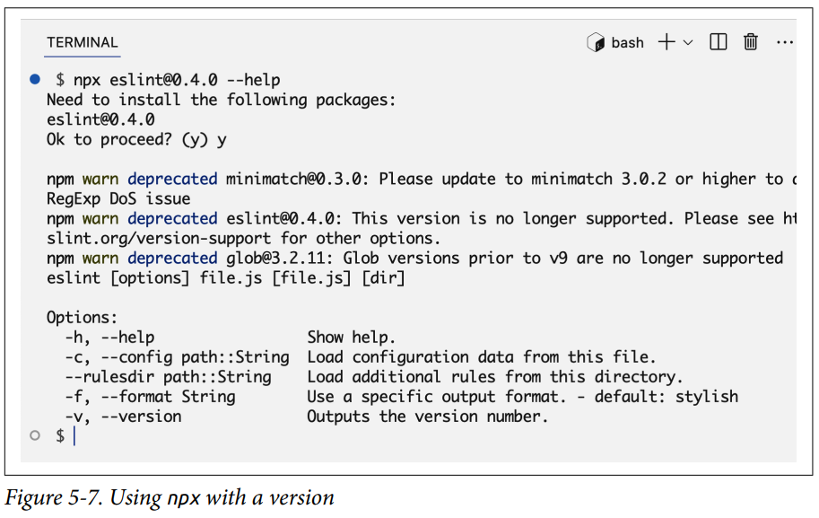

# Administrador de Paquetes

En el Capítulo 1, aprendimos brevemente sobre el gestor de paquetes predeterminado de Node, npm. Ahora es el momento de profundizar y sentirnos cómodos encontrando, usando y creando paquetes para Node.

El término **paquete** es lo que el mundo del software usa para describir una carpeta que contiene código. En Node, esa carpeta también tendrá un archivo `package.json` que describe los metadatos y las dependencias del paquete.

El término **módulo** se refiere a un solo archivo o una colección de archivos relacionados que encapsulan un conjunto de funcionalidades. Los módulos permiten a los desarrolladores organizar su código en unidades separadas y reutilizables. Un paquete Node a menudo representa un solo módulo Node, pero algunos paquetes tienen más de un módulo.

Un paquete usualmente se refiere a código externo del que un proyecto depende, pero creo que una mejor palabra para describir el código de un paquete es **genérico**. Puedes hacer que partes de tu propio código sean genéricas y extraerlas en un paquete que luego puedas usar en muchos proyectos.

---

## Introducción a la Gestión de Paquetes

Si los paquetes son solo carpetas, ¿por qué exactamente necesitamos un gestor de paquetes para ellos? Mantener el rastro de estas carpetas de paquetes se vuelve un desafío cuando hay muchas y cuando estos paquetes dependen de otros paquetes. Esto es especialmente cierto para un equipo de desarrolladores trabajando en el mismo proyecto Node. Las herramientas de gestión de paquetes proporcionan un enfoque simplificado y sistémico para manejar las tareas comunes relacionadas con los paquetes. Proporcionan comandos simples para instalar, actualizar y eliminar paquetes, y para asegurar que un proyecto tenga exactamente lo que necesita para funcionar correctamente y de manera similar en todas las máquinas que lo ejecutan.

Más importante aún, las herramientas de gestión de paquetes pueden gestionar cualquier conflicto entre todas las dependencias en el proyecto, a las que generalmente se les llama el **árbol de dependencias**. Es un árbol porque un proyecto tiene una lista principal de dependencias, y estas dependencias principales tienen sus propias dependencias, y así sucesivamente. El término **dependencia transitiva** se usa a menudo para referirse a todas las dependencias en un proyecto que están más allá del primer nivel del árbol de dependencias.

!!! note

    La herramienta npm ha sido durante mucho tiempo la predeterminada para gestionar paquetes y sus dependencias en proyectos Node, pero hoy en día existen algunas alternativas, como Yarn, pnpm y JSR. Estas alternativas a npm tienen sus características y ventajas únicas. A menudo ofrecen mejoras en rendimiento, uso de espacio en disco y gestión de versiones. Esta competencia saludable ha impulsado a npm a mejorar también. En este libro solo cubrimos npm, pero podrías terminar usando un gestor de paquetes diferente. Los conceptos básicos de la gestión de paquetes son todos similares, pero las interfaces de comandos y lo que sucede detrás de escena son un poco diferentes.

El término npm se usa principalmente para referirse al CLI (comando `npm`) que viene con Node y proporciona herramientas para gestionar paquetes Node. También está el sitio web de npm, que aloja el registro público de muchos paquetes npm de código abierto. El registro de npm es como un gran almacén lleno de paquetes JavaScript, ofreciendo muchas opciones para características y funcionalidades comunes que podrías necesitar agregar a tus proyectos.

Por ejemplo, si necesitas que tu proyecto maneje solicitudes web, maneje web sockets o se conecte a una base de datos, no necesitas construir estas características desde cero o lidiar con código de bajo nivel. Puedes descargar y usar soluciones genéricas ya preparadas y a menudo probadas en batalla desde un registro de paquetes y luego construir tus necesidades personalizadas sobre ellas.

Pero, ¿se puede confiar en estas soluciones ya preparadas? Tú debes ser el juez de eso, pero muchos de estos paquetes ya han establecido la confianza y el respeto de las comunidades de JavaScript y Node. Todos los paquetes npm son de código abierto, por lo que puedes hacer tu propia investigación. Hay actores maliciosos en el espacio, así que elige tus paquetes cuidadosamente y mantén un ojo en sus actualizaciones. Incluso un paquete de confianza podría ser hackeado, pero mirar los cambios en el código fuente y las actividades alrededor de esos cambios (como issues de GitHub, pull requests, etc.) ayuda a mitigar el riesgo.

!!! tip

    El registro de npm es el registro predeterminado para el comando npm, pero npm es altamente configurable. Puedes, por ejemplo, configurarlo para usar un registro diferente.

Adoptar un enfoque sistémico para gestionar las dependencias de paquetes es esencial para un proyecto en equipo. Con npm, debido a que todas las dependencias de paquetes están configuradas en el archivo `package.json` del proyecto (que se comparte entre todos los desarrolladores), se vuelve fácil configurar un nuevo entorno o actualizar uno más antiguo. Todos los desarrolladores del equipo usan versiones similares para los paquetes del proyecto, y cuando ocurren conflictos, pueden detectarse temprano.

Los paquetes generalmente se actualizan con frecuencia para corregir errores, agregar nuevas funciones y mejorar las cosas en general. Con un gestor de paquetes, tienes el control de cómo manejar estas actualizaciones. Para garantizar la compatibilidad y prevenir conflictos, puedes especificar qué versiones exactas de paquetes necesita el proyecto. También puedes automatizar la instalación de parches de seguridad importantes.

El proyecto npm comenzó con un pequeño conjunto de scripts de Node para gestionar tareas comunes alrededor de carpetas que contienen código para Node, y desde entonces ha evolucionado hasta convertirse en un gestor de paquetes completamente funcional que es útil no solo para Node sino para todo el código JavaScript, en todas partes. Si navegas por los paquetes que están alojados en el registro de npm, encontrarás paquetes que son para Node y paquetes que son bibliotecas y frameworks destinados a ser utilizados en un navegador o una aplicación móvil. Si profundizas lo suficiente, verás ejemplos de paquetes para muchos otros entornos donde se puede ejecutar JavaScript.

!!! warning

    El registro de npm tiene muchos paquetes inútiles. Cualquiera puede publicar paquetes y no hay control de calidad. No tomes la presencia de un paquete en ese registro como una señal de confianza. Siempre haz tu propia investigación, mira cómo se usa el paquete en otros proyectos de código abierto y, preferiblemente, inspecciona su código tú mismo.

Una herramienta interesante que puedes usar para encontrar paquetes activamente mantenidos y populares en el ecosistema Node es el sitio web **Node.js Toolbox**. Los mejores paquetes allí están agrupados por tareas, por lo que, por ejemplo, puedes ver todas tus opciones para un paquete de entrega de correo electrónico o un paquete de carga de archivos.

--- 

## El Comando npm

El CLI de npm es poderoso y soporta muchos comandos. Para ver las instrucciones de uso y la lista de todos los comandos disponibles, puedes ejecutar `npm --help`:

```bash linenums="1"
$ npm --help

npm <command>

Uso:

npm install          instala todas las dependencias en tu proyecto
npm install <foo>    agrega la dependencia <foo> a tu proyecto
npm test             ejecuta los tests de este proyecto
npm run <foo>        ejecuta el script llamado <foo>
npm <command> -h     ayuda rápida sobre <command>
npm -l               muestra información de uso para todos los comandos
npm help <term>      busca ayuda sobre <term>
npm help npm         descripción general más detallada

Todos los comandos:

  access, adduser, audit, bin, bugs, cache, ci, completion,
  config, dedupe, deprecate, diff, dist-tag, docs, doctor,
  edit, exec, explain, explore, find-dupes, fund, get, help,
  hook, init, install, install-ci-test, install-test, link,
  ll, login, logout, ls, org, outdated, owner, pack, ping,
  pkg, prefix, profile, prune, publish, rebuild, repo,
  restart, root, run-script, search, set, set-script,
  shrinkwrap, star, stars, start, stop, team, test, token,
  uninstall, unpublish, unstar, update, version, view, whoami
```

No te abrumes por la cantidad de comandos que ves aquí. Realmente no necesitas muchos de ellos. Los comandos que usarás a menudo son `install` y `update`. También probablemente usarás comandos `run` como `start` y `test`, y un puñado de otros comandos dependiendo del tipo de proyecto. La mayoría de los otros comandos los usarás con poca frecuencia.

Aquí hay algunos destacados:

- **`npm create`** — Configura un paquete npm nuevo o existente. Este es un alias del comando `init` que usamos en el Capítulo 1. Puedes usarlo para crear un archivo `package.json` o ejecutar un inicializador para paquetes que los proporcionan (como ESLint o Vite). Un inicializador determina cómo se configura y construye una nueva aplicación, y puede hacer muchas otras tareas también.

    

- **`npm show <package>`** — Muestra información sobre un paquete, como qué licencia usa, cuántas dependencias tiene, cuándo fue publicado, etc. Puedes usarlo sin argumento para ver información sobre el paquete actual.

    

- **`npm search <términos>`** — Busca en el registro npm paquetes basados en la consulta de búsqueda proporcionada. Por ejemplo, prueba `npm search lodash`.

    

- **`npm list <package>`** — Muestra una vista en forma de árbol de los paquetes instalados y sus dependencias, junto con sus versiones. Puedes usarlo en un solo paquete o para toda la aplicación. Un alias común es `npm ls`. Pruébalo con la opción `--depth=1` para ver el primer nivel de dependencias transitivas.

    

- **`npm link`** — Crea un enlace simbólico entre un paquete en tu sistema de archivos local y un paquete instalado en `node_modules` (o globalmente). Esto te permite desarrollar y probar paquetes localmente sin necesidad de publicar o reinstalar.

- **`npm cache clean`** — Limpia la caché de npm, lo que puede ayudar a resolver ciertos problemas de instalación o versiones de paquetes desactualizadas.

- **`npm publish`** — Publica tu paquete en el registro npm, haciéndolo disponible para que otros lo instalen. Veremos un ejemplo de esto más adelante en el capítulo.

Puedes obtener más detalles e instrucciones sobre cualquier comando npm usando `npm <command> -h`. Aquí está el resumen de ayuda para el comando `npm install`:

```bash linenums="1"
$ npm install -h

Install a package

Uso:

  npm install [<@scope>/]<pkg>
  npm install [<@scope>/]<pkg>@<tag>
  npm install [<@scope>/]<pkg>@<version>
  npm install [<@scope>/]<pkg>@<version range>
  npm install <alias>@npm:<name>
  npm install <folder>
  npm install <tarball file>
  npm install <tarball url>
  npm install <git:// url>
  npm install <github username>/<github project>

Opciones:

  [-S|--save|--no-save|--save-prod|--save-dev|--save-optional|...
  ...

aliases: add, i, in, ins, inst, ...
```

Como puedes ver, podemos usar el comando `install` de muchas maneras y con muchas opciones. También tiene muchos alias.

No necesitas recordar todas las formas de uso y opciones, pero hacer un escaneo rápido para referencia futura ciertamente es útil.

!!! info 

    Esta es en realidad la versión resumida de la página de ayuda de install. Puedes ver la página de ayuda completa usando `npm help install`.

Aquí hay algunos desafíos para que descubras a partir del texto de ayuda de `npm install`:

- Instalar un paquete que está alojado bajo un **scope**. Un scope de npm es una forma de agrupar paquetes relacionados bajo un espacio de nombres u organización específica. Un ejemplo de scope es `@babel`. Un ejemplo de paquete bajo ese scope es `core`.
- Instalar un paquete directamente desde GitHub. Intenta instalar lodash desde GitHub. Para verificar, mira la sección de dependencias del archivo `package.json` del proyecto — lodash debería tener una etiqueta de github.
- Instalar un paquete globalmente para hacerlo disponible para cualquier proyecto Node en la máquina. Esta opción se usa comúnmente para herramientas de línea de comandos. Por ejemplo, puedes instalar el paquete ESLint globalmente usando npm, y eso hará que el comando `eslint` esté disponible en todas partes.

!!! warning

    Evita instalar paquetes npm globalmente a menos que realmente lo necesites. Instalar paquetes globalmente reduce la modularidad de tus proyectos y puede llevar a conflictos de versiones entre diferentes proyectos. También puede hacer que tus proyectos se comporten de manera inconsistente en diferentes entornos.

---

## Versionado Semántico

El comando `npm update` se puede usar para actualizar los paquetes listados en `package.json` a su última versión (según lo restringido en el archivo). Para entender eso, primero necesitamos aprender sobre el **versionado semántico** (o **SemVer** para abreviar).

SemVer es usado por npm cuando es momento de actualizar paquetes. Cada paquete tiene una versión. Una versión es una de las piezas de información requeridas sobre un paquete, y generalmente se escribe con el formato SemVer. Por ejemplo, cuando instalamos el paquete lodash en el Capítulo 1, la línea que se agregó a la sección de dependencias del `package.json` fue la siguiente:

```json linenums="1"
"lodash": "^4.17.21"
```

La parte `4.17.21` es la cadena SemVer, y es básicamente un contrato simple entre el autor de un paquete y los usuarios de ese paquete. Cuando ese número se incrementa para lanzar una nueva versión del paquete, el SemVer comunica qué tan grande es el cambio que traerá ese nuevo lanzamiento.

El **primer número**, que se llama el **número major**, se usa para comunicar que ocurrieron cambios que rompen la compatibilidad (**breaking changes**). Esos son cambios que requerirán que los usuarios modifiquen su código para que funcione con el nuevo lanzamiento. La próxima vez que eso suceda para lodash, se lanzará con una cadena SemVer que comienza con 5 en lugar de 4.

El **segundo número**, que se llama el **número minor**, se usa para comunicar que se agregaron nuevas funciones en un lanzamiento, pero las funciones anteriores deberían seguir funcionando como antes. Un lanzamiento de versión minor también podría incluir advertencias sobre deprecaciones futuras y cambios de API. Las actualizaciones de versión minor deberían ser compatibles hacia atrás y seguras para que los usuarios las actualicen, sin necesidad de hacer cambios en sus proyectos.

El **último número**, que se llama el **número patch**, se usa para comunicar que el lanzamiento contiene solo correcciones de errores y mejoras de seguridad. No debería introducir ninguna nueva función ni cambios que rompan la compatibilidad.

A menudo verás caracteres especiales antes de los números SemVer. Estos caracteres especiales representan un rango de versiones aceptables y se utilizan cuando le indicas a npm que actualice tu árbol de dependencias.

Por ejemplo, el carácter **tilde (`~`)** significa que una actualización puede instalar la versión patch más reciente (recuerda, patch es el tercer número). El carácter **caret (`^`)** es una restricción más relajada que significa que una actualización puede instalar la versión minor más reciente. Si actualizamos el paquete lodash mientras su cadena de versión es `^4.17.21`, intentará encontrar la última versión que comience con el número major 4. Por lo tanto, podría instalar un paquete `4.19.1`, pero no instalará un `5.1.2`.

Otros caracteres especiales son `=`, `>`, `>=`, `<`, `<=`. Si no se usa ningún carácter especial, significa que la versión a utilizar debe ser siempre la exacta que especifica la cadena SemVer. Cuando instalas un paquete npm, puedes usar `--save-exact` (o `-E`) para indicarle a npm que guarde la dependencia como una versión exacta sin caracteres especiales.

En lugar de una cadena de versión, se puede usar un **asterisco (`*`)** para indicar la última versión disponible.

Otra forma de especificar la restricción de versión es con una **`x`** en la cadena. Por ejemplo, una cadena de versión `4.x` significa cualquier versión que comience con 4. Una cadena `4.17.x` significa cualquier versión que comience con `4.17`.

También puedes especificar manualmente un rango usando el carácter **`-`**, por ejemplo: `4.15.0 - 4.17.0`.

!!! info

    Para más detalles sobre las cadenas de versión y una forma interactiva de probarlas, consulta la **calculadora SemVer de npm**. Puedes ingresar una cadena de versión para un paquete npm en particular y ver todas las versiones disponibles restringidas por esa cadena.

Creo que SemVer es excelente. Los desarrolladores responsables de npm deberían respetarlo cuando lanzan nuevas versiones de su código, pero es bueno tratar lo que comunica como una **promesa** más que como una **garantía**, porque incluso un lanzamiento patch podría filtrar cambios que rompan la compatibilidad a través de sus propias dependencias. Una versión minor, por ejemplo, podría introducir nuevos elementos que entren en conflicto con elementos que antes considerabas seguros de usar. **Probar tu código es la única forma de proporcionar algún tipo de garantía de que no está roto después de una actualización.**

## Actualizando y Eliminando Paquetes

Cuando los paquetes en tu proyecto tengan actualizaciones disponibles, puedes ejecutar el comando `npm update <nombre-del-paquete>` para actualizar un solo paquete, o el comando `npm update` para actualizar todos los paquetes en el árbol de dependencias.

Simulemos un caso donde ocurrirá una actualización instalando una versión anterior de lodash. Para hacerlo, simplemente especificamos la versión exacta que nos interesa agregándola después del carácter `@`:

```bash linenums="1"
$ npm install lodash@3.9.1
```

Puedes verificar qué versión instaló npm usando el comando `npm ls`. Debería ser `3.9.1`.

Ahora echa un vistazo a `package.json` y nota cómo la cadena de versión comienza con el carácter `^`. Esto permite a npm actualizar el paquete a la última versión minor disponible.

Para ver qué versión se instalará usando el comando `npm update`, puedes ejecutar primero el comando `npm outdated`. Listará todos los paquetes, y si alguno tiene una actualización válida (permitida por las restricciones de las cadenas de versión), la versión actualizada se listará bajo la columna **Wanted**. Como se muestra en la Figura 5-5, la salida también incluirá la última versión.



Debido a la restricción `^`, la versión Wanted en este caso será `3.10.1`. Esa fue la última versión de lodash lanzada bajo la rama major 3.

Si cambias `^` por la más estricta `~` y ejecutas el comando `npm outdated`, la versión Wanted será `3.9.3`. Esa fue la última versión de lodash lanzada bajo la rama minor 3.9.

Si cambias `~` por `>` y ejecutas el comando `npm outdated`, la versión Wanted coincidirá con la última.

El comando `outdated` es como un ensayo en seco para que verifiques qué paquetes se actualizarán. No realiza la actualización. Para actualizar, ejecutas el comando `npm update`.

Experimenta con los comandos `outdated`, `update` y `ls` con un paquete como ESLint que tiene sus propias dependencias. Instala también una versión anterior de ese, por ejemplo:

```bash linenums="1"
$ npm i eslint@8
```

Nota la versión que uso aquí. Ese `8` es la versión major, y la sintaxis significa instalar la última versión de ESLint que comience con 8. Mira qué versión se instaló con el comando `npm ls`.

¿Qué sucede si cambias la cadena de versión en `package.json` a una más antigua? Por ejemplo, cambia la cadena de versión de ESLint a `~7.32.0`. Dado que esa restricción especifica algo más antiguo de lo que tienes instalado actualmente, ejecutar el comando `npm update` realmente degradará el paquete ESLint. Verifica eso con `npm ls`.

El comando `update` actualizará todas las dependencias, incluidas las transitivas, basándose en las restricciones de las cadenas de versión especificadas en los archivos `package.json` de los paquetes que dependen de ellas.

Para hacer que el comando `outdated` muestre todas las dependencias a actualizar, ejecútalo con la bandera `-a`:

```bash linenums="1"
$ npm outdated -a
```

Digamos que decidimos que ya no queremos usar el paquete ESLint. Puedes eliminarlo de `package.json` manualmente, pero eso no lo eliminará de `node_modules`. Para eliminarlo tanto de `package.json` como de `node_modules`, puedes ejecutar `npm uninstall <nombre-del-paquete>`. El comando `uninstall` es la mejor manera aquí.

Sin embargo, si alguien del equipo usó el comando `uninstall` y tú trajiste ese cambio de código, todo lo que ves es la línea siendo eliminada de `package.json`. La carpeta `node_modules` generalmente no se comparte en los repositorios de control de fuentes. Necesitarás ejecutar comandos npm para sincronizar tu carpeta `node_modules` con las actualizaciones en `package.json`.

Para simular eso, elimina la línea de eslint de `package.json`. Ahora tienes paquetes que están instalados pero ya no son necesarios (según `package.json`). Si ejecutas el comando `npm ls` ahora, listará estos paquetes con una etiqueta "extraneous" al lado, como se muestra en la Figura 5-6.



Para eliminar todos los paquetes no utilizados del proyecto, puedes usar el comando `npm prune`:

```bash linenums="1"
$ npm prune

removed 84 packages, and audited 4 packages in 2s

1 package is looking for funding
  run `npm fund` for details

found 0 vulnerabilities
```

Ahora si ejecutas el comando `npm ls` nuevamente, no debería haber paquetes extraneous.

Para asegurar que las dependencias de un proyecto estén sincronizadas con los cambios en `package.json`, cada vez que traigas nuevo código y notes cambios en `package.json`, ejecuta tanto `prune` como `install`.

Sin embargo, el comando `npm install` siempre instalará la última versión de un paquete según lo permitido por la restricción de la cadena de versión. Eso significa que en el tiempo entre que una dependencia fue agregada por un desarrollador y otro desarrollador trae el código para instalarlo, una nueva versión de esa dependencia podría haber sido lanzada, y si la cadena de versión especificada en `package.json` lo permite, `npm install` instalará esa nueva versión, que es diferente de la que está instalada en la máquina que agregó la dependencia en primer lugar.

Es por eso que npm mantiene automáticamente otro archivo en la raíz del proyecto, el archivo `package-lock.json`. El propósito de ese archivo es bloquear las versiones de los paquetes para que todos los desarrolladores del proyecto usen exactamente las mismas versiones de todos los paquetes. Esto es cierto tanto para las dependencias directas como para las transitivas.

Cada vez que se agrega, actualiza o elimina una dependencia, npm modificará el archivo `package-lock.json` para describir todo el árbol de dependencias (directas y transitivas), junto con las versiones exactas a instalar.

Debido a que el archivo `package-lock.json` debe ser parte del repositorio Git del proyecto para que otros lo usen, su historial de cambios se puede usar para volver a estados anteriores de exactamente lo que había en la carpeta `node_modules`.

El archivo `package-lock.json` también es usado por npm para optimizar sus operaciones.

---

## Creando y Publicando Paquetes

Creemos y publiquemos un paquete npm simple que proporcione una función llamada `printInFrame`. Esa función toma un argumento de cadena y muestra esa cadena dentro de un marco hecho de caracteres `*`. Nombremos el paquete `print-in-frame`.

Aquí hay un ejemplo de cómo lo usaríamos:

```js linenums="1"
import printInFrame from 'print-in-frame';
printInFrame('Hello World');
```

Ejecutar este código debería mostrar lo siguiente:

```
***************
* Hello World *
***************
```

Primero, crea una nueva carpeta para alojar el código de este paquete. El nombre de la carpeta generalmente coincide con el nombre del paquete (aunque eso no es un requisito):

```bash linenums="1"
$ mkdir print-in-frame & cd print-in-frame
```

El siguiente paso es convertir esta carpeta vacía en un paquete npm. Hacemos eso agregando un archivo `package.json`. Podemos usar `npm init` para eso:

```bash linenums="1"
$ npm init
```

Responde las preguntas o usa las respuestas predeterminadas. Después de que el archivo sea creado, agrega manualmente `"type": "module"` para indicarle a Node que este proyecto usará exclusivamente módulos ES.

Abre tu editor de código y crea un archivo `index.js` en la raíz del proyecto. Para implementar la función `printInFrame`, necesitamos leer la longitud del texto y usarla para imprimir un conjunto de caracteres `*` antes y después. Esto se puede hacer de muchas maneras. Esto es lo que hice:

```js linenums="1"
// En index.js
import times from 'lodash.times';

const printInFrame = (text) => {
  const frameWidth = text.length + 4; // 2 estrellas + 2 espacios
  let textToPrint = '';

  times(frameWidth, () => (textToPrint = textToPrint + '*'));
  textToPrint = textToPrint + '\n' + '* ' + text + ' *' + '\n';
  times(frameWidth, () => (textToPrint = textToPrint + '*'));

  console.log(textToPrint);
  return textToPrint;
};

export default printInFrame;
```

Hice que la función dependiera de `lodash.times`, que proporciona una función que puede repetir un bloque de código cualquier número de veces. Usé eso para preparar las líneas de encabezado y pie del marco. Necesitas ejecutar `npm install lodash.times`.

Para usar el paquete `print-in-frame` en un proyecto Node, necesitamos instalarlo. En realidad podemos instalarlo directamente desde el sistema de archivos. Por ejemplo, si estamos en un proyecto Node que está en el mismo directorio que la carpeta `print-in-frame`, en ese otro proyecto Node podemos hacer lo siguiente:

```bash linenums="1"
$ npm install ../print-in-frame
```

Si bien esto funciona bien, cuando compartas tu código con otros, tendrás que compartir también la carpeta `print-in-frame`. Para mantenerlos separados, necesitaremos usar un registro npm y publicar el paquete allí.

Si quieres publicar tu paquete en el registro npm, necesitas tener una cuenta allí. Luego puedes usar el comando `npm login` para autenticar tu cliente npm local con tu cuenta. Te pedirá tu nombre de usuario y contraseña.

Dado que el nombre del paquete es único en el registro npm, para evitar conflictos, agrega un prefijo al nombre de tu paquete. Cambié la propiedad `name` en `package.json` a `samer-print-in-frame`. Ya que estás ahí, agrega una descripción al paquete también. Es opcional, pero hace que el paquete sea más fácil de descubrir.

Cuando estés listo, ejecuta el comando `npm publish`. Si todo funciona, tu paquete estará disponible en el sitio web del registro npm (usa la búsqueda de la interfaz de usuario allí para encontrarlo). También puedes usar el comando `npm search` para encontrarlo.

Con el paquete publicado, instálalo en tu proyecto Node principal con `npm install PREFIX-print-in-frame`, reemplazando `PREFIX` con el prefijo que usaste.

Ahora mira la salida de `npm ls`. Deberías ver dos nuevas dependencias: `PREFIX-print-in-frame` y `lodash.times`.

Para hacer actualizaciones a tu paquete y probarlas en un proyecto antes de publicar una nueva versión, puedes usar el comando `npm link` para hacer temporalmente que un proyecto use un paquete local en lugar del instalado a través del registro. En la carpeta `print-in-frame`, ejecuta `npm link`; luego en la carpeta del proyecto principal, ejecuta `npm link PREFIX-print-in-frame`.

Ahora puedes hacer cambios en tu carpeta de paquete local y probarlos en tu proyecto principal. Una vez que hayas terminado, puedes incrementar la propiedad `version` en el archivo `package.json` de tu paquete y ejecutar `npm publish` nuevamente.

!!! note

    Usé módulos ES para `print-in-frame`. Esto significa que solo se puede usar en proyectos que usan módulos ES. Si quieres crear un paquete que se pueda usar en cualquier proyecto Node, necesitarás crear también una versión CommonJS. Puedes usar herramientas como Babel o TypeScript para automatizar tareas como estas.

---

## Scripts npm Run

Los scripts son una característica de npm que permite a los desarrolladores realizar fácilmente (o automatizar) tareas comunes como construir, probar y desplegar aplicaciones.

Puedes definir un script run bajo la sección `scripts` en `package.json`. Cuando ejecutas el comando `npm init`, incluirá un script run de ejemplo:

```json linenums="1"
"scripts": {
  "test": "echo \"Error: no test specified\" && exit 1"
}
```

Puedes usar ese script test ejecutando `npm run test`. Algunos nombres comunes de scripts run (como `test`, `start`, `stop`) también tienen un alias abreviado. Puedes ejecutar el script test aquí con solo `npm test`.

!!! tip

    Si ejecutas el comando `npm run` sin ningún argumento, listará todos los scripts definidos en el proyecto.

El script **test** de ejemplo solo muestra un mensaje de error, pero nota cómo usó comandos de shell como `echo` y `exit`. Puedes usar cualquier comando de shell disponible en tu máquina. Por ejemplo, prueba un script para `ls -al` o para `npm ls | grep 'extraneous'`.

Este último es un buen ejemplo de cómo una tarea común del proyecto puede simplificarse en un script run y documentarse para otros miembros del equipo que no saben sobre ello. ¿Cuál es un buen nombre intuitivo para esa tarea? Quizás `list-unused-packages`:

```json linenums="1"
"scripts": {
  ...
  "list-unused-packages": "npm ls | grep 'extraneous'"
}
```

Ahora un desarrollador que no conoce esta etiqueta extraneous puede mirar este script run y descubrir cómo listar cualquier paquete no utilizado en el proyecto. Solo necesitan ejecutar `npm run list-unused-packages`.

Esto se vuelve más importante cuando publicas paquetes para que otros equipos los usen. El mejor lugar para comunicar a los desarrolladores cómo usar un paquete es en los scripts npm run.

Los scripts run ayudan a los desarrolladores a automatizar tareas repetitivas. Primero, si necesitas ejecutar algo repetidamente para el proyecto —por ejemplo, ejecutar todas las pruebas de integración— tendrás una forma simple e intuitiva de hacerlo, en lugar de tener que descubrir el comando exacto cada vez. Más importante aún, un script npm run hará que la ejecución de esta tarea sea consistente entre todos los desarrolladores. Todos los desarrolladores deberían usar exactamente el mismo comando para ejecutar todas las pruebas de integración.

Incluso más importante, si la forma de ejecutar todas las pruebas de integración necesita cambiar, en lugar de anunciar manualmente este cambio en un canal de chat, puedes comunicarlo con un cambio en `package.json`, que se mantiene para siempre en el historial de Git del proyecto.

Incluso puedes hacer que la automatización sea oficial y adoptar una forma de ejecutar tareas automáticamente antes o después de otras tareas. Por ejemplo, a menudo olvido ejecutar `npm prune && npm install` después de traer nuevo código e intentar ejecutar todas las pruebas. Puedes usar un script npm run para ejecutar automáticamente el pruning y la instalación cada vez que ejecutes las pruebas.

Para hacer eso, puedes definir nombres de script usando un prefijo `pre` o `post`. Para este ejemplo, podemos definir un script `pretest` para hacer prune/install:

```json linenums="1"
"scripts": {
  ...
  "pretest": "npm prune && npm install"
}
```

Con ese script especial en su lugar, cada vez que ejecutes `npm test`, los comandos prune/install se ejecutarán antes de ejecutar las pruebas.

Esto funciona con cualquier nombre de script. Si tienes un nombre de script `dosomething`, puedes definir los scripts `predosomething` y `postdosomething` para ejecutar tareas antes o después de ejecutar `dosomething`.

Esto es genial para muchos casos de uso. Puedes, por ejemplo, automatizar la ejecución de pruebas, formateo/linting o generación de documentación cada vez que intentas enviar nuevo código a su repositorio.

Otra cosa interesante sobre los scripts npm run es que ejecutarán cualquier herramienta de línea de comandos instalada bajo el proyecto. No necesitas especificar explícitamente la ruta a estos comandos.

Por ejemplo, ejecuta `npm i eslint` bajo el proyecto para instalar el comando `eslint` de línea de comandos. Ahora, si estás en la carpeta del proyecto e intentas ejecutar el comando `eslint`, no estará disponible. Ese comando está en algún lugar dentro de la carpeta `node_modules`, pero npm no lo hace disponible globalmente. Sin embargo, los scripts npm run reconocen los comandos disponibles bajo `node_modules`. Para probar eso, agrega el siguiente script:

```json linenums="1"
"scripts": {
  ...
  "lint": "eslint"
}
```

Ahora puedes ejecutar `npm run lint` y npm encontrará el comando `eslint` y lo ejecutará.

Incluso puedes incluir argumentos, y npm los pasará a lo que estés ejecutando, pero dado que los comandos npm también aceptan argumentos, necesitarás usar un separador `--` para pasar argumentos al script ejecutado. Por ejemplo, para ver la página de ayuda de eslint, esto es lo que necesitas hacer:

```bash linenums="1"
$ npm run lint -- --help
```

Ejecutar la misma línea sin el separador de argumentos `--` mostrará la página de ayuda del comando `run-script` de npm. Cualquier argumento que pases antes del separador `--` será usado por el comando `run-script` de npm.

!!! tip

    Nombro el script `lint` (en lugar de `eslint`) intencionalmente. Los nombres genéricos son mejores bajo los scripts npm. Quizás en el futuro usemos algo diferente a eslint para hacer lint. Cambiar el nombre de un script run podría romper cosas en el futuro, especialmente tareas automatizadas.

---

## El Comando npx

Otra opción para ejecutar una herramienta de línea de comandos instalada en un proyecto es `npx` (que significa **node package execute**). Por ejemplo, ejecutar `npx eslint --help` siempre funcionará, incluso si el paquete ESLint no está instalado en el proyecto.

Si un paquete está instalado, el comando `npx` usará la carpeta local dentro de `node_modules`. Si el paquete no está instalado localmente, `npx` descargará automáticamente una copia temporal del paquete y la usará para ejecutar el comando.

Pruébalo con eslint. Desinstálalo con `npm uninstall eslint`, luego ejecuta `npx eslint --help` para ver cómo `npx` descargará y luego ejecutará el comando.

Al igual que npm, puedes usar `npx` con versiones específicas. Por ejemplo, digamos que necesitas descubrir cuál de las opciones de eslint (que puedes ver en la página de ayuda) existían desde el principio, desde la primera versión disponible de eslint.

Puedes usar el comando `npm show` para descubrir la versión más temprana disponible de eslint:

```bash linenums="1"
$ npm show eslint versions
```

Cuando probé este comando, la versión más temprana de eslint era `0.4.0`. Nota que una versión anterior podría haber estado disponible, pero los mantenedores de eslint decidieron eliminarla del registro.

Para ver la página de ayuda del comando `eslint@0.4.0`, puedes ejecutar `npx eslint@0.4.0 --help`, como se muestra en la Figura 5-7.



El comando `npx` se usa comúnmente para iniciar un proyecto desde una plantilla. Un ejemplo de un paquete que se puede usar de esa manera es `create-react-app`. Puedes usarlo a través del comando `npx` para generar una aplicación React funcional usando una de las muchas plantillas soportadas:

```bash linenums="1"
$ npx create-react-app your-app-name-here
```

Esto no solo descargará una copia temporal del paquete `create-react-app`, sino que luego reconocerá que este es un paquete generador con un comando predeterminado para crear un proyecto. Ejecutará ese comando predeterminado.

Los paquetes generadores pueden incluso tener múltiples comandos. Revisa la página de ayuda del paquete generador `@vue/cli` para ver un ejemplo de eso:

```bash linenums="1"
$ npx @vue/cli --help
```

## Resumen

Un gestor de paquetes como npm es una parte importante del trabajo en un proyecto Node. Introduce una forma simple y estándar de tratar con las dependencias externas del proyecto y mantenerlas actualizadas, consistentes y libres de conflictos.

Con npm, los paquetes se alojan en un registro público, y el comando npm está configurado para trabajar con ese registro. Comandos relacionados de npm como `install`, `update`, `search` y más también funcionan con ese registro.

Los archivos `package.json` y `package-lock.json` son modificados automáticamente por npm cada vez que hay un cambio en el árbol de dependencias del proyecto. Estos archivos almacenan qué versiones de paquetes están instaladas y qué rango de versiones se debe usar al actualizar paquetes.

Además del comando `npm`, también hay un comando `npx` que se puede usar para ejecutar herramientas de línea de comandos locales o remotas.

En el próximo capítulo, exploraremos cómo trabajar con streams en Node para manejar eficientemente grandes cantidades de datos sin agotar el proceso.


