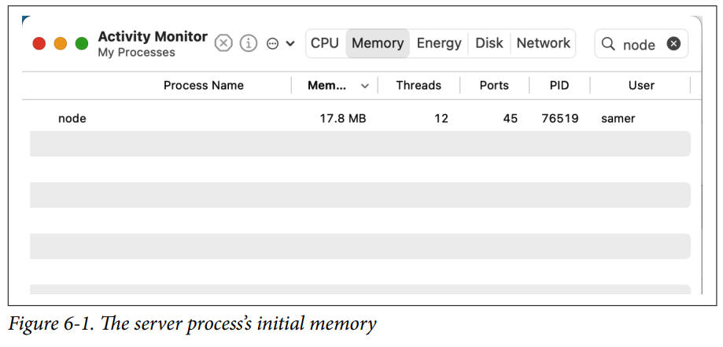
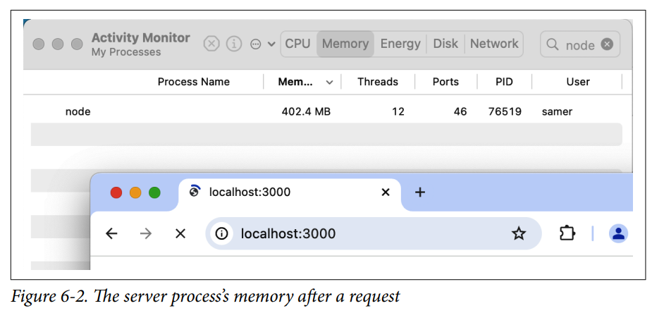
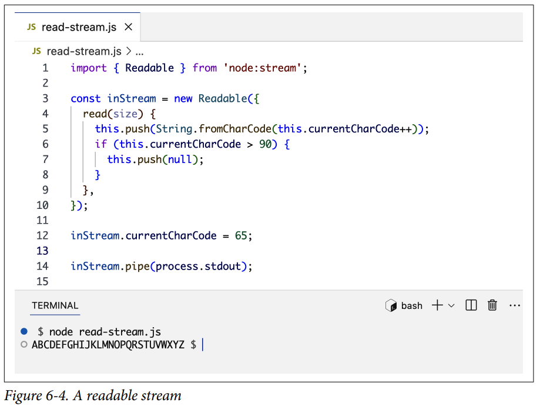
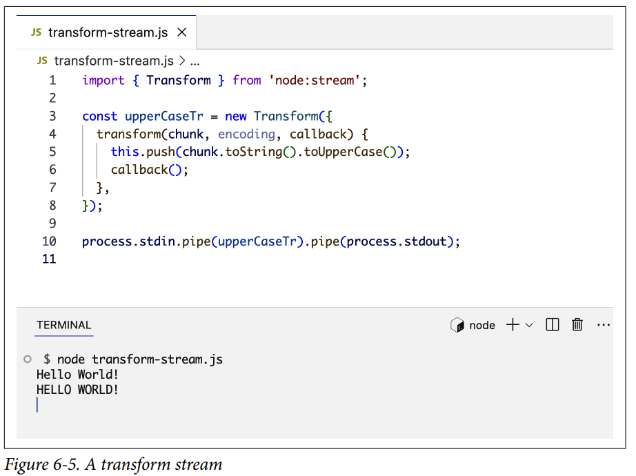
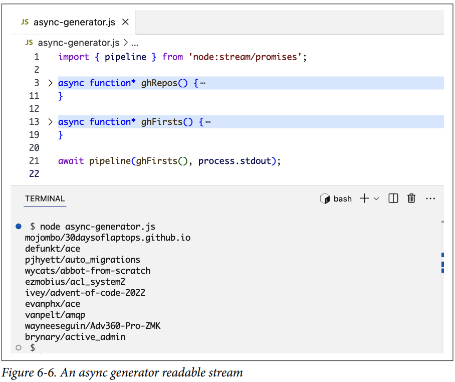
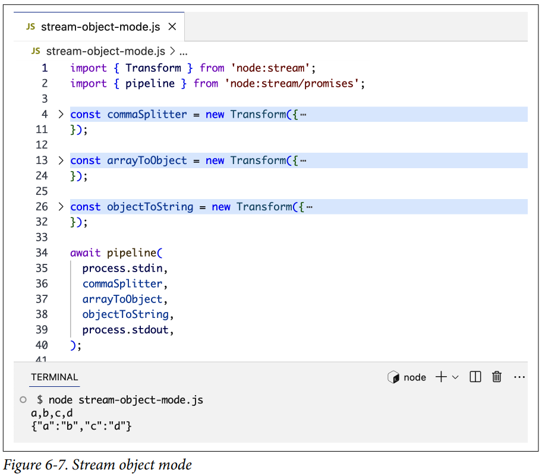

# Streams

Los streams de Node tienen la reputación de ser difíciles de entender y trabajar con ellos. Ese podría haber sido el caso en los primeros días de Node, pero las cosas han cambiado. Hoy en día, es relativamente fácil crear y consumir streams en Node. Incluso podemos usar iteradores asíncronos nativos de JavaScript y generadores para trabajar con streams de Node.

En este capítulo, explicaré el concepto de streams, por qué son necesarios y cómo crearlos, usarlos y combinarlos para procesar eficientemente grandes cantidades de datos sin abrumar la memoria disponible para un proceso Node.

---

## Introducción a los Streams

Cuando descargas un archivo de internet, ves un programa o escuchas una canción, estás usando streams. El contenido se está transmitiendo (streaming) hacia ti un fragmento (chunk) a la vez.

Los streams son básicamente colecciones de datos, similares a arrays o strings, pero en lugar de almacenar datos en el espacio de memoria, los streams procesan datos a lo largo del tiempo. Puedes usar streams para procesar cantidades muy grandes de datos usando un espacio de memoria limitado.

Las analogías para los streams están a nuestro alrededor en la vida. Cuando tienes un fregadero lleno de platos sucios, puedes cargarlos en un lavavajillas, y eso sería procesarlos todos a la vez, como si los mantuvieras en un array. Si no puedes usar un lavavajillas, necesitarás emplear el concepto de streams y limpiar el fregadero un plato a la vez. Tomas un plato, lo restriegas, lo enjuagas y luego pasas al siguiente.

Esto es genial si tienes una pequeña cantidad de platos para lavar. Si tienes muchos platos para lavar y alguien que pueda ayudar, ¡puedes usar dos streams! Puedes tener una persona que restriegue y otra que enjuague. Cada persona se ocupa de una tarea diferente, pero la entrada de un proceso (el enjuague) depende de la salida de otro (el restregado). Podemos agregar más streams a partir de ahí, como secar y apilar. Así es como se pueden combinar múltiples streams para hacer las tareas más eficientes.

Cuando usamos la salida de un stream como la entrada para otro, eso se conoce como **piping**. Ese es el mismo término usado en el sistema operativo Unix, donde los pipes se utilizan para transferir datos de un proceso a otro.

Aquí hay un ejemplo de uso de pipes en Linux. Supongamos que tienes la tarea de contar la ocurrencia de la palabra `require` en todos los archivos de un proyecto grande. En Linux, tienes el comando `grep` que puede encontrar patrones en archivos y el comando `wc` que puede contar líneas, palabras o caracteres. Podemos usar la salida del comando `grep` y pasarla por pipe como entrada del comando `wc`:

```bash linenums="1"
$ grep -wR require * | wc -l
```

Los pipes en Linux nos permiten componer comandos poderosos a partir de comandos más pequeños, y la capacidad de encadenar streams entre sí les da también el poder de la **componibilidad**.

Si tuviéramos un stream para grep y un stream para wc en Node, podríamos combinarlos así:

```js linenums="1"
const grep = ... // Un stream para la salida de grep
const wc = ...   // Un stream para la entrada de wc
grep.pipe(wc)
```

O, para poner la analogía del lavado de platos en pseudocódigo:

```js linenums="1"
const scrub = ...  // Un stream de salida de platos restregados
const rinse = ...  // Un stream de entrada para platos a enjuagar
scrub.pipe(rinse)
```

Hablaremos más sobre el método `pipe` más adelante en el capítulo.

Antes de concluir la analogía del lavado de platos, usémosla para entender un par de conceptos más sobre streams.

Hay dos tipos principales de streams en Node: **streams legibles (readable)** y **streams escribibles (writable)**. Algunos streams son tanto legibles como escribibles; estos se conocen como **streams dúplex (duplex)**.

Un stream legible produce salida, y un stream escribible necesita entrada. En esta analogía, el proceso de restregado es la parte legible (tiene una salida de platos restregados), y el proceso de enjuague es la parte escribible (necesita una entrada de platos restregados). Cuando usamos el método `pipe` en Node, el llamante tiene que ser un stream legible, y el argumento tiene que ser un stream escribible:

```js linenums="1"
readableStream.pipe(writableStream)
```

El **flujo de datos** en los streams es otro concepto que debes entender. Mientras las dos personas lavando los platos manejen sus tareas a un ritmo relativamente similar, el flujo de platos desde sucios a restregados a enjuagados funciona bien. Pero digamos que el restregador necesita trabajar en un plato particularmente sucio y restregarlo muy bien; el enjuagador en ese caso podría necesitar pausar un poco antes de recibir el siguiente plato. De manera similar, si el enjuagador va atrasado, podría comenzar a acumularse una pila de platos restregados, y el restregador podría necesitar pausar. Estos son algunos de los aspectos desafiantes del uso de streams. Hablaremos más sobre eso en breve.

---

## Usando Streams

Para realmente entender la poderosa eficiencia de los streams, veamos algunos números. Revisemos un ejemplo práctico de hacer la misma tarea con y sin streams, y comparemos el uso de memoria.

Primero, necesitamos un archivo grande. Los streams se tratan de procesar grandes cantidades de datos. Aquí hay una forma simple de crear un archivo grande en Node:

```js linenums="1"
import fs from 'node:fs';
import { randomBytes } from 'node:crypto';

const file = fs.createWriteStream('./big.file');

for (let i = 0; i <= 1e6; i++) {
  file.write(
    randomBytes(200).toString('hex')
  );
}

file.end();
```

Nota lo que usé para crear ese archivo grande: ¡un stream escribible! El módulo `node:fs` se puede usar para leer y escribir archivos usando una interfaz de streams. Creamos este archivo grande un fragmento (chunk) a la vez, usando un bucle. En cada iteración, transmitimos una línea al archivo, y repetimos eso 1 millón de veces.

Cuando ejecuté este código, generó un archivo de **381 MB**.

Ahora, digamos que necesitamos hacer que este archivo esté disponible para descarga desde un servidor web Node. Aquí hay un ejemplo de servidor web diseñado exclusivamente para servir `big.file`:

```js linenums="1"
import { createServer } from 'node:http';
import { readFile } from 'node:fs/promises';

const server = createServer();

server.on('request', async (req, res) => {
  const data = await readFile('./big.file');
  res.end(data);
});

server.listen(3000, () => {
  console.log('Server is running...');
});
```

Cuando este servidor web recibe una solicitud, servirá el contenido del archivo grande usando el método `fs.readFile`. No necesité usar streams para hacer que eso sucediera, y el código usa métodos asíncronos, por lo que no estamos bloqueando el call stack. Entonces, ¿cuál es exactamente el problema?

Bueno, veamos qué sucede cuando ejecutamos el servidor, nos conectamos a él y monitoreamos la memoria mientras lo hacemos.

Cuando ejecuté el servidor, comenzó con una cantidad normal de memoria para un proceso — **17.8 MB**, como se muestra en la Figura 6-1.



Luego me conecté al servidor. La Figura 6-2 muestra lo que sucedió con la memoria consumida — saltó a **402.4 MB**.



Básicamente, pusimos todo el contenido de `big.file` en memoria antes de escribirlo en el objeto response. Eso es muy ineficiente, y podemos hacerlo mucho mejor usando streams.

Afortunadamente, muchos de los módulos incorporados de Node usan streams internamente, y el módulo `node:http` es uno de ellos. ¡El objeto `res` en el manejador del evento `request` es un stream escribible! Podemos usarlo para transmitir datos al cliente en lugar de enviarlo todo de una vez. Solo necesitamos un stream legible para representar el contenido de `big.file`, y luego podemos usar el método `pipe` para enviar el archivo un fragmento a la vez sin consumir alrededor de 400 MB de memoria.

El módulo `node:fs` puede darnos un stream legible para cualquier archivo usando el método `createReadStream`. Así es como podemos usarlo con el objeto stream `res`:

```js linenums="1"
import { createServer } from 'node:http';
import { createReadStream } from 'node:fs';

const server = createServer();

server.on('request', (req, res) => {
  const src = createReadStream('./big.file');
  src.pipe(res);
});

server.listen(3000, () => {
  console.log('Server is running...');
});
```

Para probarlo, después de ejecutar el servidor, conéctate para descargar el archivo y observa el consumo de memoria del proceso mientras lo haces (ver Figura 6-3).

Con esta versión del servidor web, cuando un cliente solicita ese archivo grande, lo transmitimos un fragmento a la vez, lo que significa que no lo almacenamos en memoria en absoluto.

Puedes llevar este ejemplo al límite. Regenera `big.file` con 5 millones de líneas en lugar de solo 1 millón, lo que llevaría el archivo a más de 2 GB. En la mayoría de las instalaciones de Node, eso sería incluso más grande que el límite de buffer predeterminado.

Si intentas servir ese archivo más grande usando `fs.readFile`, simplemente no puedes por defecto (puedes cambiar los límites). Pero con `fs.createReadStream`, no hay ningún problema en transmitir 2 GB de datos al solicitante y, lo mejor de todo, el uso de memoria del proceso será aproximadamente el mismo.

---

## Fundamentos de los Streams

Como aprendimos en la sección anterior, los streams pueden ser legibles, escribibles, o ambos. Un **stream legible** es una abstracción para una fuente de la cual se pueden consumir datos. Un ejemplo de eso es el método `fs.createReadStream`. Un **stream escribible** es una abstracción para un destino al cual se pueden escribir datos. Un ejemplo de eso es el método `fs.createWriteStream`.

Un stream que es tanto legible como escribible se conoce como **stream dúplex** o **bidireccional**. Estos streams son útiles donde los datos necesitan fluir en ambas direcciones, como en la comunicación de red usando sockets TCP.

Un **stream transform** es un stream dúplex que se puede usar para modificar los datos en tránsito. Un ejemplo de eso es el stream `zlib.createGzip` que comprime datos usando gzip. Puedes pensar en un stream transform como una función donde la entrada es la parte del stream escribible y la salida es la parte del stream legible.

Muchos de los módulos incorporados en Node implementan la interfaz de streaming. La Tabla 6-1 lista algunos ejemplos.

**Tabla 6-1. Ejemplos de objetos stream**

| Streams legibles | Streams escribibles |
|---|---|
| Solicitudes HTTP | Respuestas HTTP |
| Streams de lectura fs | Streams de escritura fs |
| Streams zlib | Streams zlib |
| Streams crypto | Streams crypto |
| Sockets TCP | Sockets TCP |
| stdout y stderr de child-process | stdin de child-process |
| process.stdin | process.stdout, process.stderr |

Nota que los objetos stream en la Tabla 6-1 están estrechamente relacionados. También nota cómo los streams stdio (stdin, stdout, stderr) tienen los tipos de stream inversos cuando se trata de procesos hijo. Esto permite una forma realmente fácil de hacer pipe hacia y desde estos streams stdio de procesos hijo usando los streams stdio del proceso principal. Aprenderemos sobre procesos hijo en el Capítulo 7.

Todos los streams son instancias de `EventEmitter`. Emiten eventos que se pueden usar para leer y escribir datos. Sin embargo, podemos consumir datos de streams de una manera más simple usando el método `pipe`.

---

## El Método pipeline

El método `pipe` en Node conecta dos objetos stream: una fuente legible y un destino escribible. Esta es la línea importante que necesitas recordar:

```js linenums="1"
readableSrc.pipe(writableDest);
```

En esta simple línea, estamos canalizando (piping) la salida de un stream legible (la fuente de datos) como la entrada de un stream escribible (el destino). La fuente tiene que ser un stream legible, y el destino tiene que ser uno escribible. Por supuesto, ambos también pueden ser streams dúplex/transform. De hecho, si estamos haciendo pipe hacia un stream dúplex, podemos encadenar llamadas `pipe` como lo hacemos en Linux:

```js linenums="1"
readableSrc
  .pipe(transformStream1)
  .pipe(transformStream2)
  .pipe(finalWritableDest);
```

El método `pipe` devuelve el stream de destino. Eso permite el encadenamiento si el stream de destino también es legible.

Para los streams a (legible), b y c (dúplex), y d (escribible), podemos hacer lo siguiente:

```js linenums="1"
a.pipe(b)
 .pipe(c)
 .pipe(d);

// Que es equivalente a:
a.pipe(b);
b.pipe(c);
c.pipe(d);

// Que, en Linux, es equivalente a:
// $ a | b | c | d
```

El método `pipe` es la forma más fácil de consumir streams ya que gestiona automáticamente el flujo de datos para que un destino escribible no se vea abrumado por una fuente legible. Cuando usamos otros métodos de stream para leer/escribir datos, necesitaremos gestionar manualmente el flujo de datos.

Generalmente, cuando usamos el método `pipe`, no necesitamos usar eventos de stream aparte de los eventos de error, pero si necesitamos consumir los streams de formas más personalizadas, podemos combinar otros métodos y eventos de stream para hacerlo.

Una forma incluso mejor de consumir múltiples streams es usar el método `pipeline`. Puedes usarlo tanto con el patrón de callback como con el de promesas:

```js linenums="1"
import { pipeline } from 'node:streams/promises';

await pipeline(
  readableSrc,
  transformStream1,
  transformStream2,
  finalWritableDest
);
```

Además de la sintaxis más clara, el método `pipeline` es mejor para manejar errores de stream y realizar cualquier limpieza necesaria.

!!! warning

    Debes usar la función `pipeline` dentro de una declaración `try/catch` para manejar cualquier error lanzado por cualquier stream en el pipeline.

---

## Eventos de Stream

Podemos usar métodos de stream como `read` y `write` en combinación con listeners de eventos de stream para consumir streams.

Aquí está el código simplificado equivalente de lo que el método `pipe` hace principalmente para leer y escribir datos:

```js linenums="1"
// readable.pipe(writable)
readable.on('data', chunk => {
  writable.write(chunk);
});

readable.on('end', () => {
  writable.end();
});
```

La Tabla 6-2 muestra una lista de los eventos y métodos importantes que se pueden usar con streams legibles y escribibles.

**Tabla 6-2. Eventos y métodos importantes para streams**

| Streams legibles | Streams escribibles |
|---|---|
| **Eventos:** data, end, error, close, readable | **Eventos:** drain, finish, error, close, pipe, unpipe |
| **Métodos:** pipe(), unpipe(), wrap(), destroy(), read(), unshift(), resume(), pause(), setEncoding() | **Métodos:** write(), destroy(), end(), cork(), uncork(), setDefaultEncoding() |

Los eventos y métodos en la Tabla 6-2 están de alguna manera relacionados porque generalmente se usan juntos.

Los eventos y métodos se pueden combinar para un uso personalizado de streams. Para consumir un stream legible, podemos usar los métodos `pipe`/`unpipe` o los métodos `read`/`unshift`/`resume`. Para consumir un stream escribible, podemos hacerlo el destino de `pipe`/`unpipe`, o simplemente escribir en él con el método `write` y llamar al método `end` cuando hayamos terminado.

Cuando no se usa `pipe`/`unpipe`, será necesario el uso de eventos de stream. Los eventos más importantes en un stream legible son:

**El evento `data`**
: Se emite cada vez que el stream pasa un fragmento de datos al consumidor.

**El evento `end`**
: Se emite cuando no hay más datos para consumir del stream.

Los eventos más importantes en un stream escribible son:

**El evento `finish`**
: Se emite cuando todos los datos han sido vaciados (flushed) al sistema subyacente.

**El evento `drain`**
: Una señal de que el stream escribible puede recibir más datos.

El evento `drain` es importante. Es necesario para asegurar un flujo equilibrado de datos. La velocidad a la que los datos son empujados o escritos en un stream se conoce como la **presión** del stream. Cuando un stream escribible tiene una velocidad de procesamiento de datos más lenta que la velocidad de un stream legible que está empujando datos, los datos comenzarán a almacenarse en buffer en el stream escribible. Esta condición se conoce como **backpressure**.

Mientras un stream escribible esté operando dentro de sus límites de memoria, su método `write` devolverá `true`. Cuando se alcanza el límite de memoria, el método `write` devuelve `false` para indicar que los intentos adicionales de escribir datos en el stream deben detenerse hasta que se emita el evento `drain`.

El evento `error` puede ser emitido por los streams en cualquier momento y siempre debe ser manejado, incluso cuando se usa el método `pipe`:

```js linenums="1"
readable.pipe(writable);

readable.on('error', (err) => {
  // Manejar posibles errores de lectura
});

writable.on('error', (err) => {
  // Manejar posibles errores de escritura
});
```

Las funciones callback para manejar eventos de error reciben un único objeto `Error` como argumento. Este objeto se puede usar para manejar diferentes errores de manera diferente.

---

## Modos Pausado y Flowing

Los streams legibles tienen dos modos principales que afectan la forma en que podemos consumirlos. Pueden estar en el **modo pausado** o en el **modo flowing**. Estos modos a veces se denominan modos **pull** y **push**.

Todos los streams legibles comienzan en modo pausado por defecto, pero pueden cambiarse fácilmente a flowing y volver a pausado cuando sea necesario. A veces, el cambio ocurre automáticamente.

Cuando un stream legible está en modo pausado, podemos usar el método `read()` para leer del stream bajo demanda. Sin embargo, para un stream legible en modo flowing, los datos fluyen continuamente y tenemos que escuchar eventos para consumirlos.

En el modo flowing, los datos pueden perderse si no hay consumidores disponibles para manejarlos. Es por eso que cuando tenemos un stream legible en modo flowing, necesitamos un manejador del evento `data`. De hecho, solo agregar un manejador del evento `data` cambia un stream pausado a modo flowing, y eliminar el manejador del evento `data` vuelve a cambiar el stream a modo pausado. Parte de esto se hace por compatibilidad hacia atrás con la interfaz de streams más antigua de Node.

Para cambiar manualmente entre estos dos modos de stream, podemos usar los métodos `resume()` y `pause()`.

!!! tip

    Cuando se consumen streams legibles usando los métodos `pipe` o `pipeline`, no tenemos que preocuparnos por estos modos porque se gestionan automáticamente.

---

## Implementando Streams

Cuando hablamos de streams en Node, hay dos tareas principales:

- **Implementar** los streams
- **Consumir** los streams

Hasta ahora, solo hemos hablado de consumir streams. ¡Implementemos algunos!

Los módulos que implementan streams son generalmente los que importan el módulo `stream`.

#### Streams Escribibles

Para implementar un stream escribible, usamos el constructor `Writable` del módulo `stream`:

```js linenums="1"
import { Writable } from 'node:stream';
```

Podemos implementar un stream escribible de muchas maneras. Por ejemplo, podemos extender la clase `Writable`:

```js linenums="1"
class myWritableStream extends Writable {
  // ...
}
```

Sin embargo, prefiero el enfoque más simple del constructor. Simplemente creamos un objeto a partir del constructor `Writable` y le pasamos una serie de opciones. La única opción requerida es una función `write`, que expone el fragmento de datos a escribir:

```js linenums="1"
import { Writable } from 'node:stream';

const outStream = new Writable({
  write(chunk, encoding, callback) {
    console.log(chunk.toString());
    callback();
  }
});

process.stdin.pipe(outStream);
```

Este método `write` toma tres argumentos:

**El chunk**
: Son los datos transmitidos. Generalmente es un objeto buffer de Node, pero también puede ser un string.

**El argumento encoding**
: Es necesario si el chunk es un string para ser codificado con una codificación diferente de la predeterminada utf8. Puedes omitirlo en caso contrario.

**El callback**
: Es una función que debemos llamar después de terminar de procesar el fragmento de datos. Es lo que señala si el paso de escritura fue exitoso o no. Para señalar un fallo, llamamos a la función callback con un objeto de error como argumento.

En este ejemplo, simplemente hacemos `console.log` del chunk (como string) y llamamos a la función callback después sin un error (para indicar éxito). Este es un stream echo muy simple. Simplemente repite cualquier cosa que recibe.

Para consumir este stream, lo usamos con `process.stdin`, que es un stream legible, por lo que podemos simplemente hacer pipe de `process.stdin` a nuestro `outStream`.

Cuando ejecutamos este código, cualquier cosa que escribamos en `process.stdin` será repetida usando la línea `console.log` de `outStream`.

El objeto `outStream` es en realidad similar al objeto incorporado `process.stdout`. Podemos simplemente hacer pipe de stdin a stdout y obtendremos la misma funcionalidad echo con esta simple línea:

```js linenums="1"
process.stdin.pipe(process.stdout);
```

#### Streams Legibles

Para implementar un stream legible, usamos el constructor `Readable` del módulo `stream`:

```js linenums="1"
import { Readable } from 'node:stream';

const inStream = new Readable();
```

Hay una forma simple de implementar streams legibles. Podemos simplemente empujar (push) directamente los datos que queremos que los consumidores consuman:

```js linenums="1"
// ...
inStream.push('ABCDEFGHIJKLM');
inStream.push('NOPQRSTUVWXYZ');
inStream.push(null); // No más datos

inStream.pipe(process.stdout);
```

Cuando empujamos un objeto `null`, significa que queremos señalar que el stream no tiene más datos.

Para consumir este stream legible simple, simplemente lo canalizamos al objeto stream escribible `process.stdout`.

Cuando ejecutamos este código, estaremos leyendo todos los datos de `inStream` y enviándolos a la salida estándar. Muy simple, pero también no muy eficiente. Básicamente, estamos empujando todos los datos al stream de una sola vez y luego haciéndolos pipe a `process.stdout`. La forma mucho mejor es empujar datos bajo demanda, cuando un consumidor los solicita. Podemos hacer eso implementando el método `read()` en una configuración de stream legible:

```js linenums="1"
const inStream = new Readable({
  read(size) {
    // Hay demanda por los datos...
    // Alguien quiere leerlos.
  }
});
```

Cuando se llama al método `read` en un stream legible, la implementación puede empujar datos parciales a la cola. Por ejemplo, podemos empujar una letra a la vez, comenzando con el código de carácter 65 (que representa A), e incrementando el código en cada push:

```js linenums="1"
const inStream = new Readable({
  read(size) {
    this.push(String.fromCharCode(this.currentCharCode++));
    if (this.currentCharCode > 90) {
      this.push(null);
    }
  },
});

inStream.currentCharCode = 65;
inStream.pipe(process.stdout);
```

Mientras el consumidor está leyendo un stream legible, el método `read` continuará ejecutándose y empujaremos más letras. Necesitamos detener este ciclo en algún punto, y por eso usé una declaración `if` para empujar `null` cuando `currentCharCode` es mayor que 90 (que representa Z).

Este código es equivalente al más simple con el que comenzamos, pero ahora estamos empujando datos bajo demanda cuando el consumidor los solicita, como se muestra en la Figura 6-4. Siempre deberías hacer eso.



Si la fuente de datos es un string, un array o cualquier otro objeto iterable, puedes usar el método `Readable.from` para crear un stream legible:

```js linenums="1"
// Para convertir datos string en un stream legible
Readable.from('ABCDEFGHIJKLMNOPQRSTUVWXYZ');
```

Puedes usar generadores de funciones de JavaScript con `Readable.from` y usar la palabra clave `yield` para hacer que más datos sean legibles con el stream creado. Aquí hay un ejemplo:

```js linenums="1"
function* generate() {
  for (let index = 65; index <= 90; index++) {
    yield String.fromCharCode(index);
  }
}

// Para crear un stream a partir de valores yield:
Readable.from(generate());
```

#### Streams Dúplex / Transform

Con los streams **Dúplex**, podemos implementar tanto streams legibles como escribibles dentro del mismo objeto. Es como si heredáramos de ambas interfaces.

Aquí hay un ejemplo de un stream dúplex que combina los ejemplos anteriores de escribible y legible:

```js linenums="1"
import { Duplex } from 'node:stream';

const inoutStream = new Duplex({
  write(chunk, encoding, callback) {
    console.log(chunk.toString());
    callback();
  },
  read(size) {
    this.push(String.fromCharCode(this.currentCharCode++));
    if (this.currentCharCode > 90) {
      this.push(null);
    }
  }
});

inoutStream.currentCharCode = 65;
process.stdin.pipe(inoutStream).pipe(process.stdout);
```

Al combinar los métodos, podemos usar este stream dúplex para leer las letras de la A a la Z, y también podemos usarlo por su funcionalidad echo. Hacemos pipe del stream legible stdin a este stream dúplex para usar la funcionalidad echo, y hacemos pipe del stream dúplex mismo al stream escribible stdout para ver las letras de la A a la Z.

Es importante entender que los lados legible y escribible de un stream dúplex operan completamente independientes uno del otro. Esto es meramente una agrupación de dos funcionalidades en un solo objeto.

Un **stream transform** es un stream dúplex más interesante porque su salida se calcula a partir de su entrada. Para un stream transform, no tenemos que implementar los métodos `read` o `write`; solo necesitamos implementar un método `transform`, que combina ambos. Tiene la firma del método `write`, y también podemos usarlo para empujar datos.

Aquí hay un stream transform simple que repite cualquier cosa que escribas después de transformarlo a mayúsculas:

```js linenums="1"
import { Transform } from 'node:stream';

const upperCaseTr = new Transform({
  transform(chunk, encoding, callback) {
    this.push(chunk.toString().toUpperCase());
    callback();
  }
});

process.stdin.pipe(upperCaseTr).pipe(process.stdout);
```

En este stream transform, que estamos consumiendo exactamente como el ejemplo anterior del stream dúplex, implementamos solo un método `transform()`. En ese método, convertimos el chunk a su versión en mayúsculas y luego empujamos esa versión como la parte legible, como se muestra en la Figura 6-5.



---

## Generadores Asíncronos e Iteradores

Vimos cómo se puede usar una función generadora para crear un stream legible. Esto también funciona con iteradores asíncronos, por lo que puedes usar `for await` en una función generadora asíncrona y usar esa función para crear un stream legible.

Aquí hay un ejemplo de un stream legible creado a partir de llamadas API a GitHub:

```js linenums="1"
import { Readable } from 'node:stream';

async function* ghRepos() {
  const response = await fetch('https://api.github.com/users');
  const users = await response.json();
  for (let index = 0; index < 10; index++) {
    const reposResponse = await fetch(users[index].repos_url);
    yield await reposResponse.json();
  }
}

async function* ghFirsts() {
  for await (const repos of ghRepos()) {
    if (repos[0]) {
      yield repos[0].full_name + `\n`;
    }
  }
}

Readable.from(ghFirsts()).pipe(process.stdout);
```

!!! tip

    Para entender mejor este ejemplo, mira `https://api.github.com/users` en tu navegador, encuentra el `repos_url` de un usuario y mira también esa URL.

La función `ghRepos` primero obtiene una lista de usuarios, luego obtiene iterativamente (y luego hace yield) la lista de repositorios para los primeros 10 usuarios. La función `ghFirsts` se usa luego para hacer yield del nombre del primer repositorio de la lista yield por la función `ghRepos`.

Dado que la función `ghFirsts` es un generador asíncrono, podemos usarla para crear un stream legible donde cada chunk es el nombre del primer repositorio para cada usuario.

El método `pipeline` incluso soporta tener una función generadora asíncrona en la mezcla. En lugar de la última línea, donde usamos `.pipe`, puedes incluir directamente `ghFirsts` dentro de una llamada a `pipeline`:

```js linenums="1"
// En lugar de:
// Readable.from(ghFirsts()).pipe(process.stdout);

await pipeline(ghFirsts(), process.stdout);
```

La Figura 6-6 muestra la salida.



El método `pipeline` también pasa un objeto stream a un generador asíncrono que lo sigue en el pipeline, habilitando efectivamente que un generador asíncrono actúe como un stream transform. Aquí está el ejemplo de transformación a mayúsculas hecho con una función generadora asíncrona:

```js linenums="1"
import { pipeline } from 'node:stream/promises';

async function* upperCaseTr(source) {
  for await (const chunk of source) {
    yield String(chunk).toUpperCase();
  }
}

await pipeline(
  process.stdin,
  upperCaseTr,
  process.stdout
);
```

Los streams legibles se pueden consumir usando un iterador asíncrono también:

```js linenums="1"
for await (const chunk of readableStream) {
  console.log(chunk);
}
```

---

## Modo Object Mode de Streams

Por defecto, los streams esperan valores buffer o string. Hay una bandera `objectMode` que podemos establecer para que el stream acepte cualquier objeto JavaScript.

Aquí hay un ejemplo simple para demostrar eso. La siguiente combinación de streams transform hace una funcionalidad para mapear un string de valores separados por comas a un objeto JavaScript. Entonces `a,b,c,d` se convierte en `{a: b, c: d}`:

```js linenums="1"
import { Transform } from 'node:stream';

const commaSplitter = new Transform({
  readableObjectMode: true,
  transform(chunk, encoding, callback) {
    this.push(chunk.toString().trim().split(','));
    callback();
  },
});

const arrayToObject = new Transform({
  readableObjectMode: true,
  writableObjectMode: true,
  transform(chunk, encoding, callback) {
    const obj = {};
    for (let i = 0; i < chunk.length; i += 2) {
      obj[chunk[i]] = chunk[i + 1];
    }
    this.push(obj);
    callback();
  },
});

const objectToString = new Transform({
  writableObjectMode: true,
  transform(chunk, encoding, callback) {
    this.push(JSON.stringify(chunk) + '\n');
    callback();
  },
});
```

Puedes usar estos streams transform con el método `pipeline`:

```js linenums="1"
await pipeline(
  process.stdin,
  commaSplitter,
  arrayToObject,
  objectToString,
  process.stdout,
);
```

Pasamos un string de entrada (por ejemplo, `a,b,c,d`) a través de `commaSplitter`, que empuja un array como sus datos legibles (`["a", "b", "c", "d"]`). Agregar la bandera `readableObjectMode` en ese stream es necesario porque estamos empujando un objeto allí, no un string.

Luego tomamos el array y lo canalizamos al stream `arrayToObject`. Necesitamos una bandera `writableObjectMode` para hacer que ese stream acepte un objeto. También empujará un objeto (el array de entrada mapeado a un objeto), y es por eso que también necesitamos la bandera `readableObjectMode` allí también. El último stream `objectToString` acepta un objeto pero empuja un string, y es por eso que solo necesitamos una bandera `writableObjectMode` allí. La parte legible es un string normal (el objeto convertido a string; ver Figura 6-7).



---

## Streams Transform Incorporados

Node tiene algunos streams transform incorporados muy útiles, como los streams `zlib` y `crypto`.

Aquí hay un ejemplo que usa el stream `zlib.createGzip()` combinado con los streams legibles/escribibles de `node:fs` para crear un script de compresión de archivos:

```js linenums="1"
import fs from 'node:fs';
import zlib from 'node:zlib';
import { pipeline } from 'node:stream/promises';

const file = process.argv[2];

await pipeline(
  fs.createReadStream(file),
  zlib.createGzip(),
  fs.createWriteStream(file + '.gz')
);
```

Puedes usar este script para comprimir con gzip cualquier archivo del que pases su ruta como argumento. Estamos canalizando un stream legible para ese archivo hacia el stream transform incorporado de zlib y luego hacia un stream escribible para el nuevo archivo comprimido.

Lo interesante de un pipeline de streams es que nos permite componer nuestro programa pieza por pieza, de una manera legible. Digamos, por ejemplo, que quieres que el usuario vea un indicador de progreso mientras el archivo se está comprimiendo. Puedes crear un stream para reportar el progreso y hacerlo parte del pipeline. Una función generadora asíncrona hace que tareas como estas sean fáciles:

```js linenums="1"
await pipeline(
  fs.createReadStream(file),
  zlib.createGzip(),
  async function* (source) {
    for await (const chunk of source) {
      process.stdout.write('.');
      yield chunk;
    }
  },
  fs.createWriteStream(file + '.gz')
);
```

Las aplicaciones de combinar streams son infinitas. Por ejemplo, si necesitamos encriptar el archivo antes (o después) de comprimirlo con gzip, todo lo que necesitamos hacer es agregar otro stream transform al pipeline. El módulo `node:crypto` tiene el método `createCipheriv` que se puede usar para ese propósito:

```js linenums="1"
import crypto from 'node:crypto';
// ...

const algorithm = 'aes-256-ctr';
const key = crypto.randomBytes(32);
const iv = crypto.randomBytes(16);

await pipeline(
  fs.createReadStream(file),
  zlib.createGzip(),
  crypto.createCipheriv(algorithm, key, iv),
  fs.createWriteStream(file + '.gz'),
);
```

Este código comprime y luego encripta el archivo que recibe como argumento, lo que significa que el archivo ni siquiera se puede descomprimir con una utilidad de descompresión normal. Solo alguien que tenga los valores de key/iv puede usar este archivo. Para poder descomprimir cualquier archivo comprimido con este código, necesitamos usar los streams opuestos para crypto y zlib en orden inverso:

```js linenums="1"
await pipeline(
  fs.createReadStream(file),
  crypto.createDecipheriv(algorithm, key, iv),
  zlib.createGunzip(),
  fs.createWriteStream(file.slice(0, -3)),
);
```

Este código crea un stream de lectura desde el archivo encriptado y comprimido, lo canaliza hacia el stream `crypto.createDecipheriv()` (usando los mismos valores de key/iv), canaliza la salida de eso hacia el stream `zlib.createGunzip()`, y luego escribe el contenido de vuelta a un archivo sin la extensión `.gz`.

## Resumen

Los streams proporcionan una forma eficiente en memoria para procesar grandes datos en Node. Nos permiten trabajar con datos en fragmentos a lo largo del tiempo en lugar de necesitar manejar todos los datos a la vez.

Los dos tipos principales de streams son los **streams legibles** (que producen datos) y los **streams escribibles** (que consumen datos). Los **streams dúplex** combinan ambas funcionalidades, y los **streams transform** son streams dúplex que también modifican los datos en tránsito.

Los streams tienen muchos métodos y eventos que se pueden usar juntos para asegurar un uso adecuado. Los streams legibles pueden estar en **modo flowing** o **modo pausado**. Un stream escribible puede ser más rápido o más lento que un stream legible. Todos estos diferentes estados requieren el uso de diferentes métodos y eventos. La forma más fácil de trabajar con streams es mediante el uso del método `pipeline`, ya que maneja automáticamente muchas de las complejidades del uso de streams.

En el próximo capítulo, exploraremos cómo hacer que un proceso Node ejecute un comando del sistema operativo y cómo hacer que un proceso bifurque (fork) otro.


