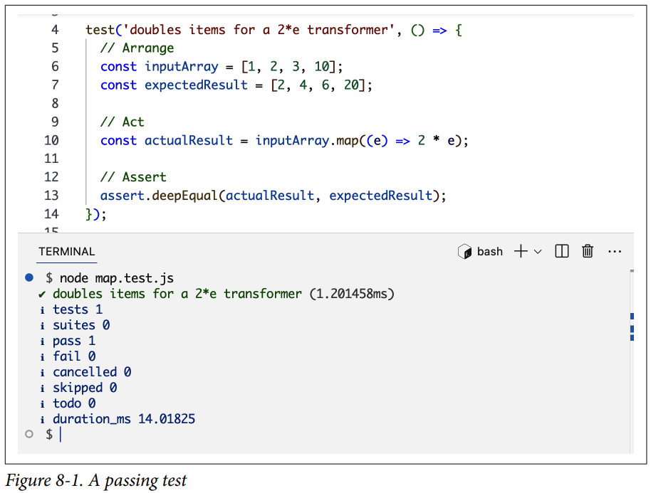
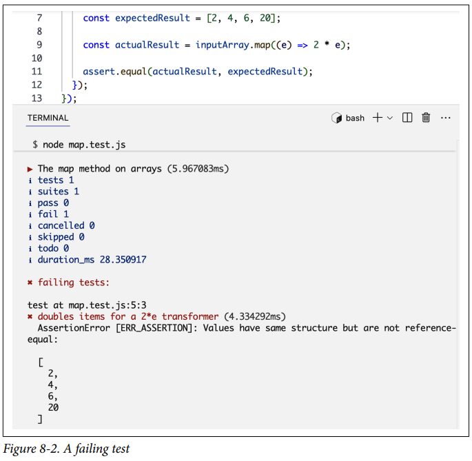
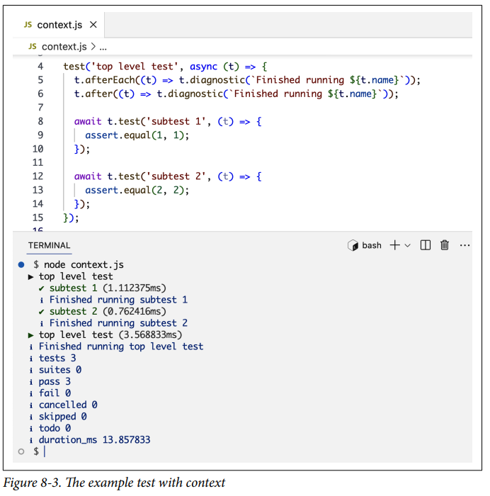

# Testing en Node

El testing en el mundo real generalmente se trata de encontrar qué está mal con algo. Cuando se trata de código, el testing se trata de encontrar qué está bien. Es la garantía de que algo funciona.

El código no probado es simplemente peligroso. El código eficiente y escalable está bien probado. El testing no solo se trata de asegurarse de que el código esté haciendo lo que se supone que debe hacer; también se trata de asegurarse de que el código continúe haciendo lo que se supone que debe hacer después de cualquier cambio en el código, su entorno y sus patrones de uso. El testing se trata de escribir código de alta calidad y detectar problemas potenciales lo antes posible.

Las pruebas regulares del código lo mantienen saludable y hacen que sea más fácil de mantener. También aumenta la confianza de sus mantenedores para hacer cambios. Hacer cambios en código no probado es una receta para el desastre. Una nueva característica en el módulo X podría romper otras características en el módulo Y. No puedes mantener las dependencias en tu cabeza. No puedes probar todo el código manualmente cada vez que hay un cambio. No hay forma de evitarlo. Tienes que escribir código para probar tu código, y sí, tu código de prueba también podría tener problemas. Las pruebas podrían introducir falsos negativos y falsos positivos. Es por eso que es extremadamente importante hacer las pruebas correctamente. De eso se trata este capítulo.

---

## Aserciones y Runners

Una prueba en Node es un conjunto de aserciones. Para ejecutar las pruebas, necesitas un test runner. Node tiene módulos incorporados para ambos. Aquí hay una prueba simple para el método `map` en arrays:

```js linenums="1"
import test from 'node:test';
import assert from 'node:assert/strict';

test('duplica elementos para un transformador 2*e', () => {
  // Arrange
  const inputArray = [1, 2, 3, 10];
  const expectedResult = [2, 4, 6, 20];

  // Act
  const actualResult = inputArray.map((e) => 2 * e);

  // Assert
  assert.deepEqual(actualResult, expectedResult);
});
```

Ayuda pensar en las pruebas con el patrón **Arrange-Act-Assert**:

**Arrange**
: Esta sección es la configuración. Es donde preparamos el entorno y los prerrequisitos de la prueba.

**Act**
: Esta sección es donde ejecutamos el método que queremos probar.

**Assert**
: Esta sección es donde confirmamos nuestras expectativas.

Para ejecutar esta prueba, simplemente la pones en un script de Node y la ejecutas con el comando `node`.

La Figura 8-1 muestra la salida.

El módulo `node:test` tiene algunos objetos que se pueden usar para organizar tus pruebas y etiquetarlas. Usé el método `test` en este ejemplo para darle a la prueba el nombre `duplica elementos para un transformador 2*e`. Cuando el comando `node` ve este método, el runner incorporado lleva a cabo las aserciones para producir esta salida, que lista todos los nombres de las pruebas y si tuvieron éxito o fallaron, junto con la duración de cada una y un resumen de diagnóstico sobre todas las pruebas. Como puedes ver en este ejemplo, la única prueba que hicimos fue OK.



El módulo `node:assert` tiene un conjunto de funciones de aserción que podemos usar para implementar la sección Assert de cualquier prueba. En este ejemplo, usé el método `deepEqual` para asegurarme de que el array mapeado real sea profundamente igual al array esperado. El simple `assert.equal` no funcionará aquí ya que los arrays son objetos diferentes. El método `deepEqual` verifica la igualdad de los elementos del array, que es lo que queremos aquí.

!!! note

    Nota cómo usé `node:assert/strict` en este ejemplo y eso es lo que siempre debes hacer. El modo legacy de este módulo (sin `/strict`) está basado en el operador `==` (que realiza conversiones de tipo de los operandos antes de la comparación) y debe evitarse.

En lugar del método `test` simple, podemos usar los métodos `describe` e `it`:

```js linenums="1"
import { describe, it } from 'node:test';
import assert from 'node:assert/strict';

describe('El método map en arrays', () => {
  it('duplica elementos para un transformador 2*e', () => {
    const inputArray = [1, 2, 3, 10];
    const expectedResult = [2, 4, 6, 20];
    const actualResult = inputArray.map((e) => 2 * e);
    assert.deepEqual(actualResult, expectedResult);
  });
});
```

El método `it` es básicamente un alias de `test`, pero lo prefiero como un recordatorio para mantenerme consistente al etiquetar las pruebas respondiendo la pregunta "¿Qué valida esta prueba?" y terminando la frase: "It __" (o en español: "valida que __").

El método `describe` nos da una forma de agrupar pruebas juntas y describir su propósito. Generalmente tendremos múltiples pruebas escritas para un método como `map`. Usamos `describe` para agruparlas. Esto también afecta la salida de la ejecución de las pruebas.

---

## Igualdad Profunda vs Superficial

Cuando verificamos `a === b`, eso es una verificación de igualdad superficial que asegura que tanto `a` como `b` se refieran a la misma ubicación de memoria.

La **igualdad profunda (deep equality)**, por otro lado, es cuando dos objetos tienen la misma estructura y valores, independientemente de su ubicación en memoria.

Por ejemplo, considera los siguientes dos arrays:

```js linenums="1"
const arrA = [1, 4, 16];
const arrB = [2-1, 2*2, 4**2];

assert.equal(arrA, arrB);    // AssertionError
assert.deepEqual(arrB, arrB); // Ok
```

Dado que los dos arrays son objetos diferentes, la verificación `assert.equal` fallará. Sin embargo, dado que ambos arrays tienen tres elementos y cada elemento en `arrA` es igual al elemento en `arrB` que está en la misma posición, estos dos arrays son profundamente iguales, y la verificación `assert.deepEqual` pasará.

---

Veamos cómo se ve una ejecución de prueba fallida. Reemplaza `deepEqual` con `equal` en la prueba del método `map` y ejecútala de nuevo. La Figura 8-2 muestra la salida que obtengo. 



Dado que el array esperado no es igual al array real, usar `assert.equal` falla aquí.

!!! tip

    Usé el método `map` como ejemplo aquí, pero realmente no deberíamos probar métodos de la biblioteca estándar de esa manera. Ya están bien probados. Deberíamos probar nuestro propio código, nuestras funciones, nuestros módulos, nuestras dependencias y nuestros sistemas. Para empezar con eso, hablemos de los diferentes tipos de pruebas.

---

## Tipos de Pruebas

Hay cuatro tipos principales de pruebas: **unitarias**, **funcionales**, **de integración** y **de extremo a extremo (e2e)**. Cada una tiene diferentes alcances y propósitos. En la práctica, algunos de estos tipos a veces se superponen, y en ciertos casos, algunas pruebas se pueden categorizar bajo múltiples tipos. Sin embargo, creo que aprender la diferencia entre estos tipos te hace escribir mejores pruebas.

Para entender la diferencia entre estos tipos, comencemos con un ejemplo de código y veamos cómo se pueden escribir diferentes pruebas para él. Supongamos que tenemos dos módulos para gestionar productos y pedidos en una base de datos. Para simplificar, usaremos arrays simples para almacenar los registros.

En un archivo `products.js`, tenemos lo siguiente:

```js linenums="1"
let products = [
  { id: 1, name: 'Phone', price: 600 },
  { id: 2, name: 'Laptop', price: 2000 },
  { id: 3, name: 'Headphone', price: 100 },
];

const addProduct = (product) => {
  products.push(product);
  return product;
};

const getProductById = (id) => {
  return products.find((product) => product.id === id);
};

export { addProduct, getProductById };
```

En un archivo `orders.js`, tenemos lo siguiente:

```js linenums="1"
const orders = [];

const createOrder = (productId, quantity) => {
  const order = { productId, quantity, status: 'pending' };
  orders.push(order);
  return order;
};

const updateOrderStatus = (orderId, status) => {
  const order = orders.find((order) => order.id === orderId);
  if (order) {
    order.status = status;
  }
  return order;
};

export { createOrder, updateOrderStatus };
```

!!! note

    Inicialicé el array de productos con algunos datos de prueba. Los datos de prueba generalmente se siembran (seed) para las pruebas en una fase diferente — por ejemplo, una fase de configuración ejecutada antes de todas las pruebas. Para simplificar, lo incluí directamente en el módulo.

### Pruebas Unitarias

Una **prueba unitaria** se escribe para una pequeña parte del código (una unidad). Una unidad podría ser una sola función, un grupo de funciones relacionadas, un módulo, un componente o cualquier otra cosa que pueda probarse por sí misma, de forma aislada. Generalmente, cualquier dependencia externa se falsifica con objetos dobles (double objects) para mantener la prueba de una unidad de forma aislada. Más sobre eso en breve.

Un ejemplo de una prueba unitaria para estos módulos es una que pruebe una sola función en cualquiera de los módulos. Por ejemplo, deberíamos probar `getProductById` contra uno de los productos conocidos de los datos de prueba y contra un producto que no existe:

```js linenums="1"
import { describe, it } from 'node:test';
import assert from 'node:assert/strict';
import { getProductById } from './products.js';

describe('getProductById', () => {
  it('encuentra un producto que existe', () => {
    const product = getProductById(2);
    assert.deepEqual(product, {
      id: 2,
      name: 'Laptop',
      price: 2000,
    });
  });

  it('retorna undefined para un producto que no existe', () => {
    const product = getProductById(-1);
    assert.equal(product, undefined);
  });
});
```

!!! tip

    Para los ejemplos restantes, omitiré las declaraciones de importación de `node:test` y `node:assert` por brevedad.

### Pruebas Funcionales

Una **prueba funcional** se escribe para una característica del código (una funcionalidad). Una característica podría ser una sola unidad o múltiples unidades, pero este tipo de prueba no se ejecuta de forma aislada. Las pruebas funcionales a menudo interactúan con dependencias externas como bases de datos y redes.

Un ejemplo de una prueba funcional para el módulo de pedidos es una que pruebe la funcionalidad de realizar un pedido y actualizar su estado:

```js linenums="1"
import { createOrder, updateOrderStatus } from './orders.js';

describe('Gestión de Pedidos', () => {
  it('realiza un pedido y actualiza su estado', () => {
    const newOrder = createOrder(1, 1);
    const updatedOrder = updateOrderStatus(
      newOrder.id,
      'completed',
    );
    assert.equal(updatedOrder.status, 'completed');
  });
});
```

### Pruebas de Integración

Una **prueba de integración** se escribe para verificar que diferentes módulos o servicios funcionan correctamente juntos. Mientras que las pruebas funcionales prueban la funcionalidad de un solo módulo o servicio, las pruebas de integración se usan para verificar cómo se integran múltiples módulos o servicios entre sí.

Un ejemplo de una prueba de integración para los módulos de productos/pedidos es una que pruebe cómo la creación de pedidos se integra con la recuperación de productos:

```js linenums="1"
import { getProductById } from './products.js';
import { createOrder } from './orders.js';

describe('Creación de Pedidos', () => {
  it('se integra con la recuperación de productos', () => {
    const product = getProductById(1);
    const order = createOrder(product.id, 2);
    assert.equal(order.productId, product.id);
    assert.equal(order.quantity, 2);
  });
});
```

### Pruebas de Extremo a Extremo (E2E)

Una **prueba de extremo a extremo (e2e)** se escribe para simular un uso real de tu código, de principio a fin, a través de todos los componentes, módulos y servicios.

Un ejemplo de una prueba e2e para los módulos de productos/pedidos es una que pruebe el flujo completo desde la creación del producto hasta la finalización del pedido:

```js linenums="1"
import { addProduct, getProductById } from './products.js';
import { createOrder, updateOrderStatus } from './orders.js';

describe('Desde la adición de producto hasta la finalización del pedido', () => {
  it('funciona', () => {
    addProduct({ id: 4, name: 'Tablet', price: 500 });
    const product = getProductById(4);
    const order = createOrder(product.id, 1);
    const finalOrder = updateOrderStatus(order.id, 'completed');
    assert.equal(product.name, 'Tablet');
    assert.equal(finalOrder.status, 'completed');
  });
});
```

Conocer los diferentes tipos de pruebas es bueno en general. Podemos enfocar nuestra estrategia de pruebas según las necesidades de la aplicación, y quizás más importante, cuando una prueba falla, su tipo es el primer indicador de qué salió mal.

Sin embargo, a menudo hay una línea delgada entre estos diferentes tipos de pruebas. Por ejemplo, para probar mejor unitariamente la función `getProductById`, deberíamos hacer que la prueba primero agregue un producto y luego intente encontrarlo. Podrías pensar en eso como un tipo de prueba de integración. Las etiquetas realmente no son tan importantes. Lo importante es tener una estrategia que se adapte a la aplicación y organizar el código de prueba de acuerdo con esa estrategia. En una aplicación con módulos aislados que no dependen entre sí en absoluto, hay poco lugar para pruebas de integración. El enfoque en esa aplicación debería estar en las pruebas unitarias. Para otros tipos de aplicaciones, el equipo podría optar por no escribir pruebas unitarias en absoluto y confiar completamente en pruebas de integración y pruebas e2e.

---

## Dobles de Prueba (Test Doubles)

En muchos casos, ciertos comportamientos necesitan ser simulados para propósitos de prueba. Por ejemplo, al probar código que usa una API externa, es una mala idea hacer que tus pruebas golpeen la API real cada vez que las ejecutas. Es mejor usar un objeto **doble de prueba (test double)** para falsificar la respuesta de la API y mantener regularmente este doble de prueba basado en respuestas reales de la API.

Los dobles de prueba son básicamente objetos que usamos para simular el comportamiento de objetos reales. Así como un doble de acción en una película realiza acciones en lugar de un actor real, un objeto doble de prueba simula la acción de un objeto real.

Los dobles de prueba se usan comúnmente en pruebas unitarias, ya que estas pruebas generalmente se centran en unidades aisladas. Por ejemplo, si necesitas probar unitariamente una función que primero recupera un registro de una base de datos, puedes usar un doble de prueba para el objeto recuperador de la base de datos y enfocar la prueba en la lógica restante de esa función. Una prueba de integración o e2e puede encargarse de probar la recuperación real de registros de la base de datos.

Usar dobles de prueba simplifica las pruebas y mejora la velocidad de ejecución de todas las pruebas. Con los dobles de prueba adecuados, no necesitas configurar una base de datos, una API o canales de red para ejecutar pruebas simples de forma aislada.

Hay diferentes tipos de dobles de prueba. Para verlos en acción, comencemos con un ejemplo de código:

```js linenums="1"
function notifyCompletion(taskId, { database, emails, mailer }) {
  const status = database.getStatus(taskId);
  if (status === 'complete') {
    const email = emails.notifications;
    mailer.sendEmail(email, `Task ${taskId} is complete.`);
  }
}
```

Esta es una función simple que tiene tres dependencias: un objeto `database`, un objeto `emails` y un objeto `mailer`. Las tres dependencias se inyectan en la función como argumentos (siguiendo el patrón de **inyección de dependencias**).

Se pueden usar diferentes tipos de dobles de prueba para simular estos servicios con características variables para las pruebas.

**Objetos Dummy**
: Se pasan pero nunca se usan realmente. Son solo marcadores de posición. No hacen nada en absoluto. Por ejemplo, si no nos estamos enfocando en el servicio de correos electrónicos, podemos usar un objeto dummy vacío en una prueba:

```js linenums="1"
// Afirmar algo
notifyCompletion(123, {
  database,
  emails: {},
  mailer,
});
```

**Objetos Stub**
: Se usan para reemplazar una unidad de código por una que siempre se comporta de una manera fija. Para usar un stub para una función, escribimos una nueva función que siempre devolverá el mismo resultado. Por ejemplo, para stub el servicio `database` en `notifyCompletion`, podemos hacer algo como esto:

```js linenums="1"
const stubDatabase = {
  getStatus: function (taskId) {
    return 'complete';
  },
};

// Afirmar algo
notifyCompletion(123, {
  database: stubDatabase,
  emails,
  mailer,
});
```

**Objetos Mock**
: Se usan para probar interacciones y flujos entre componentes. Podemos usarlos para casos en los que queremos asegurarnos de que cierta función se llame con ciertos argumentos, una función intente enviar un correo electrónico, o un conjunto de métodos se llamen en un orden específico. Para el caso de `notifyCompletion`, podemos mockear el objeto `mailer` para asegurarnos de que su método `sendEmail` se llame con los argumentos correctos:

```js linenums="1"
const mockMailer = {
  sendEmail(email, message) {
    assert.equal(email, 'task@example.com');
    assert.equal(message, 'Task 123 is complete.');
  },
};

// Afirmar algo
notifyCompletion(123, {
  database,
  emails,
  mailer: mockMailer,
});
```

**Objetos Spy**
: Se usan para recopilar información sobre llamadas a funciones, como cuántas veces se llama a una función. Si estamos interesados en llevar la cuenta de cuántas veces se usa el método `sendEmail`, podemos usar el siguiente objeto spy:

```js linenums="1"
const spyMailer = {
  sendCount: 0,
  sendEmail (email, message) {
    this.sendCount++;
  },
};
```

**Objetos Fake**
: Son básicamente una implementación simplificada de una interfaz o clase compleja. Funcionan como el código real pero con algunas complejidades eliminadas. Por ejemplo, si necesitamos probar tanto los valores `complete` como `incomplete` para `getStatus`, podemos usar un objeto fake de base de datos como el siguiente:

```js linenums="1"
class FakeDatabase {
  constructor() {
    this.tasks = { 123: 'incomplete', 456: 'complete' };
  }

  getStatus(taskId) {
    return this.tasks[taskId];
  }
}
```

Como puedes ver, elegir qué dobles de prueba usar depende completamente de qué estás probando y cuánto de ello quieres probar.

Los dobles de prueba no tienen que ser puramente uno de estos tipos. Podemos combinarlos. Podemos hacer que `FakeDatabase` espíe cuántas veces se llama a `getStatus` y agregar algunas expectativas para convertirlo también en un doble mock.

Los nombres y alcances de estos tipos son buenos de conocer y entender, pero no te abrumes con ellos. Solo recuerda que un objeto doble de prueba se puede usar para simular el comportamiento de un objeto real, y añade poder a tu prueba. Puedes usarlos para simplificar tus pruebas, llevar un registro de llamadas y verificar expectativas también.

Node tiene un objeto mock incorporado dentro del módulo `node:test` que se puede usar para crear dobles de prueba y también tiene algunas características poderosas. Hablemos de algunos ejemplos.

Puedes usar el objeto mock de Node para mockear un método en cualquier objeto, incluidos métodos dentro de módulos incorporados. Por ejemplo, si estás probando una función que usa el método `readFile` del módulo `node:fs` de Node, puedes usar el objeto mock para omitir la lectura real de archivos para propósitos de prueba:

```js linenums="1"
import fs from 'node:fs/promises';
import { mock } from 'node:test'

mock.method(fs, 'readFile', async () => 'Hello World');
```

Una vez que un método está mockeado, obtiene una propiedad `.mock` que se puede usar para rastrear cómo y cuándo se llama a ese método. La siguiente aserción asegura que el método `readFile` se llame exactamente una vez:

```js linenums="1"
assert.equal(
  fs.readFile.mock.calls.length,
  1,
);
```

El objeto mock se puede usar para mockear funciones de temporizador como `setTimeout` y `setInterval`:

```js linenums="1"
// Crear una función mock
const fn = mock.fn();

// Mockear la API setTimeout
mock.timers.enable({ apis: ['setTimeout'] });

// Ahora, cualquier llamada a setTimeout no
// creará un temporizador.

// Probarlo
setTimeout(fn, 500);
assert.equal(fn.mock.callCount(), 0);

// Puedes avanzar manualmente el temporizador mockeado
mock.timers.tick(500);
assert.equal(fn.mock.callCount(), 1);
```

También puedes usar el objeto mock para mockear objetos `Date` cuando necesites escribir una prueba dependiente del tiempo:

```js linenums="1"
test('mockea el objeto Date', (context) => {
  // Mockear el objeto Date
  context.mock.timers.enable({ apis: ['Date'] });

  // La fecha inicial estará basada en 0 en la época UNIX
  assert.equal(Date.now(), 0);

  // Avanzar en el tiempo también avanzará la fecha
  context.mock.timers.tick(100);
  assert.equal(Date.now(), 100);
});
```

Nota cómo en este ejemplo usé el argumento `context` de la prueba. Este se pasa a cada función de prueba y se puede usar para interactuar con el test runner. Tiene muchas de las características del módulo `node:test` adjuntas por conveniencia. El objeto `context.mock` es uno de ellos. Puedes usarlo directamente sin importar `mock` de `node:test`. Algunos métodos de `context` tienen ventajas sobre sus métodos equivalentes sin context. Por ejemplo, al usar `context.mock`, el test runner restaurará automáticamente toda la funcionalidad mockeada una vez que la prueba termine. Esto no es cierto al usar el objeto mock directamente; de hecho, con el uso directo del objeto mock, necesitaremos restablecer manualmente las cosas después de terminar con ellas usando una llamada `mock.reset()`.

Hay muchos otros métodos adjuntos al objeto `context`. Aquí hay algunos ejemplos:

- **`context.test`** — Este método se puede usar para estructurar tus pruebas de manera jerárquica anidando subpruebas bajo una prueba de nivel superior.
- **`context.diagnostic`** — Este método se puede usar para escribir un mensaje en la salida del test runner. Cualquier información diagnóstica se incluye al final de los resultados de la prueba.
- **`.before`, `.after`, `.beforeEach` y `.afterEach`** — Estos métodos se pueden usar para ejecutar código antes/después de todas las pruebas en un ámbito y antes/después de cada prueba.

Aquí hay un ejemplo para demostrar:

```js linenums="1"
test('prueba de nivel superior', async (t) => {
  t.afterEach((t) => t.diagnostic(`Terminó de ejecutar ${t.name}`));
  t.after((t) => t.diagnostic(`Terminó de ejecutar ${t.name}`));

  await t.test('subprueba 1', (t) => {
    assert.equal(1, 1);
  });

  await t.test('subprueba 2', (t) => {
    assert.equal(2, 2);
  });
});
```

La Figura 8-3 muestra la salida. 



Nota cómo `${t.name}` dentro de `afterEach` se refiere a las subpruebas, mientras que se refiere a la prueba de nivel superior dentro de `after`.

Las funciones `after`, `before`, `afterEach` y `beforeEach` también están disponibles como importaciones de `node:test`.

---

## Organizando y Filtrando Pruebas

¿Dónde debería colocarse el código de prueba en una aplicación? Las dos estrategias principales son: colocar los archivos de prueba justo al lado de los archivos de código que prueban, o aislarlos en carpetas que se puedan mapear al código que prueban.

Para la **primera estrategia**, pones un archivo de prueba justo al lado del módulo que está probando. Si tu módulo es `orders.js`, creas `orders.test.js` (o `ordersTest.js`, o `orders.spec.js`) en la misma carpeta que `orders.js`. Elige uno de los formatos de nomenclatura y mantente con él en toda la aplicación. La principal ventaja de este enfoque es encontrar rápidamente las pruebas para cualquier código con el que estés trabajando y descubrir rápidamente cuando algo no está probado en absoluto. Creo que esta estrategia es excelente para pruebas unitarias y funcionales.

Para la **otra estrategia**, reflejas la estructura de la aplicación en un directorio de pruebas. Por ejemplo, si tienes carpetas `app/domain` y `app/models`, crearías directorios `tests/domain` y `tests/models`. La principal ventaja de este enfoque es mantener el código y las pruebas separados mientras aún puedes encontrar pruebas rápidamente. Sin embargo, esta dependencia de la estructura de la aplicación no es ideal. Vincula las pruebas a cualquier problema en la estructura, y cuando se necesita una reestructuración, también debe ocurrir una coincidencia de esa reestructuración en la carpeta de pruebas, porque de lo contrario será más difícil encontrar las pruebas.

Una variante de esta estrategia es mantener una carpeta `tests` dentro de cada carpeta de la aplicación. Creas carpetas `app/domain/tests` y `app/models/tests` y pones todas las pruebas relacionadas con estos módulos allí. Esto aún sigue la estructura de la aplicación, mantiene el aislamiento entre el código y las pruebas, y es más fácil de manejar cuando las cosas se reestructuran.

No importa qué enfoque elijas para tus pruebas, la **consistencia** es la clave. Elige una convención de nomenclatura de carpetas y también una convención de nomenclatura de archivos, y mantente con ellas en toda la aplicación.

!!! tip

    Puedes usar herramientas de calidad de código como ESLint y sus plugins para marcar cualquier divergencia de las convenciones de nomenclatura de un proyecto.

La consistencia en la organización de pruebas ayuda cuando necesitas ejecutar un subconjunto de pruebas. Mientras trabajas en una parte de una aplicación, generalmente ejecutarías con frecuencia las pruebas relacionadas con esa parte. Aún necesitarías ejecutar todas las pruebas, pero puedes hacerlo con menos frecuencia.

Node soporta algunas formas de filtrar qué pruebas ejecutar. Un segundo argumento opcional para los métodos principales de `node:test` se puede usar para omitir una prueba por completo, marcarla como una prueba **TODO** (que se ejecuta pero no se incluye en las pruebas fallidas), o marcar una prueba como la única prueba que debe ejecutarse:

```js linenums="1"
// La siguiente prueba será omitida
test('algo', { skip: true }, () => {
  // ...
});

// La siguiente prueba será marcada como TODO
test('algo', { todo: true }, () => {
  // ...
});

// La siguiente prueba será la única ejecutada
// cuando el comando `node` se ejecute
// con la opción `--test-only`
test('algo', { only: true }, () => {
  // ...
});
```

También puedes filtrar pruebas por sus nombres. Node tiene dos opciones para eso: `--test-name-pattern="algo"` y `--test-skip-pattern="algo"`. Esto te da la opción de ejecutar u omitir pruebas cuando sus nombres coinciden con ciertos patrones.

Combinar todas estas características te da mucha flexibilidad para ejecutar y mantener archivos de prueba.

---

## Desarrollo Guiado por Pruebas (TDD)

En lugar de escribir pruebas para el código, ¿por qué no escribir código para las pruebas? Este es el enfoque de **desarrollo guiado por pruebas (TDD)**. Comienzas con una prueba, que fallará al principio ya que no hay código. Escribes el código para hacer que esa prueba pase. Luego escribes otra prueba fallida, la haces pasar con más código, y así sucesivamente. Esto crea un ciclo de rojo-verde (o falla-éxito para las pruebas). Mientras estás en un estado verde, puedes refactorizar y mejorar tu código, por lo que este ciclo se conoce como el **ciclo rojo-verde-refactor**.

El ciclo invertido de TDD puede parecer extraño, pero en realidad es increíblemente poderoso. Si sigues estrictamente un enfoque TDD, simplemente no tendrás código que no esté probado. Después de todo, solo puedes escribir código para hacer que una prueba roja se vuelva verde.

No solo eso, creo que TDD te obliga a escribir mejor código. No pierdes tiempo en código innecesario. Para cualquier pieza de código en la que estés pensando, te ves obligado a pensar en un caso de prueba para ella. Te da una comprensión clara del código y te ayuda a tomar mejores decisiones sobre cómo debería evolucionar el código.

Si bien TDD es simple de usar, hay algunas cosas a tener en cuenta. Veamos un ejemplo. Digamos que queremos crear una función que valide direcciones de correo electrónico. Para usar TDD, podríamos comenzar con un caso de prueba como este:

```js linenums="1"
describe('validateEmail', () => {
  it('funciona para un email normal', () => {
    assert(validateEmail('test@example.com'));
  });
});
```

Luego implementamos el código más simple que pueda hacer que esta prueba pase. Esto es importante. No intentes escribir más código que el mínimo absoluto que pueda hacer que esta prueba pase. Después de hacer que la prueba pase, puedes agregar otro caso de prueba:

```js linenums="1"
it('funciona para correos menos comunes', () => {
  assert(validateEmail('test.one@example.com.ab'));
  assert(validateEmail('test+one@1.com.ab'));
  assert(validateEmail('123@a-z.com.ab'));
});
```

Escribe el código para hacer que la prueba pase, luego agrega otra prueba:

```js linenums="1"
it('funciona para caracteres no ingleses', () => {
  assert(validateEmail('test@mañana.org'));
});
```

Escribe el código para hacer que la prueba pase, luego agrega otra prueba:

```js linenums="1"
it('falla para direcciones inválidas', () => {
  assert(validateEmail('test@') === false);
  assert(validateEmail('@test.com') === false);
});
```

Nota cómo el pensamiento es explícito aquí con las pruebas, y cada pensamiento que tenemos está documentado con una prueba. Para el último caso, comenzarías a pensar: ¿debería la función devolver `false` o debería lanzar un error? Tomas estas decisiones mientras diseñas las pruebas.

!!! tip

    TDD es excelente para pruebas unitarias y algunas pruebas funcionales, pero se vuelve más desafiante para pruebas más grandes.

---

## Integración Continua (CI)

Cuando trabajas en un proyecto Node que tiene pruebas, debes ejecutar pruebas continuamente mientras haces cambios en tu entorno de desarrollo. Para hacer esto más fácil, puedes usar las técnicas de organización y filtrado discutidas anteriormente. También puedes usar la opción `--watch` para ejecutar pruebas automáticamente cada vez que hay un cambio.

Este proceso se conoce como **pruebas continuas (continuous testing)**. No deberías enviar ningún código sin asegurarte primero de que todas las pruebas pasen localmente. Pero incluso las pruebas que pasan para ti localmente podrían no pasar en otro entorno de prueba. Es por eso que un proyecto probado también necesita una estrategia de **integración continua (CI)**.

Con CI, puedes usar una plataforma como **GitHub Actions** o **GitLab CI/CD** para forzar una ejecución de todas las pruebas después de que se propongan nuevos cambios al proyecto (por ejemplo, en un pull request). Los cambios no se pueden fusionar al proyecto a menos que las pruebas pasen primero. Las herramientas de CI ejecutan todas las pruebas en la nube, y se pueden integrar con tus herramientas de control de fuentes. Por ejemplo, puedes hacer que automaticamente bloqueen un pull request cuyos cambios hicieron que el conjunto de pruebas fallara.

CI no deja espacio para errores comunes. Tal vez alguien no ejecutó todas las pruebas mientras hacía un cambio, o tal vez las pruebas pasaron para ellos en su entorno de desarrollo local pero no pasarían en un entorno más cercano a producción. CI es el enfoque a prueba de fallos.

Otra ventaja sutil de tener un pipeline de CI es que el historial se puede conservar para rastrear el progreso de un conjunto de pruebas. Puedes rastrear cosas como el tiempo que toma ejecutar todas las pruebas y la cobertura de estas pruebas, y también puedes rastrear cómo evolucionan estas cosas.

La **cobertura** es un indicador de cuánto del código está probado. Es un buen indicador de cantidad, pero no tiene nada que ver con la calidad. Sin embargo, asegurar una buena cantidad de cobertura es un buen primer paso. Puedes configurar tu pipeline de CI para generar un informe de cobertura (el test runner de Node tiene algo de soporte para eso) y luego exigir que el porcentaje de código cubierto con pruebas no baje de cierto umbral. Si envías código no probado, la cobertura disminuirá y tu código no se fusionará.

---

## Resumen

Si bien una aplicación pequeña y simple podría funcionar bien sin pruebas, a medida que el código evoluciona, una buena estrategia de pruebas se convierte en la única forma de hacer crecer una aplicación con confianza.

Node tiene herramientas incorporadas para pruebas. Está el módulo `node:test` que proporciona métodos para estructurar y ejecutar pruebas, y el módulo `node:assert` que proporciona métodos para realizar aserciones en las pruebas.

Hay cuatro tipos principales de pruebas: las **pruebas unitarias** se usan para probar un solo componente de forma aislada, las **pruebas funcionales** se usan para probar una funcionalidad, las **pruebas de integración** se usan para probar la integración entre múltiples partes de una aplicación, y las **pruebas de extremo a extremo (e2e)** se usan para probar una interacción completa con la aplicación, de principio a fin.

Puedes usar objetos **dobles de prueba** (mocks, stubs, spies, etc.) para reemplazar ciertas partes del código con el propósito de aislar lo que se va a probar y mejorar la calidad y velocidad de las pruebas.

Los archivos de prueba pueden estar colocados junto con el código que prueban u organizados en una estructura que refleje la estructura de la aplicación. Al ejecutar pruebas, puedes tener filtros para ejecutar un subconjunto de las pruebas y enfocarte solo en ese subconjunto.

En una aplicación Node bien probada, debes integrar las pruebas en tu flujo de trabajo de desarrollo. Debes ejecutar todas las pruebas localmente antes de enviar un cambio, o mejor aún, escribir y ejecutar las pruebas antes y después de hacer un cambio (lo que se conoce como **desarrollo guiado por pruebas**). También debes hacer que las pruebas se ejecuten en un entorno de staging a través de un pipeline de **integración continua** que se active automáticamente para cada nuevo cambio que se proponga al proyecto, y usarlo para bloquear ese cambio si hace que alguna prueba falle.

En el próximo capítulo, exploraremos el módulo `cluster` de Node y veremos cómo se puede usar para gestionar la ejecución de múltiples procesos Node.
