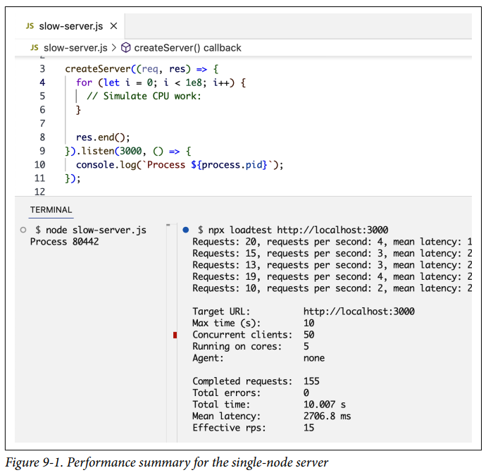
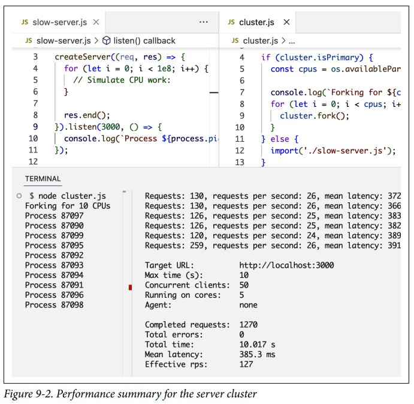
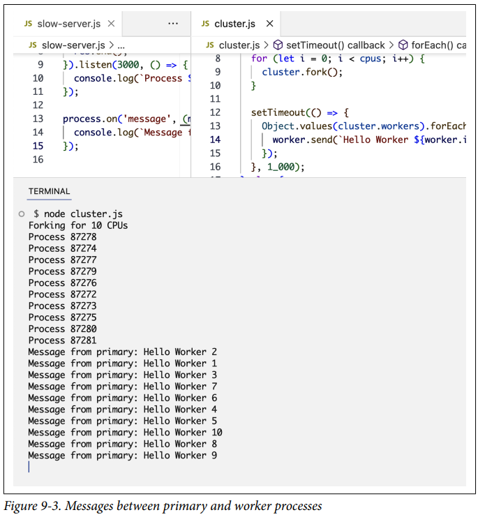
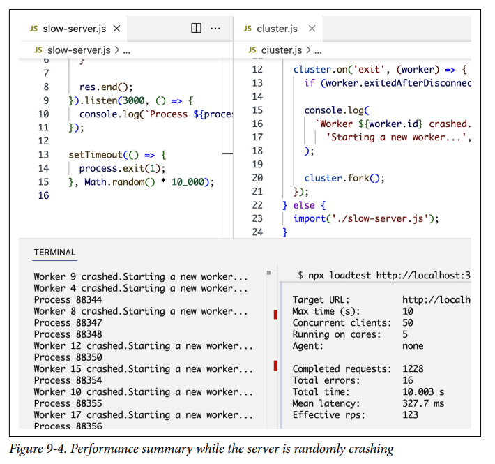
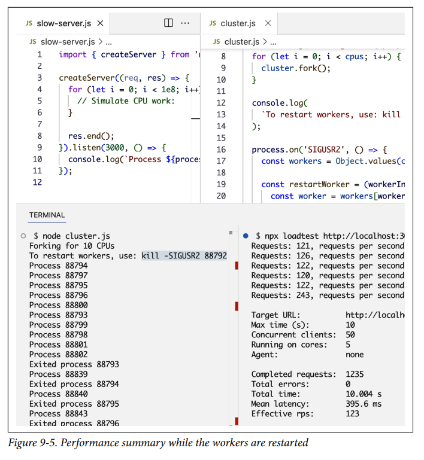

# Escalando Node

Escalar una aplicación se trata de hacerla capaz de manejar más trabajo sin ralentizarse ni bloquearse. Puedes escalar cualquier aplicación dando a sus servidores más memoria o potencia de CPU, o agregando más servidores.

Para Node, con su modelo no bloqueante y basado en eventos, la escalabilidad está incorporada en el núcleo del entorno de ejecución. Una aplicación Node debería estar compuesta de múltiples nodos pequeños y distribuidos. Puedes ejecutar el mismo proceso Node en múltiples núcleos de CPU (o múltiples servidores) y luego balancear la carga de las solicitudes entre ellos. Node tiene un módulo incorporado para ayudar con eso.

En este capítulo, aprenderemos todo sobre el módulo `node:cluster` de Node, que puede ayudar a mejorar el rendimiento de carga de trabajo de un proceso Node haciendo que utilice toda la potencia de CPU de un servidor. También mejora la disponibilidad y el tiempo de actividad de los servidores.

---

## Estrategias de Escalabilidad

Si bien hacer que una aplicación sea capaz de manejar más trabajo es la razón más popular para escalarlas, hay más razones. Las aplicaciones también se escalan para aumentar su disponibilidad y su tolerancia a fallos.

Si tienes la tarea de escalar una aplicación existente, tus opciones son escalarla **verticalmente** dándole más potencia a sus servidores (memoria y CPU) o **horizontalmente** agregando más servidores. Sin embargo, si estás pensando en escalar mientras construyes tus aplicaciones (que es lo que deberías hacer), necesitas entender las siguientes tres estrategias y tomar decisiones de escalabilidad basadas en ese entendimiento y el uso proyectado de las aplicaciones a lo largo del tiempo:

**Clonación**
: Lo más fácil de hacer para escalar una aplicación grande es clonarla múltiples veces y hacer que cada instancia clonada maneje parte de la carga de trabajo (con un balanceador de carga, por ejemplo). Esto no cuesta mucho en términos de tiempo de desarrollo y es altamente efectivo. Esta estrategia es el mínimo que deberías hacer, y Node tiene el módulo incorporado `node:cluster` para facilitarte la implementación de la estrategia de clonación en un solo servidor.

**Descomposición**
: También podemos escalar una aplicación descomponiéndola según funcionalidades y servicios. Esto significa tener múltiples aplicaciones con diferentes bases de código y a veces con sus propias bases de datos y UIs dedicadas. Esta estrategia se asocia comúnmente con el término **microservicio**, donde *micro* indica que esos servicios deberían ser lo más pequeños posible (en realidad, el tamaño del servicio no es lo importante sino la aplicación de un **acoplamiento débil** y una **alta cohesión** entre servicios). La implementación de esta estrategia a menudo no es fácil y podría resultar en problemas inesperados a largo plazo, pero cuando se hace correctamente, las ventajas son grandes.

**División (Splitting)**
: También podemos dividir la aplicación en múltiples instancias donde cada instancia es responsable de solo una parte de los datos de la aplicación. Esta estrategia a menudo se denomina **particionamiento horizontal** o **sharding** en bases de datos. La partición de datos requiere un paso de búsqueda antes de cada operación para determinar qué instancia de la aplicación usar. Por ejemplo, tal vez queramos particionar nuestros usuarios según su país o idioma. Necesitamos hacer una búsqueda de esa información primero.

Las aplicaciones pueden elegir una o más de estas estrategias según sus necesidades actuales y proyectadas.

---

## El Módulo Cluster

El módulo `node:cluster` de Node se puede usar para ejecutar múltiples instancias del mismo proceso Node en diferentes núcleos de CPU y balancear la carga de trabajo entre ellas. Utiliza el método `child_process.fork` internamente para darnos una forma fácil de bifurcar un proceso de aplicación tantas veces como necesitemos. En una máquina servidor, podemos bifurcar un proceso tantas veces como núcleos de CPU tenga esa máquina. El módulo `node:cluster` puede entonces encargarse de la gestión de estas bifurcaciones, balancear la carga de todas las solicitudes que llegan a la aplicación entre todos los procesos bifurcados y recargar cualquier bifurcación cuando sea necesario.

El módulo `node:cluster` es la ayuda de Node para que implementemos la estrategia de escalabilidad de **clonación** verticalmente en un servidor. Cuando tienes un servidor grande con muchos recursos o cuando es más fácil y económico agregar más recursos a un servidor en lugar de agregar nuevos servidores, el módulo `node:cluster` es una excelente opción para una implementación realmente rápida de la estrategia de clonación.

Incluso los servidores pequeños generalmente tienen múltiples núcleos, e incluso si no estás preocupado por la carga en tu servidor Node, deberías usar el módulo `node:cluster` de todas formas para aumentar la disponibilidad de tu servidor y la tolerancia a fallos. Es un paso simple con grandes ventajas.

Aprovechar lo que el módulo `node:cluster` tiene para ofrecer es simple. Creas un **proceso primario** que bifurca una serie de **procesos trabajadores (workers)** y los gestiona. Cada proceso trabajador representa una instancia de la aplicación. Todas las solicitudes entrantes son manejadas por el proceso primario, que es el que decide qué proceso trabajador debe manejar una solicitud entrante.

El trabajo del proceso primario es simple. En realidad, solo usa un algoritmo **round-robin** para elegir un proceso trabajador. Esto está habilitado por defecto en la mayoría de las plataformas, pero se puede modificar para que el balanceo de carga se maneje de manera diferente (por ejemplo, por el SO o con lógica personalizada).

El algoritmo **round-robin** distribuye la carga uniformemente entre todos los procesos trabajadores disponibles de forma rotativa. La primera solicitud se reenvía al primer proceso trabajador, la segunda al siguiente proceso trabajador, y así sucesivamente. Cuando se llega al final de la lista de procesos trabajadores, el algoritmo comienza de nuevo desde el principio.

Round-robin es uno de los algoritmos de balanceo de carga más simples, pero hay varios otros algoritmos que se pueden usar para el balanceo de carga:

**Menos conexiones (Least connections)**
: El proceso primario envía una solicitud entrante al trabajador con menos conexiones activas. Esto ayuda a distribuir la carga de trabajo de manera más uniforme.

**Round-robin ponderado (Weighted round-robin)**
: A los trabajadores se les asignan diferentes pesos, y aquellos con pesos más altos manejan más solicitudes entrantes.

**Aleatorio (Random)**
: El proceso primario elige un trabajador aleatoriamente para manejar una solicitud entrante.

**Hash de IP (IP hash)**
: El proceso primario usa la IP del cliente que realiza una solicitud para determinar qué trabajador debe manejar esa solicitud.

**Hash de URL (URL hash)**
: El proceso primario usa la URL solicitada para determinar qué trabajadores deben manejar esa solicitud.

Cada algoritmo de enrutamiento tiene sus propios casos de uso, beneficios y desventajas. Elegir un algoritmo depende de los requisitos de la aplicación y los entornos en los que se ejecuta.

---

## Procesos Primario y Trabajador

Para ver el módulo `node:cluster` en acción, usemos este servidor HTTP básico. Crea un archivo `slow-server.js` para este código:

```js linenums="1"
import { createServer } from 'node:http';

createServer((req, res) => {
  for (let i = 0; i < 1e8; i++) {
    // Simular trabajo de CPU:
  };
  res.end();
}).listen(3000, () => {
  console.log(`Process ${process.pid}`);
});
```

Nota cómo agregué un bucle `for` vacío para simular algo de trabajo de CPU antes de responder.

Con el módulo `node:cluster`, estaremos trabajando con múltiples procesos, por lo que estoy registrando el ID del proceso (con `process.pid`) cuando el servidor HTTP se inicia, para ver qué procesos se están creando.

Antes de crear un cluster para este servidor y bifurcar muchos trabajadores para él, hagamos una prueba de carga simple. La prueba de carga consiste básicamente en enviar muchas solicitudes al servidor e informar cuánta carga fue capaz de manejar.

Hay muchas herramientas que puedes usar para realizar pruebas de carga, desde básicas como ApacheBench (AB) hasta completas como Artillery. Para mantener las cosas simples para nuestro ejemplo, usaremos el paquete npm `loadtest`.

Después de instalar el paquete, ejecuta el servidor HTTP y luego ejecuta el comando `loadtest` (en una terminal diferente) para realizar la prueba de carga:

```bash linenums="1"
$ node slow-server.js
$ npx loadtest http://localhost:3000/
```

La Figura 9-1 muestra el resumen de rendimiento que obtuve cuando hice la prueba en mi computadora.

El servidor de un solo nodo fue capaz de manejar aproximadamente **15 solicitudes por segundo** en mi computadora. Este resultado será diferente en diferentes computadoras.



Ahora que tenemos un punto de referencia para un solo nodo, veamos qué diferencia hará el módulo `node:cluster` para este rendimiento.

Aquí está el código (agregado a un archivo `cluster.js`) que necesitamos para crear un proceso primario con el módulo `node:cluster` y hacer que ese proceso bifurque muchos procesos trabajadores para ejecutar el mismo servidor HTTP:

```js linenums="1"
import cluster from 'node:cluster';
import os from 'node:os';

if (cluster.isPrimary) {
  const cpus = os.availableParallelism();
  console.log(`Bifurcando para ${cpus} CPUs`);

  for (let i = 0; i < cpus; i++) {
    cluster.fork();
  }
} else {
  import('./slow-server.js');
}
```

Primero importamos tanto el módulo `node:cluster` como el módulo `node:os`. Usamos el módulo `node:os` para descubrir cuántos procesos paralelos podemos ejecutar usando la función `availableParallelism`. Dependiendo del servidor donde se ejecute el código, esta función devolverá un número entre uno y el número máximo de núcleos de CPU disponibles en ese servidor (`os.cpus().length`). El plan es bifurcar un proceso trabajador por cada núcleo de CPU disponible.

El módulo `node:cluster` nos da la práctica bandera booleana `isPrimary` para determinar si este archivo `cluster.js` se está cargando como un proceso primario. La primera vez que ejecutamos este archivo, estaremos ejecutando el proceso primario, y esa bandera `isPrimary` se establecerá en `true`. En este caso, podemos instruir al proceso primario para que bifurque nuestro servidor tantas veces como núcleos de CPU tengamos usando el método `cluster.fork` con un bucle sobre el número de CPUs que tiene el servidor. Esto hace que el cluster aproveche toda la potencia de procesamiento disponible.

Cuando la línea `cluster.fork` se ejecuta desde el proceso primario, el archivo actual, `cluster.js`, se ejecuta de nuevo, pero esta vez en modo trabajador con la bandera `isPrimary` establecida en `false`.

!!! tip

    En realidad, hay otra bandera establecida en `true` en este caso (la bandera `isWorker`) si necesitas usarla.

Cuando la aplicación se ejecuta como un trabajador, puede comenzar a hacer el trabajo real. Aquí es donde necesitamos definir nuestra lógica de servidor, que, para este ejemplo, podemos hacer importando el archivo `slow-server.js` que ya tenemos.

Eso es básicamente todo. Así de fácil es aprovechar toda la potencia de procesamiento en un servidor. Para probar el cluster, ejecuta el archivo `cluster.js`:

```bash linenums="1"
$ node cluster.js
Forking for 10 CPUs
Process 15601
Process 15602
Process 15606
Process 15607
Process 15604
Process 15605
Process 15603
Process 15609
Process 15610
Process 15608
```

La computadora con la que probé tenía 10 núcleos, por lo que el bucle `for` bifurcó 10 procesos trabajadores. Es importante entender que estas bifurcaciones son procesos Node completamente diferentes. Cada proceso trabajador bifurcado tendrá su propio espacio de memoria y event loop.

Cuando este servidor recibe múltiples solicitudes, gracias al balanceo de carga incorporado del módulo `node:cluster`, las solicitudes serán manejadas por diferentes procesos trabajadores con diferentes IDs de proceso. Los trabajadores no serán rotados exactamente en secuencia porque el módulo `node:cluster` realiza algunas optimizaciones al elegir el siguiente trabajador, pero la carga se distribuirá de alguna manera entre los diferentes procesos trabajadores.

Ahora, usemos el mismo comando `loadtest` para medir el rendimiento de este cluster, como se muestra en la Figura 9-2.



¡La misma computadora que manejó solo 16 solicitudes por segundo con un solo proceso ahora es capaz de manejar **123 solicitudes por segundo**! Esto es un aumento de más de siete veces en el rendimiento, y todo lo que tuvimos que hacer para que esto sucediera fue agregar algunas líneas simples de código.

!!! note

    No tuvimos que ejecutar los procesos trabajadores en diferentes puertos. El módulo `node:cluster` se encarga de hacer que los procesos trabajadores compartan puertos.

---

## Transmitiendo Mensajes

La comunicación entre el proceso primario y los trabajadores es simple porque internamente el módulo `node:cluster` está usando la API `child_process.fork`, lo que significa que también tenemos canales IPC disponibles entre el proceso primario y cada proceso trabajador.

Podemos acceder a la lista de objetos trabajadores usando `cluster.workers`, que es un objeto que contiene una referencia a todos los trabajadores y se puede usar para leer información sobre estos trabajadores. Dado que los canales de comunicación entre el proceso primario y todos los trabajadores ya están establecidos, para transmitir un mensaje a todos los trabajadores podemos usar un bucle simple sobre ellos y usar el método `send` en cada uno:

```js linenums="1"
Object.values(cluster.workers).forEach(worker => {
  worker.send(`Hola Trabajador ${worker.id}`);
});
```

El método `Object.values` se usa aquí para obtener un array de todos los trabajadores del objeto `cluster.workers`. Luego, para cada trabajador, usamos la función `send` para enviar cualquier valor que queramos. En un archivo de trabajador — `slow-server.js`, en nuestro ejemplo — para leer un mensaje recibido de este proceso primario, podemos registrar un manejador para el evento `message` en el objeto `process`. Aquí hay un ejemplo:

```js linenums="1"
process.on('message', msg => {
  console.log(`Mensaje del primario: ${msg}`);
});
```

La Figura 9-3 muestra lo que veo cuando pruebo estas dos adiciones al ejemplo de `cluster.js`/`slow-server.js`. Agregué un `setTimeout` alrededor del envío para asegurarme de que todas las bifurcaciones estén hechas antes de enviar.



Cada proceso trabajador recibió un mensaje del proceso primario.

Hagamos que este ejemplo de comunicación sea un poco más práctico. Digamos que necesitamos que nuestro servicio HTTP responda con el número de usuarios que tenemos en la base de datos. Para mantener las cosas simples, podemos usar una función falsa para reemplazar la lógica de conteo de usuarios de la base de datos:

```js linenums="1"
// Doble falso
const dbUsersCount = (() => {
  let count = 1;
  return () => {
    count = 2 * count;
    return count;
  };
})();
```

Esta función simplemente devuelve 2 la primera vez que se llama, luego duplica su valor devuelto en cada llamada subsiguiente.

Esto es solo para pruebas simplificadas, pero dado que el escenario real aquí es que la función hará una solicitud a la base de datos, necesitamos evitar hacer múltiples solicitudes por los múltiples trabajadores que tenemos. Podemos usar algún tipo de caché en los procesos trabajadores y actualizar la caché después de un cierto período de tiempo (digamos 60 segundos). Esto es mejor, pero los 10 trabajadores aún estarían haciendo 10 solicitudes a la base de datos cada 60 segundos.

¿No sería genial si otro proceso hiciera las solicitudes a la base de datos y compartiera el conteo con todos los trabajadores cada 60 segundos? ¡Aquí es donde comenzamos a combinar la estrategia de **clonación** con la estrategia de **descomposición**!

Para simplificar, hagamos que el proceso primario realice la solicitud para contar usuarios en la base de datos (idealmente, otra entidad debería hacer eso). Haremos la llamada a `dbUsersCount` en `cluster.js` y luego usaremos un bucle `for` para transmitir el valor del conteo a todos los trabajadores cada 60 segundos.

Así es como cambié el archivo `cluster.js` para implementar eso:

```js linenums="1"
// En la rama cluster.isPrimary:
const dbUsersCount = (() => {
  let count = 1;
  return () => {
    count = 2 * count;
    return count;
  };
})();

const updateWorkers = () => {
  const usersCount = dbUsersCount();
  Object.values(cluster.workers).forEach((worker) => {
    worker.send({ usersCount });
  });
};

updateWorkers();
setInterval(updateWorkers, 60_000);
```

Aquí estamos invocando `updateWorkers` por primera vez y luego invocándolo cada 60 segundos usando un `setInterval`. De esta manera, cada 60 segundos, todos los trabajadores recibirán el nuevo valor de conteo de usuarios a través del canal IPC, y solo se hará una conexión a la base de datos cada 60 segundos.

En el código del servidor, podemos usar el valor `usersCount` en el manejador del evento `message`. Podemos simplemente almacenar ese valor en una variable de alcance superior y usarla en cualquier lugar de ese módulo.

Así es como cambié `slow-server.js` para implementar eso:

```js linenums="1"
let usersCount;

createServer((req, res) => {
  for (let i = 0; i < 1e8; i++) {
    // Simular trabajo de CPU:
  };
  res.write(`Process ${process.pid}\n`);
  res.end(`Users: ${usersCount}`);
}).listen(3000, () => {
  console.log(`Process ${process.pid}`);
});

process.on('message', (msg) => {
  usersCount = msg.usersCount;
});
```

Cambié la respuesta del servidor para incluir el valor `usersCount`. Si pruebas el código del cluster ahora, durante los primeros 60 segundos obtendrás 2 como el conteo de usuarios de todos los trabajadores (y solo se hará una solicitud a la base de datos). Después de 60 segundos, todos los trabajadores comenzarán a reportar el nuevo conteo de usuarios, 4 (y solo se hará otra solicitud a la base de datos).

Todo esto es posible gracias a los canales de comunicación entre el proceso primario y todos los trabajadores.

---

## Incrementando la Disponibilidad

Uno de los problemas de ejecutar una sola instancia de una aplicación Node es que cuando esa instancia se bloquea, tiene que ser reiniciada. Esto causa cierto tiempo de inactividad del servidor entre estas dos acciones, incluso si el proceso fue monitoreado y el reinicio está automatizado.

Esto también se aplica al caso en que el servidor tiene que reiniciarse para desplegar nuevo código. Con una instancia, habrá tiempo de inactividad del servidor que afecta la disponibilidad del sistema.

Cuando tenemos múltiples instancias, la disponibilidad del sistema se puede aumentar fácilmente con solo unas pocas líneas de código adicionales. Hagamos que eso suceda.

Primero, para hacer que el ejemplo sea práctico para las pruebas, simulemos un bloqueo aleatorio en el proceso del servidor. Podemos hacer una llamada a `process.exit` dentro de un temporizador que se activa después de una cantidad aleatoria de tiempo:

```js linenums="1"
// En slow-server.js
setTimeout(() => {
  process.exit(1);
}, Math.random() * 10_000);
```

Cuando un proceso trabajador termina así, el proceso primario será notificado usando el evento `exit` en el objeto `node:cluster`. Podemos registrar un manejador para ese evento y simplemente bifurcar un nuevo proceso trabajador para reemplazar el proceso bloqueado:

```js linenums="1"
// En la rama cluster.isPrimary:
cluster.on('exit', (worker) => {
  if (worker.exitedAfterDisconnect === true) return;

  console.log(
    `Worker ${worker.id} se bloqueó.` +
    'Iniciando un nuevo worker...',
  );
  cluster.fork();
});
```

Nota cómo agregué una condición `if` para asegurarme de que el proceso trabajador realmente se bloqueó y no fue desconectado manualmente y eliminado por el proceso primario mismo. Por ejemplo, el proceso primario podría decidir que estamos usando demasiados recursos basándose en los patrones de carga que ve, y necesitará eliminar algunos trabajadores en ese caso. Para hacerlo, podemos usar los métodos `disconnect` en cualquier objeto trabajador y, en ese caso, la bandera `exitedAfterDisconnect` se establecerá en `true`, por lo que la declaración `if` protegerá contra la bifurcación de un nuevo trabajador en ese caso.

Si ejecutamos `cluster.js` con el manejador anterior (y el bloqueo aleatorio en `slow-server.js`), después de un número aleatorio de segundos, los trabajadores comenzarán a bloquearse, y el proceso primario bifurcará inmediatamente nuevos trabajadores para aumentar la disponibilidad del sistema. Puedes medir la disponibilidad usando el mismo comando `loadtest` y ver cuántas solicitudes el servidor no podrá manejar en total (porque algunas de las solicitudes desafortunadas aún tendrán que enfrentar el caso de bloqueo).

La Figura 9-4 muestra la salida de `loadtest` en mi computadora mientras ocurría el bloqueo aleatorio.



Solo **16 solicitudes fallaron** de 1,228. Eso es más del 98% de disponibilidad. Al agregar algunas líneas simples de código, ahora no tenemos que preocuparnos más por los bloqueos de procesos. El proceso primario vigilará los procesos fallidos por nosotros y los reemplazará bajo demanda.

---

## Reinicios Sin Tiempo de Inactividad

Cuando desplegamos nuevo código en servidores de producción, todos los procesos Node necesitan ser reiniciados. Durante un reinicio, las solicitudes a estos procesos fallarán.

En un cluster, en lugar de reiniciar todos los procesos trabajadores juntos, podemos reiniciarlos uno a la vez. De esta manera, mientras un trabajador se está reiniciando, los demás continuarán sirviendo solicitudes, y no tendremos ningún tiempo de inactividad del servidor.

Implementar esto con el módulo `node:cluster` es realmente fácil. Déjame mostrarte cómo.

Primero, dado que no queremos reiniciar el proceso primario una vez que está activo (porque eso sería tiempo de inactividad total para todos los trabajadores), necesitamos una forma de enviar al proceso primario un comando para instruirlo a comenzar a reiniciar sus trabajadores (uno por uno).

Hay algunas formas de hacerlo dependiendo del sistema operativo del servidor. Con sistemas Linux, podemos escuchar una señal de proceso como `SIGUSR1` o `SIGUSR2`. Estas señales se pueden enviar a un proceso en ejecución emitiendo un comando `kill` como este:

```bash linenums="1"
$ kill -SIGUSR2 PID
```

En Node, podemos escuchar esta señal `SIGUSR2` como un evento en el objeto `process`, y dentro de su manejador podemos hacer lo que queramos:

```js linenums="1"
process.on('SIGUSR2', () => {
  // Hacer algo
});
```

!!! warning

    No uses `SIGUSR1`. Node lo usa para propósitos de depuración. Además, en Windows, estas señales de proceso no son compatibles, y tendrías que encontrar otra forma de instruir al proceso primario para que haga algo. Hay algunas alternativas. Por ejemplo, puedes usar la entrada estándar o la entrada de socket. También puedes monitorear la existencia de un archivo `process.pid` y rastrear cualquier evento de eliminación en él.

Ahora que sabemos cómo instruir al proceso primario para que reinicie sus trabajadores, podemos hacer que lo haga desconectando cada trabajador y bifurcando uno nuevo para reemplazarlo. Sin embargo, dado que queremos desconectar un trabajador a la vez, necesitamos que desconecte un trabajador, espere eso, bifurque otro trabajador, espere a que la bifurcación comience a tomar solicitudes, luego desconecte el siguiente trabajador.

Un proceso trabajador tiene un evento `exit` similar al evento de `node:cluster` pero específico del trabajador, y significa que ese trabajador específico ha terminado. Podemos usar ese evento `exit` para comenzar la bifurcación del siguiente trabajador.

Un proceso trabajador también tiene un evento `listening` que se activa después de que ocurre una llamada a `listen` en ese trabajador. Podemos usar ese evento para comenzar a desconectar el siguiente trabajador.

Poniendo todo junto, aquí están los cambios que hice a `cluster.js` para implementar la recarga gradual de todos los trabajadores:

```js linenums="1"
// En la rama cluster.isPrimary:
console.log(
  `Para reiniciar workers, usa: kill -SIGUSR2 ${process.pid}`,
);

process.on('SIGUSR2', () => {
  const workers = Object.values(cluster.workers);

  const restartWorker = (workerIndex) => {
    const worker = workers[workerIndex];
    if (!worker) return;

    worker.on('exit', () => {
      if (worker.exitedAfterDisconnect === false) return;
      console.log(`Proceso terminado ${worker.process.pid}`);
      cluster.fork().on('listening', () => {
        restartWorker(workerIndex + 1);
      });
    });

    worker.disconnect();
  };

  restartWorker(0);
});
```

El array `workers` tiene la lista de todos los trabajadores del cluster. La función `restartWorker` recibe el índice de un trabajador a reiniciar, comenzando desde 0. De esta manera, podemos hacer el reinicio en secuencia haciendo que esta función se llame a sí misma con el siguiente valor de índice cuando esté lista para el siguiente trabajador.

En la función `restartWorker`, obtuvimos una referencia al trabajador que se va a reiniciar. Dado que estaremos llamando a esta función recursivamente para formar una secuencia, necesitamos una condición de parada. Cuando ya no tengamos un trabajador para reiniciar, podemos simplemente retornar. Luego desconectamos ese trabajador (usando `worker.disconnect`), pero antes de reiniciar el siguiente trabajador necesitamos bifurcar uno nuevo para reemplazar este que se está desconectando. Podemos usar el evento `exit` en el trabajador actual para bifurcar un nuevo trabajador cuando el actual termine.

Tenemos que asegurarnos de que el evento `exit` se haya activado realmente después de una llamada de desconexión normal (lo opuesto al ejemplo de bloqueo). Podemos usar la bandera `exitedAfterDisconnect`. Si esta bandera es `false`, la salida fue causada por algo diferente a una llamada de desconexión, y en ese caso, debemos retornar y no hacer nada. Pero si la bandera es `true`, podemos proceder a bifurcar un nuevo trabajador para reemplazar el que estamos desconectando.

Cuando el nuevo trabajador bifurcado esté listo, lo cual se determina aquí usando el evento `listening`, podemos reiniciar el siguiente llamando a la función `restartWorker` nuevamente con el siguiente valor de índice para el array de workers.

Eso es todo lo que necesitamos para un reinicio sin tiempo de inactividad. Para probarlo, agregué una declaración `console.log` para darnos el ID del proceso del cluster.

Ejecutar el comando `kill -SIGUSR2 PID` registrado debería comenzar el proceso de recarga de los trabajadores.

Para ver el reinicio sin tiempo de inactividad en acción, antes de ejecutar el comando `kill`, ejecuta el mismo comando `loadtest`. La Figura 9-5 muestra los resultados cuando probé esto.



**¡Ninguna solicitud falló** durante la recarga de este cluster!

---

## Manejando el Estado

Uno de los desafíos importantes de entender en un entorno escalado es cómo manejar el estado en memoria y cualquier comunicación con estado en general.

Dado que los trabajadores tienen sus propios espacios de memoria separados, no podemos almacenar cosas en caché en memoria en un trabajador. Los otros trabajadores no tendrán acceso a ese valor en caché.

Si necesitas almacenar cosas en caché en un entorno escalado, tienes que usar una entidad separada y leer/escribir en la API de esa entidad desde todos los trabajadores. Esta entidad puede ser un servidor de base de datos, un servicio como Redis, o un proceso Node dedicado con una API de lectura/escritura para que todos los demás trabajadores se comuniquen con él.

Esto se conoce como **caché distribuido**, y es un ejemplo de la estrategia de escalabilidad de **descomposición** para una aplicación. Esto es algo que deberías hacer incluso si estás ejecutando tu aplicación en un solo núcleo.

Otro ejemplo de gestión de estado es manejar la autenticación de usuarios y gestionar las sesiones de usuario. En un entorno escalado, una solicitud de autenticación llega al proceso primario y se envía a un trabajador. Ese trabajador comenzará a reconocer el estado del usuario. Sin embargo, cuando el mismo usuario hace otra solicitud, el balanceador de carga eventualmente los enviará a otros trabajadores, que no lo tienen como autenticado.

Mantener una referencia a una sesión de usuario autenticado en una instancia ya no funcionará. En su lugar, necesitamos mantener los trabajadores **sin estado (stateless)** y gestionar la información de estado en una entidad externa.

Otra forma de lidiar con el problema de las sesiones de usuario es usar lo que se conoce como **sesiones persistentes (sticky sessions)**. No es tan eficiente como usar una entidad externa con estado, pero ciertamente es más fácil de implementar. Podemos simplemente usar un algoritmo de enrutamiento como **IP hash**.

Las sticky sessions son un ejemplo simple de la estrategia de escalabilidad de **división (splitting)**. Cuando un usuario se autentica con un proceso trabajador, se mantiene un registro de esa relación en el proceso primario. Luego, cuando el mismo usuario envía una nueva solicitud, usamos ese registro para seguir enviándolo al mismo proceso trabajador. De esta manera, el código del lado del servidor no tiene que cambiarse.

Si bien un algoritmo de enrutamiento como IP hash no es compatible de forma nativa con el módulo `node:cluster` de Node, implementarlo es bastante simple. Podemos poner los trabajadores en un array, reducir la IP de una solicitud entrante a un índice dentro de ese array, y hacer que el trabajador con ese índice maneje la solicitud. Aquí hay una implementación muy básica de eso:

```js linenums="1"
import os from 'node:os';
import { fork } from 'node:child_process';
import { createServer } from 'node:http';

const cpus = os.availableParallelism();
const workers = [];

for (let i = 0; i < cpus; i++) {
  workers.push(fork('./slow-server.js'));
}

function getWorkerIndex(ip) {
  const hash = ip.split('.').reduce(
    // Hashear los octetos de IP y combinarlos
    (hash, part) => Number(part) + 256 * hash,
  );
  return hash % cpus;
}

createServer((req, res) => {
  const ip = req.socket.remoteAddress;
  const workerIndex = getWorkerIndex(ip);
  workers[workerIndex].send({ req, res });
  // Lógica IPC
}).listen(3000);
```

Si bien usar un algoritmo de balanceo de carga sticky como IP hash es simple de implementar y puede ser adecuado y eficiente para algunos casos (como una aplicación pequeña con pocos trabajadores), ciertamente no es ideal. Puede llevar a una distribución desigual de la carga de trabajo y no escala muy bien. Mantener los trabajadores de Node sin estado y gestionar el estado con un servicio externo es un mejor enfoque en términos de distribución de carga de trabajo y escalabilidad.

!!! tip

    Los algoritmos de balanceo de carga sticky como IP hash se pueden configurar y usar fácilmente en otros balanceadores de carga, como nginx, y muchos otros.

---

## Gestores de Procesos

Si no quieres gestionar tu propio código de cluster, puedes usar uno de los paquetes avanzados de gestores de procesos disponibles para Node. Estos paquetes envuelven el módulo `node:cluster` y proporcionan un CLI para simplificar la gestión de procesos bifurcados.

Uno de los gestores de procesos avanzados populares para Node es **PM2**, y aunque la mayoría de sus características cuestan dinero para usar, ofrece lo básico para ejecutar y gestionar un cluster de trabajadores de forma gratuita.

Instala el paquete `pm2` con npm y echa un vistazo a su página de ayuda (con la opción `-h`). Tiene muchos comandos y opciones para iniciar, monitorear y gestionar un cluster (junto con muchas otras características).

Por ejemplo, para lanzar un cluster de trabajadores para un proceso Node, simplemente inicias el proceso Node con el comando `start` y usas la opción `-i` (con un número personalizado de bifurcaciones, o `max` para usar el máximo de bifurcaciones posibles):

```bash linenums="1"
$ npx pm2 start script.js -i max
```

Para realizar un reinicio sin tiempo de inactividad, puedes usar el comando `reload`:

```bash linenums="1"
$ npx pm2 reload all
```

Para ver una lista de todos los procesos trabajadores con su estado y uso, puedes usar el comando `list`:

```bash linenums="1"
$ npx pm2 list
```

---

## Resumen

La escalabilidad en Node es un concepto de primera clase. Es por eso que Node se llama Node, después de todo.

Hay muchas estrategias de escalabilidad como **clonación**, **descomposición** y **división (splitting)**. El enfoque de este capítulo fue principalmente en la estrategia de clonación.

El módulo incorporado `node:cluster` de Node se puede usar para crear un proceso primario que bifurca muchos procesos trabajadores y los gestiona. Puede iniciarlos y detenerlos, enviarles datos y recibir datos de ellos. Los trabajadores pueden compartir puertos, y el proceso primario puede distribuir la carga de trabajo entre ellos para aumentar el rendimiento del servidor.

La carga de trabajo se puede distribuir entre los procesos trabajadores de múltiples maneras. El módulo `node:cluster` usa un algoritmo de enrutamiento cíclico simple para balancear la carga de las solicitudes entrantes entre los trabajadores, pero se pueden usar otros algoritmos de enrutamiento. El almacenamiento en caché y la gestión de comunicaciones con estado en general se pueden hacer usando otros algoritmos de enrutamiento o usando servicios externos.

El proceso primario también puede monitorear los trabajadores, reemplazar los defectuosos inmediatamente y reiniciar los trabajadores uno por uno. Esto mejora el tiempo de actividad y la tolerancia a fallos del servidor.

En el próximo capítulo, exploraremos algunas de las herramientas que se pueden usar para mejorar los flujos de trabajo de desarrollo y ayudar con la construcción, prueba, despliegue y mantenimiento del código Node.


